# Crater Pipeline Map — world-space decal batch (legacy CPU enqueue, unified GPU flush)

> Branch: `claude/nifty-mendeleev` · Gates: `useNonWeaponEffects` (default ON, prefs.cfg driven), `drawOldWay` (default OFF)
>
> Renders in any Mermaid-aware viewer (GitHub, VS Code with the Markdown Preview Mermaid extension, Obsidian, Typora). ASCII fallback below for terminal viewing.

---

## Mermaid — three-zone dataflow overview

```mermaid
flowchart LR
    classDef game  fill:#1a365d,stroke:#90cdf4,color:#ebf8ff
    classDef api   fill:#22543d,stroke:#9ae6b4,color:#f0fff4
    classDef eng   fill:#7b341e,stroke:#fbd38d,color:#fffaf0

    subgraph GAME["GAME DATA SIDE\n(weapon impact → crater spawn)"]
        direction TB
        SPAWN["WeaponBolt::impact()\ncode/weaponbolt.cpp:827\ncode/weaponbolt.cpp:1079"]:::game
        ADDCRATER["craterManager->addCrater()\nmclib/crater.cpp:202\n• type (CRATER_1..4 or footprint)\n• position (world space)\n• rotation (0-360°)"]:::game
        DAMAGE["damage-driven crater size\n(damage > 3/6/9 → size 0/1/2/3)"]:::game
        LIFETIME["max 4096 craters cyclic buffer\n(craterList[] ring)"]:::game
    end

    subgraph API["API LAYER\n(GameOS gos_* → batch submit)"]
        direction TB
        RENDER["craterManager->render()\nmclib/crater.cpp:299\nper frame iteration"]:::api
        PROJECT["eye->projectForEffectAdmission()\nscreen-space clip check\nfar-clip + haze distance"]:::api
        EMITDECAL["gos_PushDecal()\nWorldOverlayVert (3-tri batch)\n• world position (MC2 space)\n• texture UV + handle\n• fog factor + ARGB color"]:::api
        BATCH["decalBatch_ (gosRenderer)\n• verts: vector&lt;WorldOverlayVert&gt;\n• draws: vector&lt;DrawEntry&gt;\n(texture handle + vert range)"]:::api
        RENDLISTS["mcTextureManager->renderLists()\ntxmmgr.cpp:2234\nflush point"]:::api
    end

    subgraph ENGINE["ENGINE SIDE\n(shaders / GL / GPU)"]
        direction TB
        PROG["decal program\nterrain_overlay.vert +\ndecal.frag"]:::eng
        VSHADER["Vertex: world→clip projection\nOVERLAY_DEPTH_BIAS applied\n(bias z for decal-over-terrain win)"]:::eng
        FSHADER["Fragment: decal.frag\n• cloud shadow FBM\n• static + dynamic shadow PCF\n• fog blend\n• alpha blend output"]:::eng
        DRAW["glDrawArrays(GL_TRIANGLES)\ndepth test (GEQUAL, reverse-Z)\ndepth write OFF\nblend ON"]:::eng
    end

    SPAWN --> ADDCRATER
    ADDCRATER --> DAMAGE
    DAMAGE --> LIFETIME

    LIFETIME --> RENDER
    RENDER --> PROJECT
    PROJECT -->|"if onScreen"| EMITDECAL
    EMITDECAL --> BATCH

    BATCH --> RENDLISTS
    RENDLISTS --> PROG
    PROG --> VSHADER
    VSHADER --> FSHADER
    FSHADER --> DRAW
```



---

## Mermaid — full pipeline

```mermaid
flowchart TD
    classDef producer fill:#2d3748,stroke:#a0aec0,color:#f7fafc
    classDef spawn fill:#553c9a,stroke:#d6bcfa,color:#faf5ff
    classDef manager fill:#22543d,stroke:#9ae6b4,color:#f0fff4
    classDef batch fill:#7b341e,stroke:#fbd38d,color:#fffaf0
    classDef shader fill:#5a1a4a,stroke:#c084fc,color:#faf5ff
    classDef raster fill:#742a2a,stroke:#feb2b2,color:#fff5f5

    subgraph FRAME["FRAME LOOP (code/gamecam.cpp ~L200-222)"]
        direction LR
        FC1["camera->update()"]:::producer
        SOLID["land->render()"]:::producer
        CRATER["craterManager->render()"]:::producer
        OBJECT["ObjectManager->render()"]:::producer
        WTR["land->renderWater()"]:::producer
        TXTLISTS["mcTextureManager→<br/>renderLists()"]:::producer

        FC1 --> SOLID --> CRATER --> OBJECT --> WTR --> TXTLISTS
    end

    subgraph SPAWN_PATH["CRATER SPAWN (weapon impact event loop)"]
        direction TB
        BOLT["WeaponBolt::update() +<br/>collision detection"]:::spawn
        IMPACT["hitTarget == true?<br/>impact landed on terrain"]:::spawn
        DAMAGECHECK["compute crater size:<br/>weaponShot.damage > 3/6/9<br/>→ craterType index"]:::spawn
        ADDCALL["craterManager→<br/>addCrater(craterType,<br/>position, rotation)"]:::spawn
        STORE["craterList[currentCrater] = {<br/>  craterShapeId,<br/>  position[4] (corners),<br/>  screenPos[4] (TBD)<br/>}<br/>currentCrater++;<br/>(ring buffer wrap)"]:::spawn

        BOLT --> IMPACT
        IMPACT -->|"if land hit"| DAMAGECHECK
        DAMAGECHECK --> ADDCALL
        ADDCALL --> STORE
    end

    subgraph CRATER_RENDER["CRATER MANAGER RENDER (mclib/crater.cpp:299-578)"]
        direction TB
        LOOP1["for i in [0..maxCraters):<br/>if craterShapeId != -1"]:::manager
        CLIPTEST["eye->projectForEffectAdmission(4 corners)<br/>screen clip test<br/>onScreen1-4 flags"]:::manager
        DISTANCE["if usePerspective:<br/>compute eye distance<br/>cam origin → crater center<br/>far clip plane cull<br/>haze distance transition"]:::manager
        CHECKANY["if (onScreen1 OR<br/>onScreen2 OR<br/>onScreen3 OR<br/>onScreen4):<br/>proceed to render"]:::manager
        LIGHTING["compute vertex lighting:<br/>eye->ambientRed/Green/Blue<br/>TerrainQuad::rainLightLevel<br/>TerrainQuad::lighteningLevel"]:::manager
        FOG_CALC["compute fog RGB:<br/>useFog gate<br/>fogStart, fogFull,<br/>hazeFactor (distance)"]:::manager
        DRAWOLD["if drawOldWay:<br/>(legacy direct draw)"]:::manager
        DRAWOLD_RENDER["alloc gVertex[4]<br/>TexturedPolygonQuadElement<br/>element.draw()<br/>(immediate mode)"]:::manager
        DRAWDECAL["else (modern):<br/>gos_PushDecal batched"]:::manager
        UVMAP["crater UV atlas lookup:<br/>craterUVTable[(craterShapeId*2)]<br/>+ uvAdd offset<br/>(0.125 footprint / 0.5 crater)"]:::manager
        SCREENTRI1["gVertex[0,1,2] triangle<br/>(first half of quad)"]:::manager
        SCREENTRI2["sVertex[0,1,3] triangle<br/>(second half of quad)"]:::manager
        WOVERTS["build WorldOverlayVert[3]:<br/>wx,wy,wz (from position[]):<br/>u,v (from UV table)<br/>fog (fogFloat)<br/>argb (lightRGB)"]:::manager
        TEXIDX["get_gosTextureHandle()<br/>craterTextureIndices<br/>[handleOffset]<br/>(0=crater, 1=footprint)"]:::manager
        PUSHTO["gos_PushDecal(gWov, texIdx)<br/>gos_PushDecal(sWov, texIdx)"]:::manager

        LOOP1 --> CLIPTEST
        CLIPTEST --> DISTANCE
        DISTANCE --> CHECKANY
        CHECKANY -->|"if any on-screen"| LIGHTING
        LIGHTING --> FOG_CALC
        FOG_CALC --> DRAWOLD
        DRAWOLD -->|"if TRUE"| DRAWOLD_RENDER
        DRAWOLD -->|"if FALSE (modern)"| DRAWDECAL
        DRAWDECAL --> UVMAP
        UVMAP --> SCREENTRI1
        UVMAP --> SCREENTRI2
        SCREENTRI1 --> WOVERTS
        SCREENTRI2 --> WOVERTS
        WOVERTS --> TEXIDX
        TEXIDX --> PUSHTO
    end

    subgraph BATCH_API["DECAL BATCH API (GameOS)"]
        direction TB
        PUSHENTRY["gos_PushDecal()<br/>GameOS/gameos/gameos_graphics.cpp:7684"]:::batch
        PUSHIMPL["gosRenderer::pushDecalTri()<br/>push to decalBatch_.verts<br/>push draw entry<br/>(texture handle, vert range)"]:::batch
        BATCHED["batch state per frame:<br/>decalBatch_.verts: vector&lt;WorldOverlayVert&gt;<br/>decalBatch_.draws: vector&lt;DrawEntry&gt;"]:::batch
    end

    subgraph FLUSH["DECAL FLUSH (gosRenderer::drawDecals)"]
        direction TB
        FLUSHCALL["gos_DrawDecals()<br/>txmmgr.cpp:2234<br/>called AFTER terrain SOLID"]:::batch
        FLUSHIMPL["gosRenderer::drawDecals()<br/>GameOS/gameos/gameos_graphics.cpp:7616"]:::batch
        BUFDATA["glBufferData(GL_STREAM_DRAW)<br/>upload WorldOverlayVert[] to VBO"]:::batch
        RSTATE["glDepthTest(GL_GEQUAL)<br/>glDepthMask(GL_FALSE)<br/>glBlend(SRC_ALPHA,<br/>ONE_MINUS_SRC_ALPHA)<br/>glDisable(GL_CULL_FACE)"]:::batch
        PROG["glUseProgram(decalProg)<br/>upload uniforms:<br/>terrainMVP, fog_color, time<br/>terrainLightDir<br/>shadow maps (static+dynamic)"]:::batch
        LOOPDRAWS["for each DrawEntry:<br/>  glActiveTexture(0)<br/>  glBindTexture(decal atlas)<br/>  glDrawArrays(GL_TRIANGLES,<br/>    firstVert, vertCount)"]:::batch
        RESTORE["glDepthFunc(GL_LESS)<br/>glDisable(GL_BLEND)<br/>glEnable(GL_CULL_FACE)<br/>glDepthMask(GL_TRUE)<br/>glUseProgram(0)"]:::batch
        CLEAR["clear decalBatch_<br/>verts.clear()<br/>draws.clear()"]:::batch
    end

    subgraph SHADE_VERTEX["VERTEX SHADER (terrain_overlay.vert)"]
        direction TB
        VSIN["in vec3 worldPos  (MC2: x=east, y=north, z=elev)<br/>in vec2 texcoord<br/>in float fogIn [0,1]<br/>in vec4 colorIn (BGRA packed)"]:::shader
        VOUT["out vec3 WorldPos<br/>out vec2 Texcoord<br/>out float FogValue<br/>out vec4 Color (RGBA swizzle)"]:::shader
        VPROJ["clip4 = u_worldToClipGL * vec4(worldPos, 1.0)<br/>clip4.z += OVERLAY_DEPTH_BIAS * clip4.w<br/>(precomputed bias for decal-over-terrain)"]:::shader
        VGUARD["if !(clip4.w > 0 && clip4.z in [0,clip4.w]):<br/>  gl_Position = (-2.0 off-screen)<br/>  (raster-sheet guard)"]:::shader

        VSIN --> VOUT
        VOUT --> VPROJ
        VPROJ --> VGUARD
    end

    subgraph SHADE_FRAG["FRAGMENT SHADER (decal.frag)"]
        direction TB
        FIN["in vec3 WorldPos<br/>in vec2 Texcoord<br/>in float FogValue<br/>in vec4 Color"]:::shader
        FTEX["vec4 tex_color = texture(tex1, Texcoord)<br/>(decal atlas: feet0000.tga / feet0001.tga)"]:::shader
        FCOL["vec4 c = Color × tex_color<br/>(no tone correction)"]:::shader
        FCLOUD["cloud shadow (FBM):<br/>cloudUV = WorldPos.xy × 0.0006 +<br/>  vec2(time × 0.012, time × 0.005)<br/>cloudNoise = fbm(cloudUV, 4)<br/>mix(0.88, 1.0, smoothstep(...))"]:::shader
        FSHADOW["static + dynamic shadow PCF:<br/>calcShadow(WorldPos, flatNorm, lightDir, 8)<br/>calcDynamicShadow(..., 4)<br/>c.rgb *= shadow"]:::shader
        FFOG["if fog enabled:<br/>  c.rgb = mix(fog_color.rgb, c.rgb,<br/>    FogValue)"]:::shader
        FOUT["FragColor = c<br/>GBuffer1 = rc_gbuffer1_shadowHandled_flatUp<br/>(marks pixel as shadow-handled,<br/>skips post-shadow multiply)"]:::shader

        FIN --> FTEX
        FTEX --> FCOL
        FCOL --> FCLOUD
        FCLOUD --> FSHADOW
        FSHADOW --> FFOG
        FFOG --> FOUT
    end

    subgraph RASTER["RASTERIZATION & OUTPUT"]
        direction TB
        RHIZ["depth test (GL_GEQUAL, reverse-Z)<br/>clip4.z ≥ terrain.z wins<br/>decal-over-terrain ordering"]:::raster
        RBLEND["alpha blend (SRC_ALPHA, ONE_MINUS_SRC_ALPHA)<br/>screen_color = c.rgb × c.a +<br/>  screen_color × (1 - c.a)"]:::raster
        RNODEPTH["depth write disabled<br/>(GL_FALSE)<br/>crater does not alter terrain depth"]:::raster
        RNOCULL["face cull disabled<br/>(GL_CULL_FACE OFF)<br/>both quad triangles visible"]:::raster
        RMRT["MRT output:<br/>location=0: FragColor (scene blend)<br/>location=1: GBuffer1 (shadow marker)"]:::raster

        RHIZ --> RBLEND
        RBLEND --> RNODEPTH
        RNODEPTH --> RNOCULL
        RNOCULL --> RMRT
    end

    FRAME -->|"spawn events"| SPAWN_PATH
    FRAME --> CRATER_RENDER

    CRATER_RENDER --> BATCH_API
    BATCH_API --> FLUSH
    FLUSH --> SHADE_VERTEX
    FLUSH --> SHADE_FRAG

    SHADE_VERTEX --> RASTER
    SHADE_FRAG --> RASTER

    style FRAME fill:#f0f0f0,stroke:#333,color:#000
    style SPAWN_PATH fill:#f0f0f0,stroke:#333,color:#000
    style CRATER_RENDER fill:#f0f0f0,stroke:#333,color:#000
    style BATCH_API fill:#f0f0f0,stroke:#333,color:#000
    style FLUSH fill:#f0f0f0,stroke:#333,color:#000
    style SHADE_VERTEX fill:#f0f0f0,stroke:#333,color:#000
    style SHADE_FRAG fill:#f0f0f0,stroke:#333,color:#000
    style RASTER fill:#f0f0f0,stroke:#333,color:#000
```



---

## ASCII fallback (for terminal viewers)

```
                         CRATER PIPELINE (CPU spawn → batch → GPU flush)
                         =====================================================

  FRAME LOOP                CRATER MANAGER RENDER       DECAL BATCH         SHADER
  ==========                ==========================   ===============     ======
  code/gamecam.cpp:215      mclib/crater.cpp:299        GameOS API         decal.frag
  ↓                         ↓                           ↓                  ↓
  camera→update()     ┌─────────────────────────┐
  ↓                   │ for crater in all:       │      decalBatch_       FRAGMENT
  land→render()      │  if craterShapeId!=-1    │      .verts            ======
  ↓                   │  ↓                       │      .draws            • tex sample
  craterMgr→         │ eye→projectForEffect     │                        • cloud shadow
   render()      ────→│  Admission(4 corners)    │  gos_PushDecal()       • static shadow
  ↓                   │  ↓                       │      ↓                 • dynamic shadow
  ObjectMgr→         │ distance cull check      │  WorldOverlayVert[3]   • fog blend
   render()      │ far clip + haze         │      ↓                 • alpha out
  ↓              │ ↓                       │  gosRenderer::
  land→          │ if any on-screen:       │   pushDecalTri()
   renderWater() ├──────────────────┐      │      ↓
  ↓              │ compute lighting        │  batch._verts.push()
  mcTextureManager│  eye→ambient RGB       │  batch._draws.push()
   →renderLists()│ ↓                       │      ↓
  ├─────────────┤ compute fog             │
  │ Render.Decals│  useFog gate            │
  │ (L2232-34)  │ ↓                       │
  │             │ if drawOldWay:          │
  │             │  TexturedPolygonQuad    │
  │             │  element.draw()         │  gos_DrawDecals()
  │ [NEW PATH]  │  (legacy immediate)     │      ↓
  │             │                         │  glBufferData(
  │ gos_DrawDecals│ else:                 │    GL_STREAM_DRAW)
  │ (L7616)      │  for each triangle:     │      ↓
  │              │  gos_PushDecal(         │  Render state:
  │              │    gWov/sWov,          │  • glDepth=GEQUAL
  │              │    texIdx)              │  • glDepthMask=FALSE
  │              │   ↓                    │  • glBlend=SRC_ALPHA
  │              │  compute screen UV     │  • glFrontFace=CCW
  │              │  from craterUVTable    │      ↓
  │              │  + uvAdd offset        │  for each DrawEntry:
  │              │  ↓                    │    glDrawArrays(
  │              │ build WorldOverlayVert │      GL_TRIANGLES,
  │              │  {wx,wy,wz,           │      firstVert,
  │              │   u,v,                │      vertCount)
  │              │   fog,                │      ↓
  │              │   argb}               │  VERTEX STAGE
  │              │                        │  ===============
  │              └────────────────────────┘  terrain_overlay.vert
  │                                          • transform to clip
  │                                          • apply OVERLAY_DEPTH_BIAS
  │                                          • guard against behind-cam
  │                                              ↓
  │                                          RASTERIZATION
  │                                          ===============
  │                                          • depth test (GEQUAL)
  │                                          • blend (SRC_ALPHA)
  │                                          • no depth write
  │                                          • no face cull
  │                                              ↓
  │                                          MRT Output
  │                                          ============
  │                                          loc=0: FragColor
  │                                          loc=1: GBuffer1 (shadow
  │                                                 handled marker)
  │
  │ (decalBatch cleared after flush)
  │
  └─────────────────────────────────────────→ frame complete
```

---

## Key call sites

| Where | What |
|---|---|
| `code/gamecam.cpp:200-206` | Frame loop: land→render, craterMgr→render, ObjectMgr→render, land→renderWater, mcTextureManager→renderLists |
| `code/weaponbolt.cpp:827` | WeaponBolt: missile impact → craterManager→addCrater(CRATER_1+size, targetPos, rotation) |
| `code/weaponbolt.cpp:1079` | WeaponBolt: ballistic impact → craterManager→addCrater(CRATER_1+size, targetPos, rotation) |
| `mclib/crater.h:61-125` | CraterManager class definition; public API: init, addCrater, update, render |
| `mclib/crater.cpp:116-169` | CraterManager::init() — allocate heaps, load texture assets (feet0000.tga, feet0001.tga) |
| `mclib/crater.cpp:202-267` | CraterManager::addCrater() — store crater record in cyclic buffer, compute 4 corner positions, sample terrain elevation |
| `mclib/crater.cpp:270-296` | CraterManager::update() — (legacy, now just marks texture handles) |
| `mclib/crater.cpp:299-578` | CraterManager::render() — per-frame iteration, screen clip test, distance cull, dual-path render (drawOldWay vs gos_PushDecal) |
| `mclib/crater.cpp:322-332` | projectForEffectAdmission() calls (4 corners) — screen-space clip test |
| `mclib/crater.cpp:337-364` | Distance cull: eye→usePerspective, far-clip plane, haze distance transition |
| `mclib/crater.cpp:370-395` | Lighting compute: ambient RGB, rain/lightning modulation, fog specular |
| `mclib/crater.cpp:446-506` | drawOldWay path (legacy): TexturedPolygonQuadElement, immediate draw (gos_SetRenderState, element.draw) |
| `mclib/crater.cpp:507-578` | Modern path (gos_PushDecal): build WorldOverlayVert arrays, gos_PushDecal(gWov/sWov, texIdx) ×2 per crater |
| `mclib/crater.cpp:548-573` | WorldOverlayVert population: position[] MC2 world space → gWov[3], sWov[3] triangles |
| `mclib/txmmgr.cpp:2232-2234` | renderLists() crater flush: ZoneScoped("Render.Decals"), gos_DrawDecals() |
| `GameOS/gameos/gameos_graphics.cpp:7684-7686` | gos_PushDecal() — thin wrapper, delegates to gosRenderer::pushDecalTri() |
| `GameOS/gameos/gameos_graphics.cpp:7349-7352` | gosRenderer::pushDecalTri() — enqueue to decalBatch_ |
| `GameOS/gameos/gameos_graphics.cpp:7616-7672` | gosRenderer::drawDecals() — flush implementation: VBO upload, render state, per-draw loop, clear batch |
| `GameOS/gameos/gameos_graphics.cpp:7356-7403` | setupOverlayShadowsForShp() — shadow uniform setup for decal shader |
| `GameOS/gameos/gameos_graphics.cpp:7406-7428` | uploadOverlayUniforms_() — MVP, fog color, time, camera pos, debug mode, map extent |
| `shaders/terrain_overlay.vert` | Vertex: world→clip transform, OVERLAY_DEPTH_BIAS, raster-sheet guard |
| `shaders/decal.frag` | Fragment: texture sample, cloud shadow FBM, static+dynamic PCF, fog, MRT output |
| `GameOS/include/gameos.hpp:2357-2362` | WorldOverlayVert struct definition (28 bytes) |
| `GameOS/include/gameos.hpp:2370` | gos_PushDecal() declaration |
| `GameOS/include/gameos.hpp:2375` | gos_DrawDecals() declaration |

---

## Env gates / feature flags (current truth)

| Var | Default | Type | Effect |
|---|---|---|---|
| `useNonWeaponEffects` | ON | prefs.cfg / global | Master gate for crater spawn + render; if OFF, all addCrater calls early-return |
| `drawOldWay` | OFF | global | Render path selector: TRUE=legacy TexturedPolygonQuadElement immediate draw, FALSE=gos_PushDecal batch |
| `useFog` | global flag | per-frame gate | Fog color/distance modulation on craters (computed fog RGB + hazeFactor) |
| `MC2_TERRAIN_INDIRECT_OVERLAY` | ON | shader/render gate | Not directly used by craters, but related: controls terrain overlay (cement) static-bake path |

| Counter | Source | Meaning |
|---|---|---|
| `maxCraters` | crater.h init() | max craters allowed in cyclic buffer (config-driven) |
| `currentCrater` | crater.cpp:259-263 | write head of cyclic buffer; wraps at maxCraters |

---

## Architectural notes

### Crater lifetime & spawn

**Spawn trigger:** WeaponBolt collision with terrain (not water)
- Damage-based crater size: damage > 3/6/9 → size index 0/1/2/3
- Crater type: CRATER_1 + size index (4 distinct crater meshes)
- Footprints: similar but smaller (16×16 vs 32×32 quad size)
- **Cyclic buffer:** craterList[] wraps at maxCraters; oldest crater silently overwritten

**Lifetime:** No explicit removal; craters persist until cyclic buffer wrap. No fade-out, no persistence across save/load (craterList not serialized in save games).

### Crater enqueue path (modern)

1. **CraterManager::render()** — per-frame iteration over craterList[]
2. **Screen clip test** — eye→projectForEffectAdmission(4 corners) → onScreen1-4 flags
3. **Distance cull** — far-clip plane + haze distance (if usePerspective)
4. **Lighting compute** — ambient RGB, rain lightening, fog specular
5. **Dual-path branch:**
   - **if drawOldWay:** TexturedPolygonQuadElement, immediate draw (legacy)
   - **else:** gos_PushDecal() ×2 (modern, batched)

### gos_PushDecal batching

- **Producer:** craterManager→render() (one call per triangle)
- **Batch container:** gosRenderer::decalBatch_ (verts: vector, draws: vector)
- **Draw entry:** { texHandle, firstVert, vertCount }
- **No flush inside render():** batch accumulates across frame
- **Flush trigger:** mcTextureManager→renderLists() calls gos_DrawDecals()

### Decal shader pair

**Vertex (terrain_overlay.vert):**
- Input: WorldOverlayVert (worldPos, texcoord, fogIn, colorIn)
- Transform: world→clip via u_worldToClipGL (unified projection matrix)
- Depth bias: OVERLAY_DEPTH_BIAS applied pre-divide (decal-over-terrain ordering)
- Guard: raster-sheet rejection for behind-camera vertices

**Fragment (decal.frag):**
- Cloud shadow: FBM time-animated cloud noise, narrow range (0.88-1.0) for already-dark decals
- Static shadow: calcShadow() with 8-tap Poisson PCF
- Dynamic shadow: calcDynamicShadow() with 4-tap PCF
- Fog: linear fog blend (fog_color mix with FogValue)
- Output: RGBA color (alpha-blended) + GBuffer1 (shadow-handled marker, skips post-shadow)

### Texture atlases

**Crater / footprint atlas:**
- **feet0000.tga** (gos_Texture_Keyed, no mipmaps) — craters
- **feet0001.tga** (gos_Texture_Alpha, no mipmaps) — footprints
- **UV mapping:** craterUVTable[craterShapeId×2] (pre-computed, one entry per crater type + footprint type)
- **UV offset:** uvAdd = 0.125 (footprints, 8×8 grid) or 0.50 (craters, 2×2 grid)
- **Atlas layout:** mech footprints (Anubis-Zeus, 16 entries) + craters (CRATER_1-4, 4 entries), 136-entry table

### Render state (decal flush)

**Depth:**
- `glDepthTest(GL_GEQUAL)` — reverse-Z (U2): z ≥ terrain wins (decal-over-terrain)
- `glDepthMask(GL_FALSE)` — depth write disabled (crater does not alter terrain depth)

**Blend:**
- `glBlendFunc(GL_SRC_ALPHA, GL_ONE_MINUS_SRC_ALPHA)` — standard alpha blend
- `glEnable(GL_BLEND)` — enabled for crater render

**Face cull:**
- `glDisable(GL_CULL_FACE)` — no culling (both quad triangles rendered)

**Post-flush restore:**
- `glDepthFunc(GL_LESS)` — default depth test (to match terrain for next pass)
- `glDepthMask(GL_TRUE)` — restore depth write
- `glDisable(GL_BLEND)` — disable blend
- `glEnable(GL_CULL_FACE)` — re-enable culling

### Shadow handling (decal vs terrain)

- **Decal handles shadow inline:** calcShadow() + calcDynamicShadow() in fragment shader
- **MRT GBuffer1:** set to rc_gbuffer1_shadowHandled_flatUp() (marks pixel as shadow-processed)
- **Post-shadow skip:** shadow_screen.frag checks GBuffer1.alpha == 1.0; skips multiply for craters (avoids double-shadowing)

### Render contract

**Pass name:** TerrainDecal (vs TerrainOverlay for cement)

**Color0 state:**
- Format: RGBA, alpha-blended (SRC_ALPHA / ONE_MINUS_SRC_ALPHA)
- Depth test: GL_GEQUAL (reverse-Z)
- Depth write: OFF
- Polygon offset: none (replaced by OVERLAY_DEPTH_BIAS shader tweak)

**Shadow contract:**
- castsStatic: false
- castsDynamic: false
- skipsPostScreenShadow: true

### Drawcalls & dispatch

**VBO upload:** glBufferData(GL_ARRAY_BUFFER, decalBatch_.verts, GL_STREAM_DRAW)

**Draw dispatch:**
```
for each DrawEntry in decalBatch_.draws:
  glBindTexture(GL_TEXTURE_2D, textureId)
  glDrawArrays(GL_TRIANGLES, firstVert, vertCount)
```
- **Batching:** one VBO, multiple textures (texture-change per draw entry, no rebind if consecutive entries same texture)
- **No indirect:** drawPackets / MDI not used for craters

---

## Known limits / architectural debt

1. **Cyclic buffer silent wrap.** Craters do not fade or explicitly expire; oldest crater silently overwritten when currentCrater wraps. Risk: mid-combat crater disappearance if player spawns >4096 craters.

2. **No persistence across save/load.** craterList[] is transient (not serialized); loading a save erases all craters from previous session.

3. **Dual-path codepath remains.** Both drawOldWay (immediate) and gos_PushDecal (batch) paths are live; drawOldWay=OFF by default but gate remains functional. Risk: if drawOldWay is toggled mid-mission, crater render path changes without full testing.

4. **Projection chain coupling.** Decals use u_worldToClipGL (unified projection) but do NOT use terrain TES displacement. Decals are flat-on-terrain; if terrain TES heightmap is active, decals may float/sink relative to displaced terrain.

5. **Screen clip test is CPU-side.** eye→projectForEffectAdmission(4 corners) done every frame in craterManager→render(); no GPU culling. Craters far behind camera still compute screen positions.

6. **Fog modulation is brittle.** Fog RGB computed from eye→fogColor + ambient lighting; if lighting changes between shadow pre-pass (mission.cpp) and crater render (gamecam.cpp), crater fog may be stale.

7. **Cloud shadow FBM is expensive.** Decal frag evaluates fbm(cloudUV, 4) per fragment; 4-tap noise at 4096+ craters × 2 triangles each could exceed fragment budget. No level-of-detail or early-out for distant craters.

8. **Texture atlases are small.** feet0000.tga + feet0001.tga are 1×1 RGBA 8bpp assets; if mech footprints are expanded, atlas may exceed texture budget or require atlas rebuild.

9. **No sorting or batching optimization.** Crater triangles emitted in cyclic-buffer order, not sorted by texture or distance. Potential for excessive texture rebinds if craters alternate atlas IDs.

10. **drawOldWay legacy path untested.** Modern path (gos_PushDecal) is the shipping code; drawOldWay path (TexturedPolygonQuadElement) may have bitrotted (render state, projection, or shader compatibility issues).

---

## Most surprising finding

**Craters use a world-space decal batch (gos_PushDecal) that is flushed AFTER terrain SOLID, but craters do NOT participate in the GPU-driven indirect path.** All crater triangles still enqueue via CPU craterManager→render() per frame, with no option for GPU-driven culling or indirect dispatch — even though the infrastructure (SSBO batching, compute cull, MDI) exists for terrain.

**Second surprise: craters do NOT use the same masterVertexNodes[] ring queue as terrain.** Terrain enqueues to masterVertexNodes[] (legacy gos_VERTEX path) or SSBO (fast-path ThinRecord), but craters bypass that entire system and push directly to decalBatch_ via gos_PushDecal(). This means craters are in a separate, unnamed "world-space overlay" category alongside cement overlay tiles — not in the "terrain" category at all.

