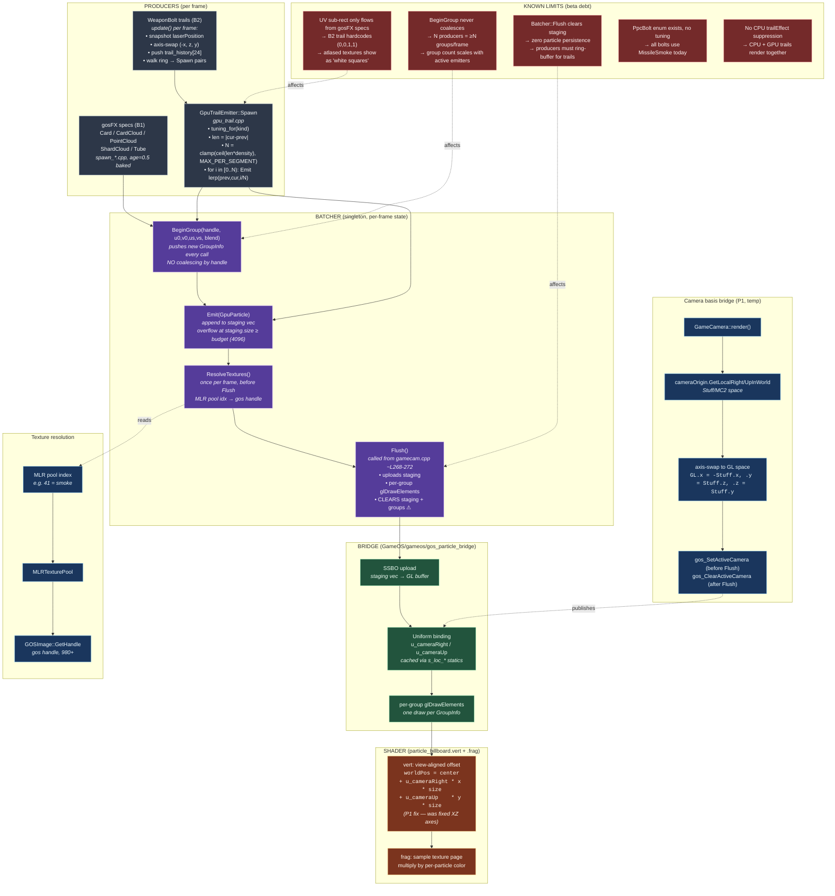

# FX Pipeline Map — GPU particle path (post-B2 beta)

> Branch: `claude/nifty-mendeleev` · Gate: `MC2_GPU_PARTICLES=1` (default OFF)
>
> Renders in any Mermaid-aware viewer (GitHub, VS Code with the Markdown Preview Mermaid extension, Obsidian, Typora). ASCII fallback below for terminal viewing.

---

## Mermaid — full pipeline



---

## Mermaid — focused B2 control flow (per-bolt, per-frame)

```mermaid
sequenceDiagram
    participant Bolt as WeaponBolt::update
    participant Ring as trail_history[24]
    participant Emit as GpuTrailEmitter::Spawn
    participant Bat as Batcher
    participant Br as gos_particle_bridge
    participant Sh as particle_billboard shader

    Bolt->>Bolt: laserPosition += laserVelocity·dt
    Bolt->>Bolt: swap = (-x, z, y) of laserPosition
    Bolt->>Ring: push swap at trail_head
    Bolt->>Ring: head = (head+1) % 24; count = min(count+1, 24)

    loop oldest → newest, count-1 pairs
        Bolt->>Emit: Spawn(MissileSmoke, prev_i, cur_i, dt)
        Emit->>Emit: len = |cur-prev|; gate len < ε
        Emit->>Emit: N = clamp(ceil(len * 2.0), MAX 32)
        Emit->>Bat: BeginGroup(handle=41, full UV, alpha)
        loop i in [0..N)
            Emit->>Bat: Emit(GpuParticle at lerp)
            Bat->>Bat: ++s_trail_spawn_total
        end
    end

    Note over Bolt: …other bolts repeat the dance…

    Note over Bat: GameCamera::render() runs ONCE
    Bat->>Bat: ResolveTextures (MLR→gos handles)
    Bat->>Br: Flush(staging, groups)
    Br->>Sh: SSBO upload + uniform bind
    Sh->>Sh: view-aligned worldPos + texture sample
    Bat->>Bat: staging.clear(); groups.clear()  ⚠ no persistence
```

---

## ASCII fallback (for terminal viewers)

```
                              FX PIPELINE (GPU path, MC2_GPU_PARTICLES=1)
                              ================================================

  PRODUCERS                              BATCHER                           BRIDGE / SHADER
  ---------                              -------                           ---------------

  gosFX specs (B1)
  ----------------
    Card          ─┐
    CardCloud     ─┤      spawn_card.cpp ─┐
    PointCloud    ─┤      spawn_*.cpp ────┤
    ShardCloud    ─┤      (1/frame per     │
    Tube          ─┘       effect, age=0.5)│
                                          │
                                          ▼
  WeaponBolt trails (B2)                ┌─────────────────────┐
  ---------------------                 │  Batcher (singleton)│
    WeaponBolt::update()                │  mclib/particles/   │
      ├─ snapshot laserPosition         │    batcher.{h,cpp}  │
      ├─ axis-swap (-x, z, y) ────────► │                     │
      ├─ push into trail_history[24]    │  • BeginGroup(      │
      └─ walk ring oldest→newest        │     handle,uvs,blend)│      ┌──────────────────────┐
         for each pair:                 │  • Emit(GpuParticle)│      │ gos_particle_bridge  │
           GpuTrailEmitter::Spawn ─────►│  • ResolveTextures()│─────►│ .{h,cpp}             │
              mclib/particles/          │     MLR pool → gos  │      │                      │
              gpu_trail.{h,cpp}         │     handle (one-shot│      │ • SSBO upload        │
                                        │     per handle)     │      │   (staging vec → GL) │
                                        │                     │      │ • per-group          │
                                        │  state per FRAME:   │      │   glDrawElements     │
                                        │   staging<GpuPart>  │      │ • g_active_camera    │
                                        │   groups<GroupInfo> │      │   (P1 bridge)        │
                                        │                     │      │ • s_loc_cameraRight/Up
                                        │  Flush() CLEARS     │      │   (cached uniforms)  │
                                        │  staging+groups     │      └──────────┬───────────┘
                                        │  every frame ◀── B2 │                 │
                                        │  bug source:        │                 ▼
                                        │  no persistence     │      ┌──────────────────────┐
                                        │                     │      │ shaders/             │
                                        │  budget = 4096      │      │  particle_billboard  │
                                        │  records / flush    │      │  .vert + .frag       │
                                        │                     │      │                      │
                                        └──────┬──────────────┘      │ vert:                │
                                               │                     │  worldPos = center   │
                                               │ called from         │   + u_cameraRight*x  │
                                               │ code/gamecam.cpp    │   + u_cameraUp*y     │
                                               │ ~L268-272 (between  │   (P1 — view-aligned)│
                                               │ renderLists() and   │                      │
                                               │ theClipper->Render) │ frag:                │
                                               │                     │  sample texture page │
                                               ▼                     │  multiply color/alpha│
                                        ┌─────────────────────┐      └──────────────────────┘
                                        │ Texture resolution  │
                                        │ ------------------- │      ┌──────────────────────┐
                                        │ MLR pool index      │      │ Camera basis bridge  │
                                        │  (small int, e.g.   │      │ (P1, temp)           │
                                        │   41 = smoke)       │      │                      │
                                        │      │              │      │ GameCamera::render() │
                                        │      ▼              │      │  ├─ get right/up via │
                                        │ MLRTexturePool ────►│      │  │  cameraOrigin.    │
                                        │ MLRTexture::GetImage│      │  │  GetLocalRight/Up │
                                        │      │              │      │  ├─ axis-swap to GL  │
                                        │      ▼              │      │  └─ gos_SetActiveCam │
                                        │ GOSImage::GetHandle │      │     before Flush     │
                                        │  (gos handle, 980+) │      │     gos_ClearActiveCam
                                        │  → stored in        │      │     after Flush      │
                                        │    GroupInfo.handle │      │                      │
                                        └─────────────────────┘      └──────────────────────┘
```

---

## Key call sites (worktree-relative)

| Where | What |
|---|---|
| `code/gamecam.cpp:268-272` | `Batcher::ResolveTextures()` + `Flush()` sandwich; camera basis set/clear wraps this |
| `code/weaponbolt.cpp:380` (update entry) | snapshot + ring push + Spawn loop (B2 hook) |
| `code/weaponbolt.cpp:1155` | `laserPosition += laserVelocity` — the real in-flight position (NOT `position`, which is launcher hotspot) |
| `code/weaponbolt.cpp:411-413` | gosFX axis swap pattern (source of truth; mirrored in trail push) |
| `code/weaponbolt.cpp:~2519` | `init()` — hardcoded `gpu_trail_kind = MissileSmoke` for every bolt (P3 will replace with INI table) |
| `mclib/particles/batcher.h:40` | `GroupInfo` struct (no `kind` field — P3 work adds it) |
| `mclib/particles/batcher.cpp:111` | `BeginGroup` — pushes new `GroupInfo` every call, no coalescing by handle |
| `mclib/particles/batcher.cpp:135` | `Emit` — overflow check at `staging.size >= budget` |
| `mclib/particles/batcher.cpp:155-200` | `ResolveTextures` — MLR handle → gos handle, one-shot per handle |
| `mclib/particles/batcher.cpp:204` | `Flush` — **clears staging + groups every frame** (root cause of "no persistence") |
| `mclib/particles/gpu_trail.cpp` | `GpuTrailEmitter::Spawn` + tuning table + `MC2_GPU_TRAIL_DISABLE` gate + `[B2 TRAIL_PROBE]` |
| `mclib/particles/spec.h:41` | `GpuParticle` 64-byte schema (static_asserts pin every offset) |
| `GameOS/gameos/gos_particle_bridge.cpp` | SSBO upload, draw loop, `g_active_camera` storage, cached uniform locations |
| `GameOS/gameos/utils/camera.cpp:110-115` | Where `cameraOrigin.GetLocalRight/UpInWorld` come from (extracted from `invView`) |
| `shaders/particle_billboard.vert` | View-aligned offset via `u_cameraRight/Up` (P1 fix) |
| `shaders/particle_billboard.frag` | Texture sample + per-particle color/alpha multiply |

---

## Env gates / probes (current truth)

| Var | Default | Effect |
|---|---|---|
| `MC2_GPU_PARTICLES` | OFF | Master gate for the entire GPU particle path |
| `MC2_GPU_PARTICLES_LOG` | OFF | `SPAWN_PROBE` / `RESOLVE_PROBE` + `[B2 TRAIL_PROBE]` (one-shot) |
| `MC2_GOSFX_GROUP_LOG` | OFF | Bridge UV dump + missing-texture errors + missing-camera-basis warning |
| `MC2_GPU_TRAIL_DISABLE` | OFF | Force-off B2 trail emitter while keeping rest of GPU path on |

| Counter | Source | Meaning |
|---|---|---|
| `emit_total` | Batcher (existing) | total Emit calls this run |
| `flush_total` | Batcher (existing) | total Flush calls this run |
| `nonempty_flush_total` | Batcher (existing) | flushes that actually drew |
| `records_per_flush_max` | Batcher (existing) | peak staging size; **= budget means saturation** |
| `trail_spawn` | gpu_trail.cpp (B2) | total trail particles emitted |
| `trail_head` | gpu_trail.cpp (B2) | total head sprites (0 for MissileSmoke, will fire for PpcBolt) |
| `event=overflow budget=4096 record dropped` | Batcher (existing) | budget hit; ANY producer's later Emits get dropped this frame |

---

## Known limits (beta debt, in priority order)

1. **No particle persistence in Batcher.** `Flush()` wipes staging every frame. Producers needing trails must ring-buffer positions themselves and re-stamp the full trail every frame. A real persistence substrate (age + despawn at lifetime) would retire every producer's ring buffer.
2. **No group coalescing by handle.** `BeginGroup` always pushes a new `GroupInfo`. With N active emitters using the same texture, you still get ≥N draw calls per frame.
3. **UV sub-rect is gosFX-spec-only.** B2 trail hardcodes `(0,0,1,1)` full page. If MLR handle 41 (smoke) is atlased, we sample the whole atlas — observed as "white-ish squares" instead of soft puffs.
4. **`PpcBolt` enum exists but no tuning, no head-sprite path, no INI mapping.** Every bolt today uses `MissileSmoke`.
5. **No CPU `trailEffect` suppression.** Both CPU gosFX trail AND GPU trail render in parallel (intentional through P3; P4 deferred).
6. **`g_active_camera` global is a stop-gap.** Future API form: `RenderFrameContext` passed into `Batcher::Flush`.

---

## Last-known smoke baseline

```
mc2_10, 40s, MC2_GPU_PARTICLES=1, MC2_GPU_PARTICLES_LOG=1, default tunings
PASS, 5471 frames @ 137 fps, 0 destroy delta
emit_total            =   926,304
trail_spawn           =   684,043
trail_head            =         0   (MissileSmoke has no head; PpcBolt will populate)
records_per_flush_max =     1,032   (well under 4096 budget)
event=overflow        =         0
groups=8 / draws=8 first flush (B1 baseline preserved)
```
