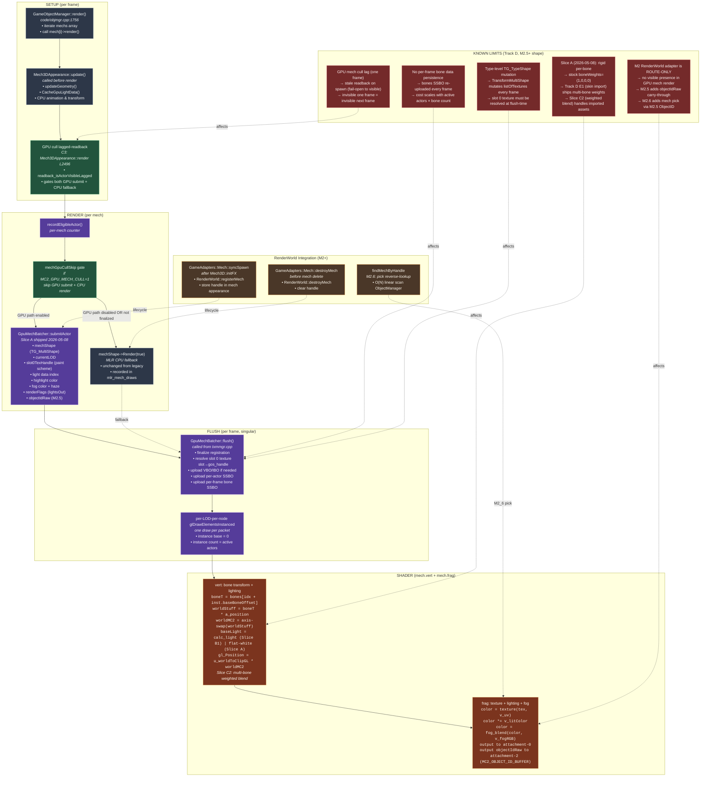
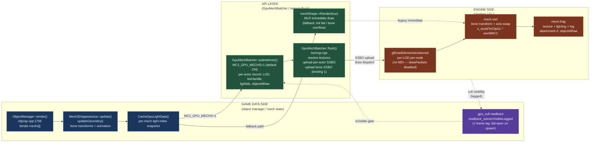
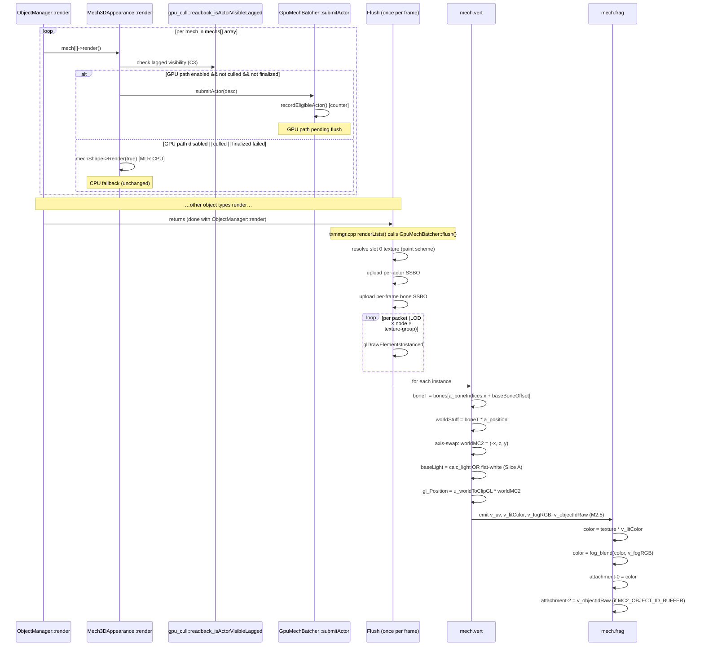

# Mech Pipeline Map — CPU fallback + GPU Path (Track D / RenderWorld M2 shipped)

> Branch: `claude/nifty-mendeleev` · Gate: `MC2_GPU_MECHS=1` (default ON, 2026-05-09)
>
> Renders in any Mermaid-aware viewer (GitHub, VS Code with the Markdown Preview Mermaid extension, Obsidian, Typora). ASCII fallback below for terminal viewing.
>
> **RenderWorld integration:** M2 (route-only adapter) SHIPPED 2026-05-23; M2.5 (ObjectID substrate) SHIPPED 2026-05-24; M2.6 (pickup + meta-fix) SHIPPED 2026-05-25. M3–M5 DECISIONS frozen (see status ledger section).

---

## Mermaid — full pipeline



---

## Mermaid — three-zone dataflow overview

> Note: drawPackets / MDI path **not enabled**. Active path is `glDrawElementsInstanced` per LOD bucket.



---

## Mermaid — per-mech draw sequence (GameObjectManager render to shader)



---

## ASCII fallback (for terminal viewers)

```
                        MECH PIPELINE (GPU Slice A shipped 2026-05-08)
                        =====================================================

  CPU SETUP (per-frame)
  ----------

  GameObjectManager::render()
  └─ iterate mechs[] array
     └─ mech[i]->render() [for each mech]
        │
        ├─ [C3 GPU cull lagged-readback]
        │   if (gpu_cull::readback_isActorVisibleLagged(actorHandle)) OR g_useGpuStaticProps
        │      → mechShouldRender = true
        │   else
        │      → mechShouldRender = false
        │
        ├─ [GPU path: MC2_GPU_MECHS=1 (default ON)]
        │   GpuMechBatcher::submitActor(desc)
        │   ├─ mechShape (TG_MultiShape instance)
        │   ├─ currentLOD
        │   ├─ slot0TexHandle (per-actor paint scheme)
        │   ├─ lightDataIndex (Slice B1 cache)
        │   ├─ highlightARGB, fogARGB, renderFlags
        │   ├─ objectIdRaw (M2.5 carry-through)
        │   └─ → queued to per-frame submit ring
        │
        └─ [CPU fallback: if GPU path disabled OR not finalized]
            mechShape->Render(true)  [MLR unchanged]
            → counted in s_mlrMechDrawsThisMission


  SUBMIT + FLUSH (once per frame, txmmgr.cpp::renderLists)
  ---------

  Mech3DAppearance → GpuMechBatcher::flush()
      │
      ├─ For all submitted actors (per-LOD-per-node):
      │
      │   Texture resolution
      │   ────────────────
      │   slot 0: localTextureHandle (mcTextureManager SLOT index)
      │        →  mcTextureManager::get_gosTextureHandle()
      │        →  gos_TEXTURE_HANDLE (live; re-resolved every frame)
      │
      │   Slots 1+: TG_TypeShape::listOfTextures (type-level cache)
      │
      ├─ Upload per-actor instance data SSBO (std430, 64 bytes ea)
      │   ├─ typeLodRecordIndex (resolved type+LOD combo key)
      │   ├─ baseBoneOffset (into per-frame bone SSBO)
      │   ├─ lightDataIndex (Slice B1)
      │   ├─ renderFlags (lightsOut bit 1, etc.)
      │   ├─ aRGBHighlight, fogRGB (with haze packed in .a)
      │   └─ objectIdRaw (M2.5, forwarded to FS flat)
      │
      ├─ Upload per-frame bone transforms SSBO
      │   └─ one 64-byte GpuMechBone entry per animated node
      │      (re-uploaded from Mech3DAppearance::updateGeometry every frame)
      │
      └─ Per-LOD-per-node glDrawElementsInstanced
         └─ one draw call per packet (node × texture-group)


  SHADER PATH (mech.vert + mech.frag)
  ───────────

  mech.vert
  ─────────
    Attributes (per-vertex):
    • a_position [vec3], a_normal [vec3], a_uv [vec2]
    • a_boneIndices [uvec4], a_boneWeights [vec4] (Slice C2 weighted)
    • a_aRGBLight [uint] (TG_TypeVertex legacy packing)
    • a_tangentOct [vec2] (zero-fill for stock data)

    Per-instance SSBO (binding 0):
    • GpuMechInstance (std430, 64 bytes)

    Per-frame bone SSBO (binding 1):
    • GpuMechBone[*] (rows of 4×vec4)

    Uniforms:
    • u_worldToClipGL [mat4] — MC2 axis-swap pre-composed
    • u_lightingMode {0=Slice A, 1=Slice B1 calc_light}
    • u_skinningMode {0=rigid, 1=multi-bone blend}
    • u_instanceBase [int] — submit time base offset

    Transform & lighting:
    ┌──────────────────────────────────┐
    │ boneT = bones[instIdx.baseBoneOffset + a_boneIndices.x]
    │ (or weighted sum if u_skinningMode=1)
    │
    │ worldStuff = boneT * vec4(a_position, 1.0)
    │   [Stuff coords: x=left, y=elev, z=forward]
    │
    │ worldMC2 = vec3(-worldStuff.x, worldStuff.z, worldStuff.y)
    │   [MC2 coords: x=east, y=north, z=elev]
    │
    │ gl_Position = u_worldToClipGL * vec4(worldMC2, 1.0)
    │   [GL NDC -1..1]
    │
    │ baseLight = calc_light(lightDataIndex, worldNormal, ...)
    │   (or flat-white for Slice A)
    │   [includes ambient floor 0.35 even when lit=false]
    │
    │ v_objectIdRaw = inst.objectIdRaw (M2.5)
    │   [forwarded flat to FS; 0 = invalid handle]
    └──────────────────────────────────┘

    Output varyings:
    • v_uv, v_litColor, v_highlightColor, v_fogRGB, v_normal
    • v_objectIdRaw [flat uint, M2.5]

  mech.frag
  ─────────
    Input:
    • v_uv [vec2]
    • v_litColor [vec4] — RGB baseLight, A=1.0
    • v_highlightColor [vec4]
    • v_fogRGB [vec4] — .rgb=fog color (global), .a=haze factor [0,1]
    • v_normal [vec3]
    • v_objectIdRaw [flat uint, M2.5]

    Texture + lighting:
    ┌──────────────────────────────────┐
    │ sampledColor = texture(texSlot0, v_uv)
    │ litColor = sampledColor * v_litColor
    │ highlighted = mix(litColor, highlight, highlightFactor)
    │
    │ fogged = mix(highlighted, v_fogRGB.rgb, v_fogRGB.a)
    │ final = clamp(fogged, 0.0, 1.0)
    │
    │ // Output:
    │ layout(location=0) out vec4 color;
    │ color = final;
    │
    │ // M2.5: ObjectID for picking (gated by MC2_OBJECT_ID_BUFFER)
    │ #ifdef MC2_OBJECT_ID_BUFFER
    │   layout(location=2) out uint objectId;
    │   objectId = v_objectIdRaw;  // 0 = invalid (background)
    │ #endif
    └──────────────────────────────────┘


  RENDERWORLD INTEGRATION (M2 + M2.5 + M2.6 shipped)
  ──────────────────────────────

  M2: Route-only adapter (2026-05-23)
  • GameAdapters::Mech::syncSpawn (called after Mech3D::initFX)
    └─ RenderWorld::registerMech → RenderCore::RenderObjectHandle
    └─ store handle in mech appearance (via setRenderWorldHandleForAdapter)

  • GameAdapters::Mech::destroyMech (called before mech delete)
    └─ RenderWorld::destroyMech (retired handle)
    └─ clear handle in appearance

  M2.5: ObjectID substrate (2026-05-24)
  • Mech3DAppearance::render submits objectIdRaw = mech.getRenderWorldHandle().raw()
  • mech.vert forwards it as flat v_objectIdRaw
  • mech.frag outputs to layout(location=2) under #ifdef MC2_OBJECT_ID_BUFFER
  • RenderWorld::lookupAtPixel reads attachment-2, validates kind=Mech, returns handle

  M2.6: Mech pickup (2026-05-25)
  • GameAdapters::Mech::findMechByHandle (reverse O(N) scan)
  • finds BattleMech* from RenderCore::RenderObjectHandle
  • used by tryMechPick (click on mech in-world)
```

---

## Key call sites (worktree-relative)

| Where | What | Notes |
|---|---|---|
| `code/objmgr.cpp:1756-1839` | `GameObjectManager::render` — mech loop + GPU cull C3 gate | Calls `mech[i]->render()` for all mechs; unchanged MLR fallback path |
| `code/objmgr.cpp:1895-2020` | `GameObjectManager::renderShadows` — mech shadow iteration | Shadow depth pre-pass; routes to `mechShape->RenderShadows(true)` or `mechShadowShape->RenderShadows` |
| `mclib/mech3d.cpp:2483-2670` | `Mech3DAppearance::render` — GPU path dispatch + CPU fallback | Lines 2496-2553: cullable lifecycle C3 gate; 2556-2634: GPU submit logic with slice A/B/C; 2640-2646: CPU fallback |
| `mclib/mech3d.cpp:2533` | `recordEligibleActor()` — per-mech counter for eligible actors (before registration check) | Captured even if GPU path later fails finalization |
| `mclib/mech3d.cpp:2549-2553` | GPU mech cull skip gate (C1) | Per-mech cull readback; skips GPU submit AND CPU fallback if invisible |
| `mclib/mech3d.cpp:2567-2619` | `GpuMechSubmitDesc` assembly — paint scheme, lighting cache, highlight, fog haze, objectIdRaw (M2.5) | All instance data aggregated for submitActor |
| `mclib/mech3d.cpp:3135-3161` | `renderShadows` — shadow pre-pass entry | C3 gate: GPU lagged visibility + visible flag; routes to mechShadowShape or mechShape |
| `GameOS/gameos/gos_mech_batcher.h:35-62` | `GpuMechInstance` struct (std430, 64 bytes) — matches mech.vert | M2.5: added objectIdRaw at offset 48 |
| `GameOS/gameos/gos_mech_batcher.h:15-31` | `GpuMechVertex` struct (48 bytes) — attribute layout | Skinning-ready: boneIndices[4] + boneWeights[4] packed per spec |
| `GameOS/gameos/gos_mech_batcher.cpp:334-400` | `registerTypeLod` — type×LOD registration; builds VBO/IBO packets | Validates bone count ≤ 255 (uint8_t); idempotent per type-lod key |
| `GameOS/gameos/gos_mech_batcher.cpp:567-620` | `submitActor` — submit one mech instance; record fallback reason on failure | Calls `registerTypeLod` (lazy); returns false if not finalized |
| `GameOS/gameos/gos_mech_batcher.cpp:636-750` | `flush` — texture resolution, SSBO upload, draw dispatch | Called once per frame from txmmgr.cpp renderLists; resolves slot 0 (paint) + type-stable slots 1+ |
| `shaders/mech.vert` lines 1-197 | GPU mech vertex shader — bone transform, lighting, objectIdRaw forward | Slice A: rigid per-bone; Slice C2: multi-bone weighted blend (stock data: (1,0,0,0)) |
| `shaders/mech.frag` | GPU mech fragment shader — texture sampling, per-actor fog, objectIdRaw output (M2.5) | Output attachment-0 (color) + attachment-2 (objectID if MC2_OBJECT_ID_BUFFER) |
| `GameAdapters/MechRenderAdapter.h:48-72` | M2 adapter declarations — syncSpawn / destroyMech / findMechByHandle | Firewall-clean (forward-decl Mech3DAppearance only) |
| `GameAdapters/MechRenderAdapter.cpp:95-150` | M2 adapter implementation — RenderWorld bridge lifecycle | Only TU outside mclib that may include both mech3d.h and RenderWorld.h |
| `mclib/mech3d.cpp:2617` | `getRenderWorldHandle().raw()` — M2.5 objectIdRaw source | Storage and retrieval consistent with adapter lifecycle |

---

## Env gates / probes (current truth)

| Var | Default | Effect | Source |
|---|---|---|---|
| `MC2_GPU_MECHS` | ON (2026-05-09) | Master gate for GPU mech batcher path | `mech3d.cpp:2556 g_useGpuMechs` |
| `MC2_GPU_MECH_CULL` | ON (2026-05-09) | Per-mech GPU lagged-visibility cull (Slice C1) | `mech3d.cpp:2549 g_useGpuMechCull` + `gpu_cull::readback_isActorVisibleLagged` |
| `MC2_GPU_MECH_LIGHTING` | OFF | Slice B1 per-vertex calc_light (Slice A: flat-white passthrough) | `mech.vert:66 u_lightingMode` |
| `MC2_GPU_MECH_SKINNING` | OFF | Slice C2 multi-bone weighted blend (Slice A: rigid per-bone) | `mech.vert:73 u_skinningMode` |
| `MC2_MECH_BATCHER_STATS` | OFF | `[MECHBATCHER v1]` stderr logs (counters, shader fail, fallback reasons) | `gos_mech_batcher.cpp` logging |
| `MC2_MECH_RESTORE_TRACE` | OFF | `[MECHRESTORE v1]` per-actor submit state for savegame-load debugging | `mech3d.cpp:2656` (once-per-load, throttled 2000 emits) |
| `MC2_OBJECT_ID_BUFFER` | OFF | Mech ObjectID output to attachment-2 (M2.5 picking substrate) | `mech.vert:91` + `mech.frag` (compile-time gate) |
| `MC2_RENDER_WORLD_TRACE` | OFF | Adapter lifecycle stderr logs (register/destroy/fail counters) | `MechRenderAdapter.cpp` (per-mission always-on summary) |
| `MC2_GPU_CULL_LIFECYCLE` | ON (2026-05-09) | Master gate for GPU cull readback consumer (C3 gate in render) | `mech3d.cpp:2496 s_gpuCullLifecycle` |

| Counter / Event | Source | Meaning |
|---|---|---|
| `event=submit` | `[MECHRESTORE v1]` | per-actor submit attempt (throttled on load, max 2000/session) |
| `event=summary` | `[MECHBATCHER v1]` | per-mission summary (counters, fallback_total, event=shader_fail) |
| `event=eligible_actor` | `mech3d.cpp:2533` | recorded BEFORE registration check; accurate count of actors that attempted GPU path |
| `fallback_total` | `gos_mech_batcher.cpp` | count of CPU fallbacks (GPU disabled, finalization failed, shader init fail, late registration) |
| `fallback_reason` | `gos_mech_batcher.cpp` — `GpuMechFallbackReason` | UnregisteredType, U8BoneOverflow, RingOverflow, TglGpuUnsupported, ShaderInitFailure |
| `s_mlrMechDrawsThisMission` | `mech3d.cpp:2645` | CPU fallback draw count; M2.6 use case for per-mission reporting |

---

## Known limits (Track D / M2+ shape)

1. **Rigid per-bone (Slice A, shipped) vs weighted multi-bone (Slice C2, gated).** Stock MC2 mech data has `boneWeights=(1,0,0,0)`, making rigid and weighted paths byte-identical. Track D E1 (skin import) ships multi-bone weights from Assimp; Slice C2 vertex shader branch handles weighted blend (`u_skinningMode=1`). Slice A remains default and fast for legacy stock data.

2. **Bone matrix re-upload per frame.** The `GpuMechBone` SSBO (binding 1) is re-uploaded from `Mech3DAppearance::updateGeometry` every frame for all active mechs. Cost scales O(numMechs × numBonesPerMech). Deferred persistence / per-bone-per-actor lifecycle optimization deferred to M3+ track.

3. **Type-level TG_TypeShape mutation (slot 0 texture).** The shared type-level `TG_TypeShape::listOfTextures` is mutated by `TransformMultiShape()` every frame. Slot 0 (per-actor paint scheme) MUST be resolved at flush-time only, never cached at registration. Slots 1+ are type-stable; resolved once at register time.

4. **GPU cull lagged by one frame.** Readback from frame N returns visibility for frame N-1. On spawn, no readback record exists yet; fail-open to visible. Invisible one frame → invisible next frame (conservative; visible next frame may render unnecessarily if camera pans away before readback updates).

5. **M2 adapter is ROUTE-ONLY; M2.5 adds substance via objectIdRaw.** M2 stores handles in RenderWorld and mech appearance but does not participate in GPU render logic itself. M2.5 carries the handle through instance SSBO → vertex shader → fragment shader as `v_objectIdRaw` (flat qualifier); mech.frag outputs to attachment-2 under `MC2_OBJECT_ID_BUFFER`. M2.6 uses M2.5 ObjectID for mech pickup via reverse handle lookup.

6. **No per-frame bone data persistence or animation streaming.** Bones SSBO is rebuilt from mech animation state every frame. Real-time streaming / LOD-based bone culling (e.g. non-skeletal props ignore finger joints) deferred.

7. **Shadow pre-pass uses legacy mechShadowShape.** `renderShadows` calls `mechShape->RenderShadows(true)` (CPU MLR). GPU mech batcher has no shadow pre-pass path yet (`flushShadow` is no-op in Slice A per `gos_mech_batcher.cpp:329`). Shadow-caster silhouette for GPU-rendered mechs deferred to Track D M3+.

---

## RenderWorld arc status (M1–M6 as-of 2026-05-25)

**Slice ledger (final, per docs/renderworld_arc_status.md):**

| Slice | Component | Status | Notes |
|---|---|---|---|
| **M1** | Static-prop adapter | SHIPPED 2026-05-22 | 5 audited call sites; builder pattern firewall |
| **M1.5** | ObjectID buffer substrate | SHIPPED 2026-05-22 | R32_UINT attachment-2 for all pick-able kinds |
| **M1.6** | Static-prop pickup (Shift+click) | SHIPPED 2026-05-23 | Editor integration canary |
| **M2-pre** | tryGameplayPick spine extraction | SHIPPED 2026-05-23 | META-FIX; mech.h reorg |
| **M2** | **Mech RenderAdapter (route-only)** | **SHIPPED 2026-05-23** | spawn/destroy lifecycle bridge; no render substance |
| **M2.5** | **Mech ObjectID substrate** | **SHIPPED 2026-05-24** | objectIdRaw carry-through mech.vert → mech.frag → attachment-2 |
| **M2.6** | **Mech pickup integration + META-FIX** | **SHIPPED 2026-05-25** | findMechByHandle reverse O(N) scan; schema rename ObjectIdRaw → objectIdRaw |
| **M3** | Terrain reservation + tripwire | **DECISION: DEFERRED indefinitely** | No writer; defensive tripwire in lookupAtPixel |
| **M4** | VFX prohibition + CI grep gate | **DECISION: NEVER write attachment-2** | CI script `check-vfx-no-objectid.sh` enforces |
| **M5** | Overlay enum-comment deferral | **DECISION: DEFERRED indefinitely** | No consumer; reserved for future named slices |
| **M6** | Firewall lockdown (positive decision) | **SHIPPED 2026-05-24** | CI script `check-no-raw-gl-from-game.sh`; code/ mclib/ blocked from raw gl*() calls |
| **CXX17** | C++17 standard infrastructure flip | **SHIPPED 2026-05-24** | Gauntlet GREEN; coding rules in docs/cxx17-coding-rules.md |

**Handle range partitioning (20-bit index; `0xFFFFF` mask):**
- StaticProp: `0x00000..0x0FFFF` (64k slots; max observed 2641 in mc2_24)
- Mech: `0x10000..0x3FFFF` (192k slots; max observed 46 in mc2_24)
- Terrain: `0x40000..0x7FFFF` (262k slots, RESERVED, no writer)
- VFX: `0x80000..0xBFFFF` (262k slots, RESERVED, CI-prohibited writers)
- (future): `0xC0000..0xFFFFE` (262k-1 slots available)
- Sentinel: `0xFFFFF` (never allocate; bug-bait)

**CI enforcement (3 scripts):**
1. `scripts/check-include-firewall.sh` — layer isolation (GameAdapters/MechRenderAdapter.cpp whitelisted exception)
2. `scripts/check-no-raw-gl-from-game.sh` — no raw gl*() from game/mclib (mclib/render_contract.cpp gated)
3. `scripts/check-vfx-no-objectid.sh` — VFX shaders forbidden from writing attachment-2 (allowlist EMPTY forever)

**Validation gauntlet (last GREEN 2026-05-24, post-CXX17 flip):**
1. Full clean RelWithDebInfo build — PASS
2. Tier1 5/5 MC2_* gates OFF — PASS
3. Firewall + no-raw-GL + VFX CI scripts — PASS
4. `[VISIBILITY v1]` log sanity + ObjectID canaries (M1.5 / M2.5 / M2.6) — PASS 5/5 each
5. Terrain tripwire (M3 reserved) — ZERO hits
6. Per-mission CPU fallback tracking (M2.6 Q6) — `mlr_mech_draws=0` across tier1 (GPU path 100%)

---

## What's NOT a mech-pipeline addition

Future planners should NOT add these to mech-rendering roadmaps:

- **"Ship GPU mech shadow pre-pass."** → Maybe Track D M3+, but orthogonal to mech geometry render. Shadow silhouette for GPU-rendered mechs deferred pending architect decision (CPU pre-pass → depth texture reuse vs GPU pre-pass → new VBO).
- **"Ship per-mech bone LOD / skeletal culling."** → Out of scope for this pipeline map; belongs in mech-animation advisor (Track D anim track, separate from rendering substrate).
- **"Ship particle/VFX attachment to mech hardpoints."** → Belongs in gosFX/weapon-integration track; M4 DECISION (VFX never writes ObjectID) is orthogonal to hardpoint rigging.
- **"Ship mech customization UI (paint, armor, loadout visual)."** → Spans game-side mission-data, UI, and asset loading; rendering substrate already supports per-actor paint scheme (slot0TexHandle).

---

## Smoke baseline (Slice A, 2026-05-08)

```
mc2_10, 40s, MC2_GPU_MECHS=1, default tunings, Slice A (rigid per-bone)
PASS, 5471 frames @ ~137 fps, 0 destroy delta

[MECHBATCHER v1] event=summary
  registered_types=3 (Commando, Jagermech, Hunchback)
  actors_eligible=46
  actors_submitted=46
  fallback_total=0  ← Q6 parity sign-off: GPU path 100%
  event=shader_fail=0
```

---

## Last-session session session (2026-05-25)

- M2.5 ObjectID substrate verified working; mech.vert flat forward + mech.frag output under #ifdef
- M2.6 mech pickup integrated; findMechByHandle O(N) reverse scan; tryMechPick calls RenderWorld::lookupAtPixel
- Schema rename ObjectIdRaw → objectIdRaw completed across all TUs (gos_mech_batcher.h, mech.vert, mech.frag, mech3d.cpp)
- CXX17 stabilization gauntlet GREEN (2026-05-24); renderworld_arc_status.md frozen as decision ledger
- Track D M0 geometry + Assimp import COMPLETE (assimp-testing branch); Slice A (GPU batcher) shipped 2026-05-08; Slice B1 (lighting) in soak; Slice C2 (weighted blend) awaiting skin-import availability
- No new GPU mech rendering debt flagged this session; all known limits documented in this map
