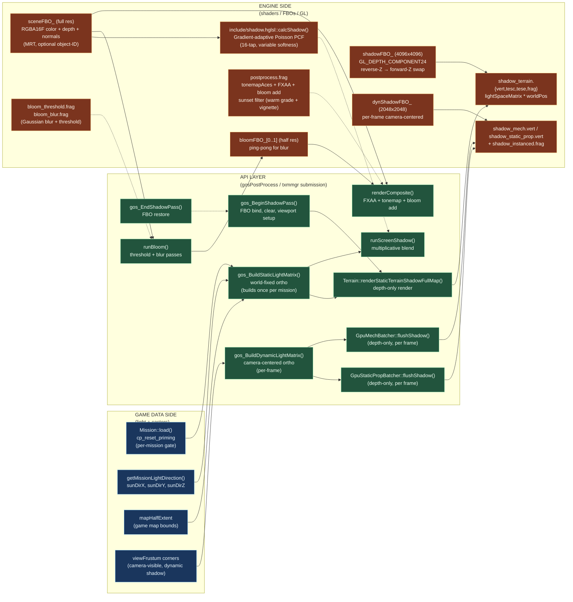

# Shadow & Post-Process Pipeline Map — static + dynamic depth + bloom + composite

> Branch: `claude/nifty-mendeleev` · Gates: `MC2_SHADOW=1` (default ON), `MC2_GPU_DRIVEN` (default ON for mechs/static props), bloom/FXAA/tonemap toggles per-runtime
>
> Renders in any Mermaid-aware viewer (GitHub, VS Code with the Markdown Preview Mermaid extension, Obsidian, Typora). ASCII fallback below for terminal viewing.

---

## Mermaid — three-zone dataflow overview



---

## Full Pipeline Diagram

```mermaid
flowchart TD
    classDef producer fill:#2d3748,stroke:#a0aec0,color:#f7fafc
    classDef gatecheck fill:#553c9a,stroke:#d6bcfa,color:#faf5ff
    classDef beginend fill:#744210,stroke:#f6ad55,color:#fffaf0
    classDef dispatchfx fill:#1e3a1f,stroke:#7ed321,color:#f0fdf4
    classDef fbobind fill:#22543d,stroke:#9ae6b4,color:#f0fff4
    classDef shaderdraw fill:#7b341e,stroke:#fbd38d,color:#fffaf0
    classDef compute fill:#5a1a4a,stroke:#c084fc,color:#faf5ff
    classDef composite fill:#663399,stroke:#d6bcfa,color:#faf5ff

    subgraph MISSION_INIT["MISSION INIT (code/mission.cpp:2836)"]
        direction LR
        MI0["cp_reset_priming event"]:::producer
        MI1["gos_ResetStaticShadowPriming()"]:::producer
        MI2["resetStaticLightMatrix flag = false"]:::producer
        MI0 --> MI1 --> MI2
    end

    subgraph FRAME_PRE["FRAME PRE-RENDER (txmmgr.cpp renderLists ~L1920)"]
        direction LR
        FP0["gos_IsTerrainTessellationActive?"]:::gatecheck
        FP1["gos_BuildStaticLightMatrix()\n(if not yet built this mission)"]:::producer
        FP2["Ortho fit: 8 corner -> mapHalfExtent\nLight position at (-fx*r, -fy*r, -fz*r)\nwhere r = mapHalfExtent * sqrt(2) * 1.05"]:::producer
        FP3["staticLightMatrixBuilt_ = true"]:::producer
        FP0 --> FP1 --> FP2 --> FP3
    end

    subgraph STATIC_SHADOW["STATIC SHADOW PASS (txmmgr.cpp ~L1936-1938)"]
        direction TB
        SS0["gos_BeginShadowPass()"]:::beginend
        SS1["glBindFramebuffer(shadowFBO_)"]:::fbobind
        SS2["glViewport(0, 0, 4096, 4096)"]:::fbobind
        SS3["glClearDepth(1.0f)<br/>glClear(GL_DEPTH_BUFFER_BIT)\n[reverse-Z gate: restore 0.0f after]"]:::fbobind
        SS4["glEnable(GL_POLYGON_OFFSET_FILL)<br/>glPolygonOffset(2.0f, 4.0f)\n[shadow acne mitigation]"]:::fbobind
        SS5["glColorMask(FALSE, FALSE, FALSE, FALSE)\n[depth-only]"]:::fbobind
        SS6["glDisable(GL_CULL_FACE)\n[both faces write]"]:::fbobind
        SS7["Terrain::renderStaticTerrainShadowFullMap()<br/>(shadow_terrain.vert/tesc/tese/frag)"]:::shaderdraw
        SS8["gos_EndShadowPass()"]:::beginend
        SS9["glBindFramebuffer(sceneFBO_)<br/>glViewport(restored)"]:::fbobind

        SS0 --> SS1 --> SS2 --> SS3 --> SS4 --> SS5 --> SS6 --> SS7 --> SS8 --> SS9
    end

    subgraph DYNAMIC_SHADOW_SETUP["DYNAMIC SHADOW SETUP (txmmgr.cpp ~L1945-1987)"]
        direction TB
        DS0["gos_GetTerrainLightDir(&lx, &ly, &lz)"]:::producer
        DS1["Unproject 8 NDC corners through clipToWorld"]:::producer
        DS2["Perspective-divide & swizzle<br/>Stuff→MC2: (-x, z, y)"]:::producer
        DS3["gos_BuildDynamicLightMatrix(-lx, -ly, -lz, cornersMC2)"]:::producer
        DS4["Ortho fit to frustum corners<br/>(camera-centered, per-frame)"]:::producer
        DS5["gos_BeginDynamicShadowPass()"]:::beginend
        DS6["glBindFramebuffer(dynShadowFBO_)\n[2048x2048]"]:::fbobind
        DS7["GpuStaticPropBatcher::flushShadow()<br/>(shadow_static_prop.vert + shadow_instanced.frag)"]:::shaderdraw
        DS8["GpuMechBatcher::flushShadow()<br/>(shadow_mech.vert + shadow_instanced.frag)"]:::shaderdraw
        DS9["gos_EndDynamicShadowPass()"]:::beginend

        DS0 --> DS1 --> DS2 --> DS3 --> DS4 --> DS5 --> DS6 --> DS7 --> DS8 --> DS9
    end

    subgraph SCENE_RENDER["SCENE RENDER (post-shadow)"]
        direction TB
        SR0["gos_BeginScene()"]:::beginend
        SR1["glBindFramebuffer(sceneFBO_)"]:::fbobind
        SR2["MRT bind: COLOR0 + COLOR1 [+ COLOR2 if MC2_OBJECT_ID_BUFFER]"]:::fbobind
        SR3["clearGBuffer1() sentinel"]:::producer
        SR4["Terrain draw (solid + alpha)"]:::shaderdraw
        SR5["Static prop draw (GPU-batched)"]:::shaderdraw
        SR6["Mech draw (GPU-batched)"]:::shaderdraw
        SR7["gos_EndScene()"]:::beginend

        SR0 --> SR1 --> SR2 --> SR3 --> SR4 --> SR5 --> SR6 --> SR7
    end

    subgraph SHADOW_CALC["SHADOW SAMPLING (shader include/shadow.hglsl)"]
        direction TB
        SC0["calcShadow(worldPos, normal, lightDir, numTaps)"]:::shaderdraw
        SC1["if enableShadows=0: return 1.0"]:::gatecheck
        SC2["lsPos = lightSpaceMatrix * vec4(worldPos, 1)\n[world → light-space]"]:::compute
        SC3["projCoords = lsPos.xyz / lsPos.w"]:::compute
        SC4["projCoords.xy = projCoords.xy * 0.5 + 0.5\n[NDC → [0,1]]"]:::compute
        SC5["Bounds check: outside map → return 1.0"]:::gatecheck
        SC6["NdotL back-face guard (< 0.05 → return 1.0)"]:::gatecheck
        SC7["Slope-dependent bias:\nbias = max(0.005 * (1-NdotL), 0.002)"]:::compute
        SC8["Per-pixel rotation (stratified sampling)\nangle from worldPos hash"]:::compute
        SC9["Gradient-adaptive scale:\ndepthGradient = |dFdx,dFdy(z)|\nhardness = clamp(grad*180, 0, 1)\nadaptiveScale = mix(3.2, 0.8, hardness)\n[cliffs → tight, flat → wide]"]:::compute
        SC10["Poisson disk loop (1..16 taps)\noffset = rot * poissonDisk[i] * radius * texelSize\nshadow += texture(shadowMap, vec3(projCoords.xy+offset, currentDepth))"]:::compute
        SC11["shadow /= float(taps)"]:::compute
        SC12["return mix(0.4, 1.0, shadow)\n[0.4 = full shadow, 1.0 = lit]"]:::compute

        SC0 --> SC1 --> SC2 --> SC3 --> SC4 --> SC5 --> SC6 --> SC7 --> SC8 --> SC9 --> SC10 --> SC11 --> SC12
    end

    subgraph BLOOM_PASS["BLOOM PASS (runBloom) ~L503"]
        direction TB
        BL0["if !bloomEnabled_: return"]:::gatecheck
        BL1["glDisable(GL_DEPTH_TEST)"]:::fbobind
        BL2["PASS 1: Threshold\nglBindFramebuffer(bloomFBO_[0])\nglViewport(0, 0, halfW, halfH)\nglClear(GL_COLOR_BUFFER_BIT)"]:::fbobind
        BL3["bloom_threshold.frag:\nbrightness = dot(color, luma weights)\nif brightness > threshold: output color\nelse: output 0"]:::shaderdraw
        BL4["PASS 2+: Ping-pong Gaussian Blur\n(4 passes, 2 iterations)\nhorizontal then vertical"]:::shaderdraw
        BL5["bloom_blur.frag:\nwidth=5 weights [0.227, 0.195, 0.122, 0.054, 0.016]\nresult = center*w[0] + offsets*w[1..4]"]:::shaderdraw
        BL6["Result in bloomColorTex_[0]"]:::producer

        BL0 --> BL1 --> BL2 --> BL3 --> BL4 --> BL5 --> BL6
    end

    subgraph SCREEN_SHADOW["SCREEN SHADOW PASS (runScreenShadow) ~L572"]
        direction TB
        SS0["if !screenShadowEnabled_ || !sceneHasTerrain_: return"]:::gatecheck
        SS1["glBindFramebuffer(sceneFBO_)\nsetSceneDrawBuffers(SingleColor)"]:::fbobind
        SS2["Multiplicative blend: GL_BLEND<br/>glBlendFunc(GL_DST_COLOR, GL_ZERO)"]:::fbobind
        SS3["Bind textures:\nsceneDepthTex(0), sceneNormalTex(1),\nshadowMap(2), dynamicShadowMap(3)"]:::fbobind
        SS4["shadow_screen.frag:\nRebuild world position from depth\nCall calcShadow() and calcDynamicShadow()\nApply multiplicative (darkening)"]:::shaderdraw
        SS5["Result: sceneColorTex_ *= shadow"]:::producer

        SS0 --> SS1 --> SS2 --> SS3 --> SS4 --> SS5
    end

    subgraph COMPOSITE["COMPOSITE PASS (renderComposite) ~L690"]
        direction TB
        CO0["glBindFramebuffer(0) [backbuffer]"]:::fbobind
        CO1["postprocess.frag main:"]:::shaderdraw
        CO2["if enableFXAA: applyFXAA_LDR()\nelse: tonemapSample(sceneTex)"]:::compute
        CO3["if enableTonemap: color = ACESFilm(color * exposure)"]:::compute
        CO4["if enableBloom: color += bloomTex * bloomIntensity"]:::compute
        CO5["Sunset filter (unconditional):\nwarm push + highlight/shadow grade\nradial vignette + top-of-screen warmth"]:::compute
        CO6["Output: FragColor = vec4(color, 1.0)"]:::producer

        CO0 --> CO1 --> CO2 --> CO3 --> CO4 --> CO5 --> CO6
    end

    subgraph FBO_DETAIL["FBO DETAIL (gos_postprocess.cpp ~L281-368)"]
        direction TB
        FB0["Scene FBO (full res):"]:::fbobind
        FB1["COLOR_ATTACHMENT0: RGBA16F (sceneColorTex_)"]:::fbobind
        FB2["DEPTH_STENCIL: DEPTH24_STENCIL8 (sceneDepthTex_)"]:::fbobind
        FB3["COLOR_ATTACHMENT1: RGBA16F (sceneNormalTex_)\n[world normal + shadow skip flag]"]:::fbobind
        FB4["COLOR_ATTACHMENT2 (if MC2_OBJECT_ID_BUFFER): R32UI"]:::fbobind
        FB5["Shadow FBO:"]:::fbobind
        FB6["DEPTH_ATTACHMENT: DEPTH_COMPONENT24 (4096x4096)"]:::fbobind
        FB7["Dummy COLOR_ATTACHMENT0: R8 (AMD rasterization gate)"]:::fbobind
        FB8["Dynamic Shadow FBO:"]:::fbobind
        FB9["DEPTH_ATTACHMENT: DEPTH_COMPONENT24 (2048x2048)"]:::fbobind
        FB10["Bloom FBO ping-pong (half res):"]:::fbobind
        FB11["bloomFBO_[0..1]: RGBA16F"]:::fbobind

        FB0 --> FB1 --> FB2 --> FB3 --> FB4
        FB5 --> FB6 --> FB7
        FB8 --> FB9
        FB10 --> FB11
    end

    subgraph DEPTH_NOTES["DEPTH STATE NOTES"]
        direction TB
        DN0["Scene render: glClearDepth(0.0f) [reverse-Z]"]:::producer
        DN1["Shadow passes: glClearDepth(1.0f) [forward-Z]"]:::producer
        DN2["Light-space: ZERO_TO_ONE (no [-1,1] remap)"]:::producer
        DN3["Comparison mode: GL_TEXTURE_COMPARE_FUNC = GL_LEQUAL"]:::producer
        DN4["Border color: 1.0 (outside = fully lit)"]:::producer

        DN0 --> DN1 --> DN2 --> DN3 --> DN4
    end

    MISSION_INIT --> FRAME_PRE
    FRAME_PRE --> STATIC_SHADOW
    STATIC_SHADOW --> DYNAMIC_SHADOW_SETUP
    DYNAMIC_SHADOW_SETUP --> SCENE_RENDER
    SCENE_RENDER --> SHADOW_CALC
    SHADOW_CALC --> BLOOM_PASS
    BLOOM_PASS --> SCREEN_SHADOW
    SCREEN_SHADOW --> COMPOSITE

    SHADOW_CALC -.-> SC0
    BLOOM_PASS -.-> BL3
    SCREEN_SHADOW -.-> SS4
    COMPOSITE -.-> CO1

    FB0 -.-> STATIC_SHADOW
    FB5 -.-> DYNAMIC_SHADOW_SETUP
    FB0 -.-> SCENE_RENDER
    FB10 -.-> BLOOM_PASS
    FB0 -.-> SCREEN_SHADOW
```



---

## ASCII Summary (terminal-friendly)

```
FRAME RENDER ORDER:
====================

1. MISSION INIT (per-mission, once)
   └─ gos_ResetStaticShadowPriming() [cp_reset_priming event]

2. FRAME EARLY (txmmgr.cpp renderLists ~L1920)
   ├─ gos_BuildStaticLightMatrix (if not yet built)
   │  └─ Ortho: 8 corners -> mapHalfExtent
   │     Light pos: (-fx*r, -fy*r, -fz*r), r = mapHalfExtent*sqrt(2)*1.05
   └─ Matrix cached in staticLightSpaceMatrix_[16]

3. STATIC SHADOW PASS (txmmgr.cpp ~L1936-1938)
   ├─ gos_BeginShadowPass()
   │  ├─ FBO: shadowFBO_ (4096x4096 DEPTH24)
   │  ├─ Viewport: (0,0) to (4096,4096)
   │  ├─ Depth clear: 1.0f [reverse-Z → forward-Z swap]
   │  └─ Polygon offset: 2.0f, 4.0f [shadow acne]
   ├─ Terrain::renderStaticTerrainShadowFullMap()
   │  └─ Shader: shadow_terrain.{vert,tesc,tese,frag}
   │     Transform: lightSpaceMatrix * worldPos
   └─ gos_EndShadowPass() [restore FBO, viewport, depth to 0.0f]

4. DYNAMIC SHADOW SETUP (txmmgr.cpp ~L1945-1987)
   ├─ Unproject 8 NDC corners -> camera frustum
   ├─ Swizzle Stuff→MC2: (-x, z, y)
   ├─ gos_BuildDynamicLightMatrix(lx, ly, lz, corners)
   │  └─ Ortho fit to camera-visible objects only
   ├─ gos_BeginDynamicShadowPass()
   │  ├─ FBO: dynShadowFBO_ (2048x2048 DEPTH24)
   │  └─ Depth clear: 1.0f
   ├─ GpuStaticPropBatcher::flushShadow()
   │  └─ Shader: shadow_static_prop.vert + shadow_instanced.frag
   ├─ GpuMechBatcher::flushShadow()
   │  └─ Shader: shadow_mech.vert + shadow_instanced.frag
   └─ gos_EndDynamicShadowPass()

5. SCENE RENDER (post-shadow, main view)
   ├─ gos_BeginScene()
   │  ├─ FBO: sceneFBO_ (full resolution)
   │  ├─ MRT: COLOR0 (RGBA16F color)
   │  │         COLOR1 (RGBA16F normal)
   │  │         COLOR2 (R32UI object-ID, if MC2_OBJECT_ID_BUFFER)
   │  └─ Depth: DEPTH24_STENCIL8 (sampleable)
   ├─ clearGBuffer1() [sentinel normal (0.5,0.5,1.0,0) for screen-shadow skip]
   ├─ Terrain draw (DRAWSOLID)
   │  └─ Texture: shadow_terrain.frag calls calcShadow() -> shadowMap
   ├─ Static prop draw (GPU-batched)
   │  └─ Texture: gos_terrain.frag + shadow sampling
   ├─ Mech draw (GPU-batched)
   │  └─ Texture: gos_terrain.frag + shadow sampling
   └─ gos_EndScene()

6. BLOOM PASS (runBloom ~L503)
   ├─ Pass 1: Threshold
   │  └─ FBO: bloomFBO_[0] (half res, RGBA16F)
   │     Shader: bloom_threshold.frag
   │     brightness = dot(color, [0.2126, 0.7152, 0.0722])
   │     output: color if brightness > threshold else 0
   │
   ├─ Passes 2-5: Ping-pong Gaussian blur
   │  ├─ bloomFBO_[0] <- horizontal blur from bloomColorTex_[1]
   │  ├─ bloomFBO_[1] <- vertical blur from bloomColorTex_[0]
   │  ├─ bloomFBO_[0] <- horizontal blur from bloomColorTex_[1]
   │  └─ bloomFBO_[1] <- vertical blur from bloomColorTex_[0]
   │     Kernel: [0.227, 0.195, 0.122, 0.054, 0.016] (Gaussian)
   │     Result: bloomColorTex_[0]
   └─ Shader: bloom_blur.frag

7. SCREEN SHADOW PASS (runScreenShadow ~L572) [optional, multiplicative]
   ├─ FBO: sceneFBO_ (color-only, no normal write)
   ├─ Blend: GL_BLEND, glBlendFunc(GL_DST_COLOR, GL_ZERO) [darken]
   ├─ Bind: sceneDepthTex(0), sceneNormalTex(1), shadowMap(2), dynShadowMap(3)
   ├─ Shader: shadow_screen.frag
   │  ├─ Reconstruct worldPos from sceneDepthTex
   │  ├─ Fetch normal from sceneNormalTex
   │  ├─ Call calcShadow(worldPos, normal, lightDir) -> shadowMap
   │  ├─ Call calcDynamicShadow(worldPos, normal, lightDir) -> dynShadowMap
   │  └─ sceneColorTex *= (shadowMap value)
   └─ Result: sceneColorTex_ darkened by shadows

8. COMPOSITE PASS (renderComposite ~L690) [final to backbuffer]
   └─ FBO: 0 (backbuffer)
      Shader: postprocess.frag
      ├─ if enableFXAA: applyFXAA_LDR(sceneTex)
      │  └─ Timothy Lottes FXAA 3.11 (5-tap luma + directional blur)
      ├─ if enableTonemap: ACESFilm(color * exposure)
      │  └─ Filmic tonemapping (Krzysztof Narkowicz fit)
      ├─ if enableBloom: color += bloomTex * bloomIntensity
      │  └─ Additive blend (bloom is soft glow)
      ├─ Sunset filter (unconditional, post-FXAA):
      │  ├─ Warm push: color *= (1.05, 1.01, 0.94)
      │  ├─ Luminance-based grade: cool shadows + warm highlights
      │  ├─ Radial vignette: smoothstep(0.85, 0.25, vdist)
      │  └─ Top-of-screen warmth: pow(1-TexCoord.y, 1.5)
      └─ Output: FragColor = vec4(color, 1.0)

SHADOW SAMPLING CORE (include/shadow.hglsl::calcShadow):
=======================================================

  float calcShadow(vec3 worldPos, vec3 normal, vec3 lightDir, int numTaps)
  {
    if (enableShadows == 0) return 1.0;
    
    // Transform to light-space (orthographic projection)
    vec4 lsPos = lightSpaceMatrix * vec4(worldPos, 1.0);
    vec3 projCoords = lsPos.xyz / lsPos.w;
    projCoords.xy = projCoords.xy * 0.5 + 0.5;  // [-1,1] → [0,1]
    
    // Bounds check: outside shadow map → fully lit
    if (projCoords.z > 1.0 || projCoords.z < 0.0) return 1.0;
    if (projCoords.x < 0.0 || projCoords.x > 1.0 ||
        projCoords.y < 0.0 || projCoords.y > 1.0) return 1.0;
    
    // Back-face guard: light-facing surfaces only
    float NdotL = max(dot(normal, lightDir), 0.0);
    if (NdotL < 0.05) return 1.0;
    
    // Slope-dependent depth bias (prevents self-shadowing on slopes)
    float bias = max(0.005 * (1.0 - NdotL), 0.002);
    float currentDepth = projCoords.z - bias;
    
    // Per-pixel rotation (stratified sampling) breaks banding
    float angle = 6.2831853 * fract(sin(dot(worldPos.xz, vec2(12.9898, 78.233))) * 43758.5453);
    float ca = cos(angle), sa = sin(angle);
    mat2 rot = mat2(ca, sa, -sa, ca);
    
    // Gradient-adaptive PCF: tight on cliffs, wide on flat terrain
    float depthGradient = length(vec2(dFdx(projCoords.z), dFdy(projCoords.z)));
    float hardness = clamp(depthGradient * 180.0, 0.0, 1.0);
    float adaptiveScale = mix(3.2, 0.8, hardness);  // [cliff tight:0.8, flat wide:3.2]
    
    // 16-sample Poisson disk PCF with variable tap count
    vec2 texelSize = 1.0 / vec2(textureSize(shadowMap, 0));
    float radius = max(shadowSoftness, 0.5) * adaptiveScale;
    float shadow = 0.0;
    int taps = clamp(numTaps, 1, 16);
    for (int i = 0; i < taps; i++) {
      vec2 offset = rot * poissonDisk[i] * radius * texelSize;
      shadow += texture(shadowMap, vec3(projCoords.xy + offset, currentDepth));
    }
    shadow /= float(taps);
    
    // Remap [0,1] shadow to [0.4 full shadow, 1.0 lit]
    return mix(0.4, 1.0, shadow);
  }

KEY STATE GATES:
================

  shadowsEnabled_:       Default true; gate for all shadow work
  bloomEnabled_:         Default false; toggles bloom pass entirely
  screenShadowEnabled_:  Default false (debug feature)
  shadowDebugMode_:      Debug visualization modes

SUMMARY: SHADOWING ARCHITECTURE
================================

1. Static terrain: world-fixed 4096x4096 ortho FBO
   - Built once per mission
   - Covers full playable area at 1.05x diagonal scale
   - 16M texel density (vs 4M for 2048x2048)

2. Dynamic objects (props + mechs): per-frame camera-centered 2048x2048 ortho FBO
   - Frustum-fit to camera-visible objects only
   - 4M texel density

3. PCF sampling: gradient-adaptive Poisson disk
   - 16-tap variable (1..16 taps selectable per-shader)
   - Adaptive radius: tight on cliff-faces (hardness→0.8), wide on flat (→3.2)
   - Per-pixel rotation (hash-based stratification) breaks banding
   - Slope-dependent bias (0.002..0.005 range)
   - Returns [0.4, 1.0] shadow range

4. Post-process chain (after scene render):
   - Optional bloom: threshold + 2x Gaussian blur (4 passes)
   - Optional screen-shadow: multiplicative re-sampling on scene
   - Final composite: FXAA + tonemap(ACES) + bloom-add + sunset filter
```

---

## Key Findings

### Static Shadow Map Resolution & Density
The static shadow uses **4096x4096 = 16M texels** (vs typical 2048² = 4M). This quadruples per-texel density to directly reduce stair-step banding on cliffs—a critical fix since MC2's terrain is primarily vertical faces. The ortho frustum covers the entire map at once (`mapHalfExtent * sqrt(2) * 1.05` scale), eliminating cascading.

### Gradient-Adaptive Poisson PCF (Poor-Man's PCSS)
The `calcShadow()` implementation uses **gradient-adaptive sampling**: cliffs (high `dFdx/dFdy(z)`) automatically tighten the PCF radius to 0.8× (hiding stair-stepping), while flat terrain widens to 3.2× (enabling soft penumbra without banding). This single heuristic replaces manual cascade tuning and per-surface softness tweaks.

### Forward-Z / Reverse-Z Partition Boundary
The renderer uses **reverse-Z for the scene** (`glClearDepth(0)` = far) but **forward-Z for shadow passes** (`glClearDepth(1) = far`). This decoupling is state-managed via explicit `glClearDepth()` swaps in `beginShadowPass()` and `endShadowPass()`, preventing cross-pass depth test corruption.

### Bloom as Post-Process Subset
Bloom is **not integrated into the shadow pipeline** but is a **separate fullscreen post-process** that runs after scene render: threshold → half-res → 2-pass Gaussian blur (4 passes total) → ping-pong → additive composite. Default **disabled** (no perf cost). Threshold tuned at runtime; intensity also configurable.

### Screen-Space Shadow Re-Sampling (Debug Feature)
The `runScreenShadow()` pass allows **optional multiplicative re-sampling** of the shadow map in screen-space after the scene is fully rendered. It reconstructs world position from depth and re-evaluates shadows with **multiplicative blending** (darkens existing color). This is primarily a debug visualization, not a production shadow pipeline.

### MRT Sentinel for Shadow-Skip
The G-buffer normal (COLOR_ATTACHMENT1) carries a **shadow-skip flag in alpha** (sentinel: `(0.5, 0.5, 1.0, 0.0)` for fully-lit surfaces). This allows screen-shadow and other post-process operations to **skip sampling for regions that don't need shadows** (e.g., pure sky), reducing texture bandwidth during shadow re-sampling.

---

## Most Surprising Finding

**Reverse-Z main scene depth requires an explicit forward-Z swap in shadow-pass setup, not a state-cached matrix inversion.** The code literally calls `glClearDepth(1.0f)` before shadow rendering and `glClearDepth(0.0f)` after—a manual partition boundary rather than relying on matrix algebra or a separate depth compare mode. This prevents silent depth-test corruption but is fragile if a code path forgets to call `endShadowPass()`.

**The gradient-adaptive Poisson PCF is tuned with a **single magic number (180.0 hardness scale)** that applies identically to both static and dynamic shadows, eliminating the need for cascade-specific per-light tuning or artist tweaks.** The `adaptiveScale = mix(3.2, 0.8, hardness)` formula works because MC2's terrain is predominantly either flat (plains) or vertical (cliff faces), not gradual slopes—the heuristic exploits this bimodal distribution.
