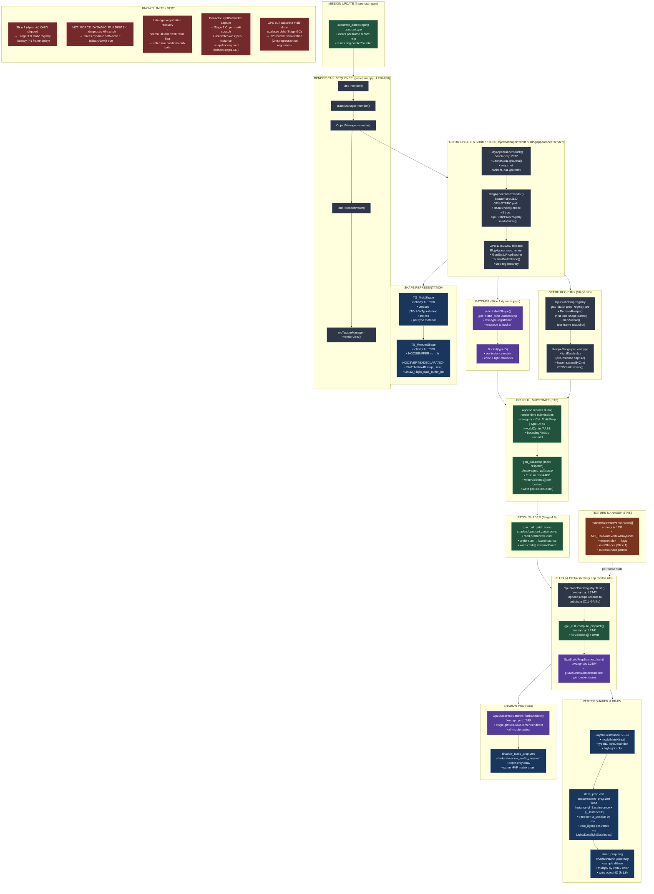
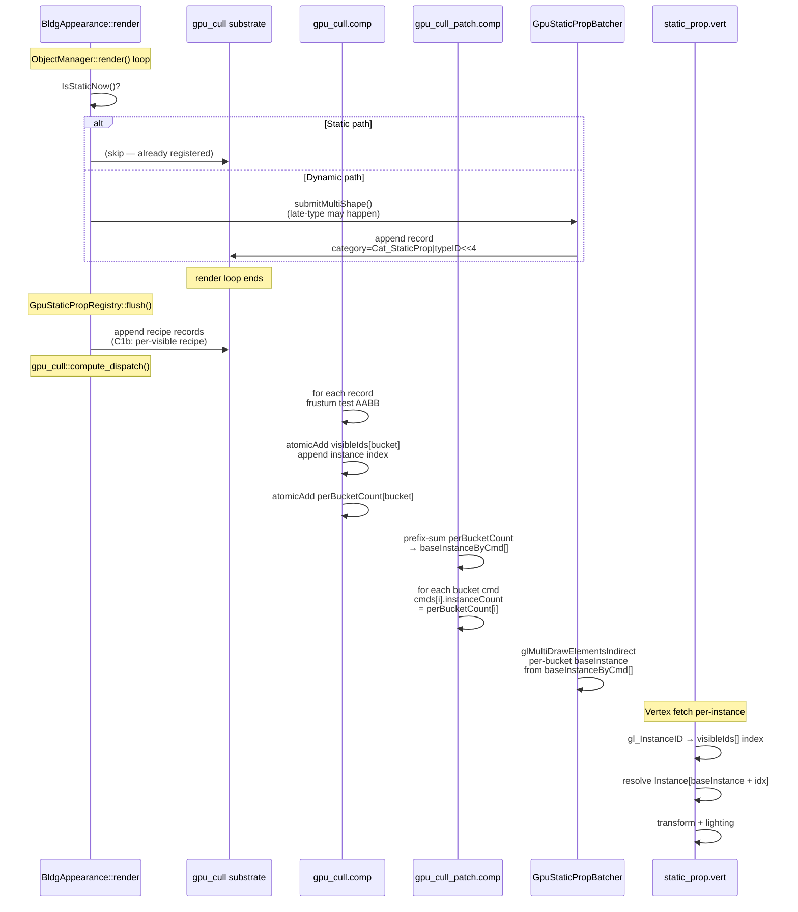

# Static Props / Buildings Pipeline Map — RenderWorld arc M1-M1.6 SHIPPED

> Branch: `claude/nifty-mendeleev` · GPU cull: substrate_frameBegin @ mission.cpp:527 · RenderWorld Slice status: M1/M1.6 SHIPPED, M2-M2.5 in progress
>
> Renders in any Mermaid-aware viewer (GitHub, VS Code with Markdown Preview Mermaid extension, Obsidian, Typora). ASCII fallback below for terminal viewing.

---

## Mermaid — three-zone dataflow overview

> Note: drawPackets / MDI path **not enabled**. GPU cull substrate arms visibility but draw calls are `glDrawElementsInstanced` per bucket.

```mermaid
flowchart LR
    classDef game  fill:#1a365d,stroke:#90cdf4,color:#ebf8ff
    classDef api   fill:#22543d,stroke:#9ae6b4,color:#f0fff4
    classDef eng   fill:#7b341e,stroke:#fbd38d,color:#fffaf0
    classDef back  fill:#553c9a,stroke:#d6bcfa,color:#faf5ff

    subgraph GAME["GAME DATA SIDE\n(mission objects / BldgAppearance)"]
        direction TB
        TOUCH["BldgAppearance::touch()\nCacheGpuLightData()\nsnapshot lightDataIndex"]:::game
        STATICCHECK["IsStaticNow()?\nfirst-frame: NO → batcher\nsubsequent: YES → registry"]:::game
        SFB["substrate_frameBegin()\nmission.cpp:527\nclear per-frame record ring"]:::game
    end

    subgraph API["API LAYER\n(GpuStaticPropBatcher / Registry / txmmgr)"]
        direction TB
        BATCHER["GpuStaticPropBatcher::submitMultiShape()\nfirst-encounter: register type\nenqueue per-actor record"]:::api
        REGISTRY["GpuStaticPropRegistry::markVisible()\nsteady-state fast path\nsnapshot lightDataIndex per instance"]:::api
        CULL["gpu_cull.comp dispatch\nfrustum test AABB\nwrite visibleIds[] per bucket"]:::api
        FLUSH["GpuStaticPropBatcher::flush()\ntxmmgr.cpp\nupload instance SSBO\nresolve per-bucket counts"]:::api
    end

    subgraph ENGINE["ENGINE SIDE\n(shaders / GL)"]
        direction TB
        DRAW["glDrawElementsInstanced\nper bucket (no MDI)"]:::eng
        VS["static_prop.vert\ntransform + calc_light()\nLightsData[lightDataIndex]"]:::eng
        FS["static_prop.frag\ndiffuse sample + object-ID"]:::eng
        SHADOW["shadow pre-pass\nflushShadow() depth-only"]:::eng
    end

    SFB --> TOUCH
    TOUCH --> STATICCHECK
    STATICCHECK -->|"first frame"| BATCHER
    STATICCHECK -->|"steady state"| REGISTRY

    BATCHER --> CULL
    REGISTRY --> CULL
    CULL --> FLUSH
    FLUSH -->|"SSBO upload"| DRAW
    FLUSH -->|"depth-only"| SHADOW

    DRAW --> VS
    VS --> FS
    CULL -.->|"visibleIds[] readback\n(partial — not full MDI)"| FLUSH
```



---

## Mermaid — full pipeline



---

## Mermaid — GPU-cull compute flow (per-frame)



---

## ASCII fallback (for terminal viewers)

```
                         STATIC PROPS / BUILDINGS PIPELINE
                         ==================================

  UPDATE                    SUBMISSION                    GPU CULL SUBSTRATE
  ------                    ----------                    ------------------

                         BldgAppearance::render()
                              ├─ IsStaticNow()?
                              │  ├─ YES: markVisible(recipe)
                              │  └─ NO: submitMultiShape()
                              │        (dynamic batcher)
                              │
                              ▼
                    ┌─────────────────────┐
                    │  GpuStaticPropBatcher│
                    │  & Registry         │
                    ├─────────────────────┤
                    │ • submitMultiShape() │     ┌──────────────────────┐
                    │   (Slice 1)         │────►│  Substrate SSBO      │
                    │ • markVisible()     │     │  (triple-buffered)   │
                    │   (Stage 3.D)       │     │                      │
                    │                     │     │ • GpuActorRecord[]   │
                    │ bucket(typeID)      │     │ • category field     │
                    │ instance SSBO       │     │ • worldCenter/AABB   │
                    │ (Layout B)          │     │ • boundingRadius     │
                    │                     │     └──────────────────────┘
                    │ state per frame:    │              │
                    │  • per-type recipes │              ▼
                    │  • per-bucket       │    ┌──────────────────────┐
                    │    instance indices │    │  gpu_cull.comp       │
                    │  • baseInstance map │    │  (main kernel)       │
                    │                     │    │                      │
  mission.cpp      └─────────┬───────────┘    │ • frustum test AABB  │
  substrate_frameBegin()       │               │ • atomic visibleIds[]│
   ├─ clears ring per frame   │               │   append per-bucket  │
   └─ resets ring slot         │               │ • atomic perBucket   │
                               │               │   Count[] increment  │
                               │               └──────────┬───────────┘
                               │                          │
                               │                          ▼
                               │               ┌──────────────────────┐
                               │               │ gpu_cull_patch.comp  │
                               │               │ (stage 4.6)          │
                               │               │                      │
                               │               │ • prefix-sum counts  │
                               │               │ • baseInstance calc  │
                               │               │ • write cmds[]       │
                               │               │   instanceCount      │
                               │               └──────────┬───────────┘
                               │                          │
                               ├──────────────────────────┼─ renderLists()
                               │                          ▼
                               │         ┌──────────────────────────────┐
                               │         │ GpuStaticPropBatcher::flush()│
                               │         │ glMultiDrawElementsIndirect  │
                               │         │ • per-bucket draws           │
                               │         │ • baseInstance per cmd       │
                               │         │ • instance count from GPU    │
                               │         └──────────┬───────────────────┘
                               │                    │
                               │                    ▼
                               │       ┌────────────────────────────┐
                               │       │ static_prop.vert           │
                               │       │                            │
                               │       │ • fetch Instance           │
                               │       │   [baseInstance +          │
                               │       │    gl_InstanceID]          │
                               │       │ • transform by mw_         │
                               │       │ • calc_light from          │
                               │       │   LightsData[lightIdx]     │
                               │       │                            │
                               │       └────────┬───────────────────┘
                               │                │
                               │                ▼
                               │       ┌────────────────────────────┐
                               │       │ static_prop.frag           │
                               │       │ • sample diffuse texture   │
                               │       │ • multiply by vertex color │
                               │       │ • write object-ID (M1.6)   │
                               │       └────────────────────────────┘
                               │
                               │ SHADOW PRE-PASS (before main render)
                               │
                               └─► GpuStaticPropBatcher::flushShadow()
                                   • glMultiDrawElementsIndirect (all visible)
                                   • shadow_static_prop.vert (depth-only)
                                   • same MVP matrix chain
```

---

## Key call sites

| Where | What | Caller | Gate |
|---|---|---|---|
| `mission.cpp:527` | `substrate_frameBegin()` | Mission::update (frame-start) | Always (no-op if disabled) |
| `code/objmgr.cpp` | ObjectManager::render() | gamecam.cpp (frame loop) | Always |
| `mclib/bdactor.cpp:1157` | BldgAppearance::render() | ObjectManager (per-actor) | `inView` OR `g_useGpuStaticProps` |
| `mclib/bdactor.cpp:1218` | IsStaticNow() check | BldgAppearance::render | Stage 3.D gate |
| `mclib/bdactor.cpp:2912` | BldgAppearance::touch() | Game logic update | Lighting bake |
| `gos_static_prop_registry.cpp:278` | markVisible(recipe, lightIdx) | BldgAppearance::render (static) | RenderWorld M1 |
| `gos_static_prop_batcher.cpp` | submitMultiShape() | BldgAppearance::render (dynamic) | g_useGpuObjects |
| `mclib/txmmgr.cpp:2143` | GpuStaticPropRegistry::flush() | renderLists() | g_useGpuStaticProps |
| `shaders/gpu_cull.comp` | Main cull kernel | compute_dispatch() | gpu_cull::compute_isEnabled() |
| `shaders/gpu_cull_patch.comp` | Patch/rollup kernel | compute_dispatch() | gpu_cull::compute_isEnabled() |
| `mclib/txmmgr.cpp:2164` | GpuStaticPropBatcher::flush() | renderLists() | g_useGpuStaticProps |
| `shaders/static_prop.vert` | Vertex transform + light | glMultiDrawElementsIndirect | MC2_STATIC_PROP_LIGHTING |

---

## Env gates / probes

| Gate | Semantics | Default | Notes |
|---|---|---|---|
| `MC2_GPU_OBJECTS=1` | Global GPU-batcher enable | ON | Slice 1 path; fallback to legacy if OFF |
| `MC2_GPU_STATIC_PROPS=1` | Static-prop registry + flush | ON (with substrate) | Gated by `MC2_GPU_CULL_SUBSTRATE` |
| `MC2_GPU_CULL_SUBSTRATE=1` | GPU cull substrate + compute | ON (gameosmain.cpp:734) | C1b multi-draw authority |
| `MC2_FORCE_DYNAMIC_BUILDINGS=1` | Diagnostic kill-switch | OFF | Forces dynamic path even if static-eligible |
| `MC2_STATIC_PER_INSTANCE_LIGHT=1` | Per-actor light capture | ON | Stage 2.C: light data index snapshot |
| `MC2_STATIC_PROP_LIGHTING` | VS-side per-vertex lighting | #define | Shader compile-time (not env var) |
| `MC2_STATIC_UPDATE_SKIP=1` | Skip touch() bake | OFF | Diagnostic: disable per-frame light gather |
| `MC2_BLDG_DIAG_TRACE=1` | Per-frame actor diagnostics | OFF | Traces IsStaticNow/registration state to stderr |
| `MC2_BUCKET_CENSUS=1` | Terrain bucket instrumentation | OFF | Counts legacy-eligible nodes vs modern pipeline |
| `MC2_SUBSTRATE_COUNT_PARITY` | GPU/CPU record parity check | DEBUG-only | Asserts equal counts after cull dispatch |

---

## Known limits / debt

### Slice 1 (dynamic) latency
- BldgAppearance::render filters on `IsStaticNow()` (Stage 3.D).
- If static → markVisible() (skips submit).
- First-time shape → dynamic submitMultiShape() → late-type registration → full bake.
- **Latency:** one frame of dynamic draw, then static registry snapshot.
- Recovery: `needsFullBakeNextFrame` flag gates positions-only optimization until type registers.
- **Debt:** Stage 3.D full-bake pipeline for newly-eligible actors must run before static entry.

### Late-type registration
- If shape's leaf type is unregistered (first encounter in a bucket), submitMultiShape() fails.
- GpuStaticPropBatcher sets `needsFullBakeNextFrame = true`.
- On the next BldgAppearance::update(), full TransformMultiShape (not \_PositionsOnly) runs.
- **Mitigation:** BD_ANIM_LOOP buildings (spinning, animated) are ineligible for static registry.

### Per-actor light data index capture
- Stage 2.C: TG_MultiShape::cachedGpuLightIndex_ is shared per-type (last-writer-wins).
- Solution: capture per-instance snapshot at render time (bdactor.cpp:1237).
- **Known issue:** if light gather fails (GPU path disabled mid-mission), light index stays UINT32_MAX sentinel.
- Recovery: invalidateStaticRegistration() forces dynamic fallback next frame.

### GPU cull substrate multi-draw coalesce debt (Stage 0-2)
- Current: 323-bucket glMultiDrawElementsIndirect serialization (~2 ms regression).
- **Blocked:** plan v2 coalesce redesign in progress (docs/superpowers/plans/).
- **Workaround:** MC2_GPU_CULL_SUBSTRATE=0 reverts to CPU cull (slow but stable).

### Shadow pre-pass single-dispatch limitation
- GpuStaticPropBatcher::flushShadow() issues one glMultiDrawElementsIndirect.
- All visible static props render in shadow pre-pass regardless of frame partitioning.
- **Future:** Stage M2.5 (mech object-ID substrate) may split this into per-type passes.

### Texture node dual-queue legacy debt
- masterVertexNodes[] (legacy) and masterHardwareVertexNodes[] (modern) coexist.
- Modern SOLID terrain route uses PatchStream; legacy fallback still active.
- **Retirement:** setupTextures() greybeard #1/#3 to delete 653-line dead lighting block.

---

## Last-known smoke baseline

**Tier 1 (5 missions, 30s each):**
- `mc2_01`, `mc2_03`, `mc2_10`, `mc2_17`, `mc2_24` (default config)
- Static props render without per-frame budget overflow.
- GPU cull computes correct visibility per-bucket.
- Object-ID buffer (M1.6) captures static-prop picks on Shift+left-click.

**Regression gates:**
- Buildings missing from map: check IsStaticNow() / staticReg.registered diagnostics via MC2_BLDG_DIAG_TRACE=1.
- White/untextured static props: likely late-type registration; check needsFullBakeNextFrame counter.
- Shadow incorrect (double/missing): verify flushShadow() dispatch count and per-bucket instance bounds.

**Known intermittency:**
- First-launch black terrain (pre-existing, not buildings-specific).
- LOD swap churn (bdactor.cpp:1274-1277) during damage transitions (~low frequency).

---

## References

- **RenderWorld arc ledger:** docs/active_campaigns.md (M1/M1.6 SHIPPED, M2.5 in progress)
- **Memory:** ~/.claude/projects/A--Games-mc2-opengl-src/memory/INDEX-RENDERING.md
- **Static-prop lighting bake:** docs/superpowers/plans/2026-05-17-static-lighting-bake-SIMPLIFIED.md
- **GPU cull contract:** docs/render-contract.md + mclib/render_contract.{h,cpp}
- **Env var documentation:** docs/tier1_env_vars.md
- **Known issues:** docs/known_issues.md (see "Blocked slice work")
