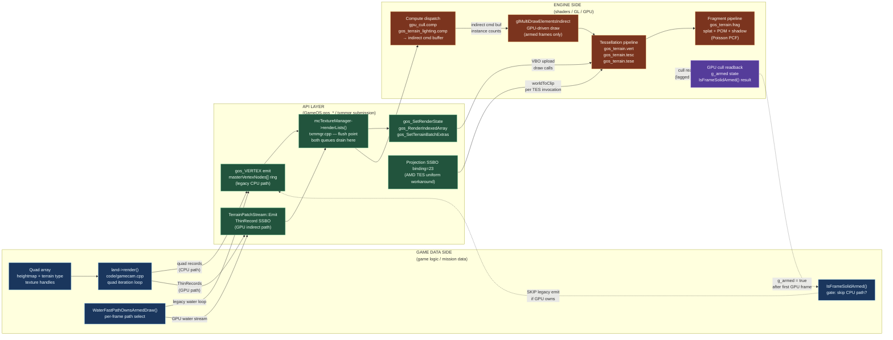

# Terrain Pipeline Map — legacy CPU + GPU-driven dual-path (FX parallel)

> Branch: `claude/nifty-mendeleev` · Gates: `MC2_TERRAIN_INDIRECT=1` (default ON), `MC2_TERRAIN_INDIRECT_OVERLAY=1` (default ON), `MC2_GPU_DRIVEN_WATER` (default OFF)
>
> Renders in any Mermaid-aware viewer (GitHub, VS Code with the Markdown Preview Mermaid extension, Obsidian, Typora). ASCII fallback below for terminal viewing.

---

## Mermaid — three-zone dataflow overview



---

## Mermaid — full pipeline

```mermaid
flowchart TD
    classDef producer fill:#2d3748,stroke:#a0aec0,color:#f7fafc
    classDef enqueue fill:#553c9a,stroke:#d6bcfa,color:#faf5ff
    classDef flush fill:#22543d,stroke:#9ae6b4,color:#f0fff4
    classDef shader fill:#7b341e,stroke:#fbd38d,color:#fffaf0
    classDef compute fill:#5a1a4a,stroke:#c084fc,color:#faf5ff
    classDef water fill:#1a3a52,stroke:#7dd3c0,color:#ecfdf5
    classDef known fill:#742a2a,stroke:#feb2b2,color:#fff5f5

    subgraph FRAME["FRAME LOOP (code/gamecam.cpp ~L215-275)"]
        direction LR
        FC1["camera->update()"]:::producer
        SOLID["land->render()"]:::producer
        CRATER["craterManager->render()"]:::producer
        OBJECT["ObjectManager->render()"]:::producer
        WTR["land->renderWater()"]:::producer
        TXTLISTS["mcTextureManager→<br/>renderLists()"]:::producer
        WTRFP["land→<br/>renderWaterFastPath()"]:::producer

        FC1 --> SOLID --> CRATER --> OBJECT --> WTR --> TXTLISTS --> WTRFP
    end

    subgraph SOLID_PATH["SOLID TERRAIN PATH (land->render via quad.draw)"]
        direction TB
        LOOP1["for i in [0..numberQuads):<br/>if terrainHandle != 0xffffffff"]:::producer
        LOOPSKIP["early-exit: pure water<br/>(terrainHandle=0,<br/>no overlay, no detail)"]:::producer
        GVERTEX["alloc gVertex[3]<br/>compute minU/maxU"]:::enqueue
        FASTPATH["FastPathEligible?<br/>g_active && g_thin &&<br/>g_ready && g_notOver &&<br/>(has terrain || detail || overlay)"]:::enqueue
        FPEMIT["TerrainPatchStream::<br/>Emit ThinRecord<br/>(via SSBO indirect path)"]:::enqueue
        LEGACYEMIT["legacy gos_VERTEX emit<br/>(masterVertexNodes[]<br/>append to ring)"]:::enqueue
        OVERLAY["if overlay enabled:<br/>emit DecalRecord<br/>(Slice A static bake)"]:::enqueue

        LOOP1 --> LOOPSKIP
        LOOPSKIP --> GVERTEX
        GVERTEX --> FASTPATH
        FASTPATH -->|YES| FPEMIT
        FASTPATH -->|NO| LEGACYEMIT
        FPEMIT --> OVERLAY
        LEGACYEMIT --> OVERLAY
    end

    subgraph TESS_VERT["TESSELLATION VERTEX STAGE (gos_terrain.vert / .tesc / .tese)"]
        direction TB
        VS["vert: pass world-space data<br/>(worldPos, worldNorm, color,<br/>texcoord, TerrainType=fog.x*255)"]:::shader
        TCS["tesc: evaluate patch parameters<br/>(tessLevel based on worldPos<br/>distance from camera)"]:::shader
        TES["tese: displace along worldNorm<br/>(optional heightmap deformation)<br/>apply projection SSBO binding=23<br/>output post-projectionUV"]:::shader

        VS --> TCS --> TES
    end

    subgraph FRAG_STAGE["FRAGMENT STAGE (gos_terrain.frag)"]
        direction TB
        ATLASUV["Atlas UV reconstruction<br/>from worldPos (if useAtlasColormap=1)"]:::shader
        CLASSIFY["Material classification:<br/>RGB → HSV → getColorWeights<br/>(rock/grass/dirt/concrete)"]:::shader
        MATMIX["per-material normal blend:<br/>matNormal0-4 sampled &amp;<br/>blended by weights"]:::shader
        POM["Parallax occlusion map:<br/>(optional per-material<br/>heightmap offset)"]:::shader
        SHADOW["Shadow sampling:<br/>calcShadow() from<br/>include/shadow.hglsl<br/>(Poisson PCF)"]:::shader
        LIGHTING["Combine: diffuse (NdotL) +<br/>specular (distance LOD) +<br/>shadow + fog"]:::shader
        OUTPUT["Output: (Color, GBuffer1)<br/>rc_gbuffer1_shadowHandled<br/>MRT or single-pass"]:::shader

        ATLASUV --> CLASSIFY
        CLASSIFY --> MATMIX
        MATMIX --> POM
        POM --> SHADOW
        SHADOW --> LIGHTING
        LIGHTING --> OUTPUT
    end

    subgraph FLUSH_LEGACY["FLUSH LEGACY PATH (txmmgr.cpp renderLists ~L2055)"]
        direction TB
        SKIPCHECK["if modernHandled &&<br/>IsFrameSolidArmed():<br/>SKIP (GPU owns)"]:::flush
        TEXADDR["gos_SetRenderState<br/>TextureAddress=Clamp<br/>Terrain=1"]:::flush
        EXTRAS["gos_SetTerrainBatchExtras<br/>(tessellation VBO alignment)"]:::flush
        GOSRENDER["gos_RenderIndexedArray<br/>(masterVertexNodes[i].vertices,<br/>indices, MAX_SENDDOWN chunks)"]:::flush

        SKIPCHECK --> TEXADDR
        TEXADDR --> EXTRAS
        EXTRAS --> GOSRENDER
    end

    subgraph GPU_PATH["GPU-DRIVEN PATH (indirect, M2+ slice)"]
        direction TB
        PATCHSTREAM["TerrainPatchStream::<br/>Emit ThinRecord (Stage 3.C)"]:::compute
        REGISTRY["GpuStaticPropRegistry::<br/>flush (injects static props)"]:::compute
        BASEINSTANCE["batcher_prepare<br/>BaseInstanceTable<br/>(prefix-sum, coalesce)"]:::compute
        CULL["gpu_cull::compute_dispatch()<br/>gpu_driven_terrain_solid.comp<br/>• reads ThinRecord SSBO<br/>• per-type bucket scatter<br/>• writes indirect cmd buffer"]:::compute
        MDIFLUSH["GpuStaticPropBatcher::<br/>flush<br/>glMultiDrawElementsIndirect"]:::compute

        PATCHSTREAM --> REGISTRY
        REGISTRY --> BASEINSTANCE
        BASEINSTANCE --> CULL
        CULL --> MDIFLUSH
    end

    subgraph WATER_PATH["WATER RENDERING"]
        direction TB
        WATERCHECK["WaterFastPathOwnsArmedDraw()?<br/>gate: MC2_RENDER_WATER_FASTPATH ||<br/>MC2_GPU_DRIVEN_WATER &&<br/>IsFrameSolidArmed() &&<br/>WaterStream::IsReady()"]:::water
        LEGACYWATER["legacy renderWater loop:<br/>for i in [0..numberQuads):<br/>currentQuad->drawWater()"]:::water
        GPUWATER["renderWaterFastPath():<br/>GPU water emitter<br/>(gos_terrain_water_stream.cpp)"]:::water
        WATEROUT["write to depth buffer<br/>alpha-blend on top<br/>of terrain (AFTER<br/>renderLists)"]:::water

        WATERCHECK -->|YES| GPUWATER
        WATERCHECK -->|NO| LEGACYWATER
        LEGACYWATER --> WATEROUT
        GPUWATER --> WATEROUT
    end

    subgraph MASK_DISP["MASK DISPATCH (B4 Slice, optional)"]
        direction TB
        MASKBUILD["gos_terrain_mask_dispatch::<br/>BuildAndUploadMasksForFrame<br/>(if MC2_TERRAIN_MASK_DISPATCH=1)"]:::compute
        MASKSOLID["DrawMaskSolid<br/>(dual-run: legacy drawPass +<br/>mask-SOLID GPU path)"]:::compute

        MASKBUILD --> MASKSOLID
    end

    SOLID_PATH -->|"FPEMIT"| GPU_PATH
    SOLID_PATH -->|"LEGACYEMIT"| FLUSH_LEGACY

    TESS_VERT --> FRAG_STAGE
    FRAG_STAGE --> OUTPUT["Fragment output:<br/>color + shadow-handled"]

    WTR --> WATER_PATH
    TXTLISTS -->|legacy| FLUSH_LEGACY
    TXTLISTS -->|GPU| GPU_PATH
    TXTLISTS -->|mask| MASK_DISP

    FLUSH_LEGACY -.renders.- TESS_VERT
    GPU_PATH -.renders.- TESS_VERT
    WATER_PATH --> WATEROUT["(after renderLists)"]:::water

    WTRFP -->|"GPU only"| GPUWATER

    subgraph KNOWN_LIMITS["KNOWN LIMITS / ARCHITECTURAL DEBT"]
        K1["Dual-path (legacy + GPU) runs in parallel<br/>on armed frames — parity slippage risk"]:::known
        K2["Legacy drawPass loop still runs<br/>even when GPU path is armed<br/>(for fallback + debug)"]:::known
        K3["Water: CPU + GPU paths are exclusive per frame<br/>but transition glitches on gate changes"]:::known
        K4["Atlas colormap rebuild cost not instrumented<br/>(one-time per atlas, not per-frame)"]:::known
        K5["Cement overlay static-bake slice (A)<br/>independent of terrain SOLID budget;<br/>no coarse per-quad cost visibility"]:::known
        K6["Shadow pre-pass runs BEFORE terrain draw<br/>in the mission.cpp frame loop;<br/>stale light data risk when lights move"]:::known
    end

    style FRAME fill:#f0f0f0,stroke:#333,color:#000
    style SOLID_PATH fill:#f0f0f0,stroke:#333,color:#000
    style TESS_VERT fill:#f0f0f0,stroke:#333,color:#000
    style FRAG_STAGE fill:#f0f0f0,stroke:#333,color:#000
    style FLUSH_LEGACY fill:#f0f0f0,stroke:#333,color:#000
    style GPU_PATH fill:#f0f0f0,stroke:#333,color:#000
    style WATER_PATH fill:#f0f0f0,stroke:#333,color:#000
    style MASK_DISP fill:#f0f0f0,stroke:#333,color:#000
    style KNOWN_LIMITS fill:#f0f0f0,stroke:#333,color:#000
```



---

## ASCII fallback (for terminal viewers)

```
                           TERRAIN PIPELINE (CPU legacy + GPU-driven dual-path)
                           ===================================================

  FRAME LOOP                   SOLID PATH                      WATER PATH
  ==========                   ===========                      ===========
  code/gamecam.cpp:215         land->render()
  ↓                            ↓
  camera→update()     ┌────────────────────┐
  ↓                   │ for quad in all:    │
  land→render()  ────►│  if terrainHandle   │
  ↓                   │  != 0xffffffff      │         land→renderWater()
  craterMgr→          │  ↓                  │         ↓
   render()      │ compute gVertex     │    │        WaterFastPathOwnsArmedDraw()?
  ↓              │ allocate gVertex[3] │    │         ├─YES→ renderWaterFastPath()
  ObjectMgr→     │ ↓                   │    │         │      (GPU water stream)
   render()      │ FastPathEligible?   │    │         └─NO → for quad: drawWater()
  ↓              │  ├─YES→ Emit thin   │    │                 (legacy loop)
  land→          │  │      record      │    │         ↓
   renderWater()─┤  │      (SSBO)       │    │        depth blend alpha-on-top
  ↓              │  ├─NO → append to   │    │
  mcTextureManager│  │      masterVx   │    │
   →renderLists()│  │      Nodes[]     │    │
  ├─────────────────┤ ↓               │    │
  │ LEGACY FLUSH   │ emit overlay     │    │
  │ (txmmgr.cpp)   │ DecalRecord      │    │
  │ Render.Terrain │ if enabled       │    │
  │ Solid zone:    │  │               │    │
  │                │  └───────┬───────┘    │
  │ for each       │          │            │
  │ masterVxNode:  │          ├─GPU──┐     │
  │  if terrain:   │          │      │     │
  │   set Clamp    │      GPU path   │     │
  │   gos_Render   │      (M2+):     │     │
  │   IndexedArray │      ├─Patch    │     │
  │   (chunks)     │      │ Stream   │     │
  │                │      ├─Registry │     │
  │ ─────────────┘      │ Flush     │     │
  │                      │ ├─Cull    │     │
  │ GPU PATH SIDE:       │ │ Compute │     │
  │ (inside renderLists) │ │         │     │
  │                      │ └─MDI     │     │
  │ TerrainPatchStream   │  Flush   │     │
  │  Emit ThinRecord     │          │     │
  │  (SSBO indirect)     │          │     │
  │                      │    ┌─────┘     │
  │ GpuStaticProp        │    │           │
  │  Registry flush      │    │           │
  │                      │    │           │
  │ batcher_prepare      │    ▼           │
  │  BaseInstanceTable   ├──────────────┐ │
  │                      │              │ │
  │ gpu_cull::compute    │  FRAGMENT    │ │
  │  _dispatch()         │  SHADER      │ │
  │ (per-type scatter)   │              │ │
  │                      │ gos_terrain  │ │
  │ Batcher::flush       │ .frag        │ │
  │ (MDI draw)           │              │ │
  │                      │ • Classify   │ │
  │                      │ • POM shade  │ │
  │                      │ • Shadow     │ │
  │                      │ • LOD blend  │ │
  │                      │ • Output MRT │ │
  │                      │              │ │
  └─────────────────────────────────────┘ │
                                           │
                                           ▼
                                    (returned to gamecam)
```

---

## Key call sites

| Where | What |
|---|---|
| `code/gamecam.cpp:215-275` | Frame loop: land→render, craterMgr→render, ObjectMgr→render, land→renderWater, mcTextureManager→renderLists, land→renderWaterFastPath |
| `code/gamecam.cpp:~268` | `mcTextureManager→renderLists()` — flushes both legacy masterVertexNodes + GPU-driven path |
| `code/gamecam.cpp:~272` | `land→renderWaterFastPath()` — called AFTER renderLists so terrain depth is written |
| `mclib/terrain.cpp:1060` | `Terrain::render()` — main entry; loops ~14-40K quads; gates: drawTerrainTiles, drawTerrainGrid, DrawDebugCells |
| `mclib/terrain.cpp:1075-1145` | Mask-dispatch build (Stage 1a) + legacy drawPass loop (Stage 1b, often skipped when GPU armed) |
| `mclib/terrain.cpp:1148-1165` | Mine rendering loop (minePass) — skipped when `IsFrameMineArmed()` |
| `mclib/terrain.cpp:1237-1388` | `Terrain::renderWater()` — legacy water loop; checks `WaterFastPathOwnsArmedDraw()` to skip if GPU path owns frame |
| `mclib/terrain.cpp:1396-` | `Terrain::renderWaterFastPath()` — GPU water emitter (WaterStream) |
| `mclib/quad.cpp:1266-1400+` | `TerrainQuad::draw()` — per-quad enqueue; handles both fast-path (SSBO emit) and legacy (gos_VERTEX append) |
| `mclib/quad.cpp:2514-` | `TerrainQuad::drawWater()` — enqueues water vertex record (legacy path only) |
| `mclib/txmmgr.cpp:1731-2115` | `MC_TextureManager::renderLists()` — master flush; legacy masterVertexNodes loop (L2055-2114) + GPU indirect path + GPU mechs + overlays |
| `mclib/txmmgr.cpp:2055-2114` | Legacy flush loop: per-node texture set, call gos_RenderIndexedArray in MAX_SENDDOWN chunks |
| `mclib/txmmgr.cpp:2078-2085` | `gos_SetTerrainBatchExtras()` — TES tessellation VBO alignment (per-node, not per-vertex) |
| `mclib/txmmgr.cpp:2125-2176` | GPU path: `GpuStaticPropRegistry::flush()` + `batcher_prepareBaseInstanceTable()` + `gpu_cull::compute_dispatch()` + `GpuStaticPropBatcher::flush()` + `GpuMechBatcher::flush()` |
| `shaders/gos_terrain.vert` | Vertex: pass worldPos/worldNorm/color/texcoord/TerrainType to TCS (projection deferred to TES) |
| `shaders/gos_terrain.tesc` | Tessellation control: compute tessLevel based on distance |
| `shaders/gos_terrain.tese` | Tessellation evaluation: heightmap displacement, apply SSBO projection (binding=23), output post-projectionUV |
| `shaders/gos_terrain.frag` | Fragment: atlas UV recon, material classify, per-material normal blend, POM, shadow, lighting combine, MRT output |
| `shaders/include/shadow.hglsl` | `calcShadow()` — Poisson PCF with variable tap count |
| `shaders/gos_terrain_lighting.comp` | GPU terrain lighting compute (when `MC2_GPU_DRIVEN` armed; runs before cull?) — TBD |
| `shaders/gpu_driven_terrain_solid.comp` | Per-type bucket scatter compute; reads ThinRecord SSBO; writes indirect command buffer |
| `shaders/gpu_driven_water.comp` | GPU water compute (when `MC2_GPU_DRIVEN_WATER` armed) — TBD |
| `GameOS/gameos/gos_terrain_indirect.h/cpp` | Single-source `WaterFastPathOwnsArmedDraw()` predicate; gates CPU vs GPU water path |
| `GameOS/gameos/gos_terrain_patch_stream.h/cpp` | TerrainPatchStream: thin record emit, fast-path eligibility check, inline overlay emit |
| `GameOS/gameos/gos_terrain_water_stream.h/cpp` | WaterStream: GPU water emitter recipe state, fast-path population, frame flags |
| `GameOS/gameos/gos_terrain_surface.h/cpp` | Surface generation (PR-1, continuous-surface mission-load) — optional, gated |
| `GameOS/gameos/gos_terrain_mask_dispatch.h/cpp` | B4 Slice dual-run (legacy drawPass + mask GPU path) for parity validation |
| `GameOS/gameos/gpu_driven_common.h/cpp` | Shared GPU-driven utilities (registry, batcher, compute dispatch coordination) |

---

## Env gates / probes (current truth)

| Var | Default | Effect |
|---|---|---|
| `drawTerrainTiles` | ON (global, C++) | Master gate for terrain rendering (entire render + waterPass) |
| `MC2_TERRAIN_INDIRECT` | ON | Enable GPU-driven indirect path (thin records, per-type bucket scatter) |
| `MC2_TERRAIN_INDIRECT_OVERLAY` | ON | Enable overlay (cement decal) static-bake GPU path; legacy fallback when OFF |
| `MC2_GPU_DRIVEN_WATER` | OFF | Enable GPU water stream (WaterStream compute + fast-path emitter) |
| `MC2_RENDER_WATER_FASTPATH` | OFF | Legacy fast-path gate (predates GPU water; still used for CPU fallback) |
| `MC2_TERRAIN_MASK_DISPATCH` | OFF | Enable B4 Slice dual-run (legacy drawPass + mask GPU for parity validation) |
| `MC2_TERRAIN_MASK_DISPATCH_SOLID` | ON (if MASK_DISPATCH=1) | When both ON, mask-SOLID GPU path runs alongside legacy drawPass |
| `MC2_TERRAIN_SURFACE` | OFF | Enable PR-1 continuous-surface mission-load generation (optional rebuild) |
| `MC2_TERRAIN_ADMISSION_MODERN` | OFF | Flip quad admission to "Modern" path (alternative to legacy) — experimental |
| `MC2_TERRAIN_COST_SPLIT` | OFF | Chrono instrumentation: split per-quad and per-pass costs |
| `MC2_TERRAIN_CULL_WIDE` | OFF | Force angular sphere cull to "wide" mode (larger frustum margin) |
| `MC2_WATER_GATE_DIAG` | OFF | Diagnostic: print water fast-path gate evaluation once per state change |
| `MC2_WATER_S6_TRACE` | OFF | Diagnostic: trace Stage 6 (S6) armed-skip state when legacy (ii) draw runs |
| `MC2_WATER_DEBUG` | OFF | Diagnostic: per-frame water population census (post-warmup, 5 frames, throttled) |
| `MC2_WATER_STREAM_DEBUG` | OFF | Diagnostic: GPU water stream state dump (one-shot at frame N) |
| `MC2_WATER_S6_COST` | OFF | Chrono: cost accounting for S6 CPU-water vs GPU-water state transitions |
| `MC2_THIN_DEBUG` | OFF | Diagnostic: per-quad fast-path eligibility gate analysis (post-warmup, 5 frames) |
| `MC2_DEPTHBIAS_CALIB` | OFF | Diagnostic: depth-bias calibration (overlay depth tuning) |
| `MC2_DEPTH_TRANSITION_PROBE` | OFF | Diagnostic: CPU water screen-z depth transition tracking |
| `MC2_TERRAIN_INDIRECT_THINEMIT_TRACE` | OFF | Diagnostic: thin record emit trace (when fast-path runs) |
| `MC2_SHAPE_C_PARITY_CHECK` | OFF | Diagnostic: parity check between shape C batchers |
| `MC2_M2D_PZ_PARITY` | OFF | Diagnostic: parity check on post-Z output from TES |
| `MC2_MODERN_TERRAIN_PATCHES` | OFF (unused?) | Possible future toggle for modern patch format (observed in code, untested) |

| Counter | Source | Meaning |
|---|---|---|
| `numTerrainFaces` | quad.cpp (per-quad draw) | total terrain faces emitted this frame |
| `legacy_drawalpha_detail_quads` | quad.cpp (A2 gate) | pixel-suppressed detail layer (always 0 post-521d83a) |
| `legacy_eligible` | txmmgr.cpp (pre-flush capture) | quads that *could* have run legacy path (now GPU-armed; for census) |
| `[TERRAIN_DRAWPASS v1] event=retired` | terrain.cpp | one-shot lifecycle trace: drawPass loop skipped due to GPU armed |
| `[WATER_LEGACY v1] event=population` | terrain.cpp | water quad handle population (disappeared/recovered/initial) |
| `[WATER_S6 v1] event=state armedSkip` | terrain.cpp | trace S6 gate state (1 = GPU fast path owns; 0 = legacy (ii) running) |
| `[WATER_GATE] fastPath/armed/streamReady/recipes/tex2` | terrain.cpp | per-state-change gate breakdown for water path selection |
| `[BUCKET_CENSUS v1]` | txmmgr.cpp / TerrainPatchStream | per-frame thin-record census after GPU flush |
| `[THIN_DEBUG v1] event=path_mix` | quad.cpp | per-quad fast-path eligibility failure breakdown (5 frames post-warmup) |

---

## Architectural notes

### CPU vs GPU path duality

**Legacy path (CPU-driven enqueue):**
- `Terrain::render()` loops ~14-40K quads (visible set)
- Each quad calls `draw()` → computes gVertex array (3 vertices per quad)
- **Fast-path (modern):** emits ThinRecord to SSBO (one record per quad) → GPU scatter later
- **Legacy fallback:** appends gos_VERTEX stream to masterVertexNodes[] ring buffer
- `mcTextureManager::renderLists()` flushes masterVertexNodes via gos_RenderIndexedArray

**GPU-driven path (indirect):**
- Fast-path ThinRecord emission populates SSBO during CPU `Terrain::render()`
- `GpuStaticPropRegistry::flush()` injects static props into substrate
- `gpu_cull::compute_dispatch()` reads ThinRecord SSBO → per-type bucket scatter → writes indirect command buffer
- `GpuStaticPropBatcher::flush()` issues glMultiDrawElementsIndirect (one MDI per bucket type)

**Dual-run on armed frames:**
- Default: both fast-path emit + legacy loop fire together (for parity/fallback)
- When `IsFrameSolidArmed() && IsFrameOverlayArmed()`: legacy drawPass loop is SKIPPED (else branch)
- Mask dispatch (B4 Slice) runs BOTH mask-SOLID + legacy for validation on enabled frames

### Water path gating

The **single-source predicate** `WaterFastPathOwnsArmedDraw()` (terrain.cpp:1202) gates water path selection:
```
return (MC2_RENDER_WATER_FASTPATH || MC2_GPU_DRIVEN_WATER) 
    && IsFrameSolidArmed() 
    && WaterStream::IsReady() 
    && (WaterStream::GetRecipeCount() > 0) 
    && (terrainTextures2 != nullptr);
```
- When **true:** `renderWater()` early-returns; GPU fast-path owns the frame
- When **false:** legacy loop runs; `quad->drawWater()` enqueues per quad

This predicate is also read by `quad.cpp::setupTextures()` to gate (ii) write suppression.

### Projection chain (SSBO binding=23)

- **Vertex/TCS:** operate in world space (worldPos, worldNorm passed to TES)
- **TES:** applies SSBO-resident projection matrix (binding=23); AMD TES uniform propagation unreliable
- **Fragment:** operates in clip space; receives UndisplacedDepth (reverse-Z, 0.9999f for HUD contract)

### Material blend (5 layers)

1. **Colormap (tex1):** atlas or per-tile, sampled at atlas-reconstructed UV or per-tile Texcoord
2. **Per-material normals (matNormal0-4):** rock/grass/dirt/concrete/snow (5 slots, 4 always present)
3. **Material classify:** RGB color → HSV → getColorWeights (profile-aware for C1 sand missions)
4. **Weight blend:** 4-component weight vec (rock, grass, dirt, concrete) controls normal mix
5. **Cement overlay (tex3):** static-bake layer (Slice A) — optional, drawn separately after terrain

### Cement atlas (unified Stage 4 / PR2)

- **Texture:** sampler unit 3 (tex3), GL_REPEAT wrap, no mipmaps
- **Control:** per-quad layer index + validity bit in ThinRecord._pad0 (bits 31:16)
- **Decode:** frag reads thinRecsFrag[RecordIdx].control.w → extract layer index
- **Render:** if valid, blend static-bake atlas layer on top of terrain

### Overlay decals (Stage A, static-bake)

- Drawn separately after terrain SOLID in renderLists (~L2200)
- Uses gos_DrawTerrainOverlays() (GOS bridge function)
- Budget independent of terrain SOLID (no per-quad accounting)

### Shadow pre-pass

- Runs in mission.cpp frame loop (BEFORE Terrain::render)
- Writes to shadow map FBO (depth + optional variance texture)
- Terrain frag samples shadow map via calcShadow() (include/shadow.hglsl)
- **Risk:** light updates happen between shadow pre-pass and terrain draw; stale light data possible

### Distance LOD

Fragment shader (gos_terrain.frag:121-126):
- `LOD_NEAR=4000.0` (full quality, covers stock zoom)
- `LOD_NEAR_FADE=4500.0` (transition end)
- `LOD_MID=5500.0` (mid quality)
- `LOD_MID_FADE=6500.0` (far quality)

Hides specular, reduces detail tiling at distance.

### Tessellation (TES displacement)

- Per-patch tessLevel computed in TCS based on distance
- Optional heightmap offset applied in TES along worldNorm
- VBO alignment control: `gos_SetTerrainBatchExtras()` (per-node, not per-vertex)
- Extras buffer holds tessellation metadata for TES

---

## Known limits / debt (in priority order)

1. **Dual-path runs in parallel on armed frames.** Legacy loop still executes even when GPU path owns draw. Risk: parity slippage if codepaths diverge. Fallback value: allows legacy path to become the ground truth on GPU glitches (at cost of redundant CPU work).

2. **Water path gate transitions glitch.** Toggling `MC2_GPU_DRIVEN_WATER` or map state changes can cause CPU→GPU or GPU→CPU transitions to leave stale water (either rendered twice or not at all). `MC2_WATER_GATE_DIAG` helps debug but transition smoothing is deferred.

3. **Shadow pre-pass runs BEFORE terrain draw.** Light updates that happen between pre-pass and terrain draw see stale shadow data. Critical for dynamic lights (vehicles with spotlights) but currently not coordinated.

4. **Cement atlas rebuild cost not instrumented.** Rebuilding the atlas is a one-time cost per mission load, not per-frame, but `MC2_TERRAIN_COST_SPLIT` doesn't break it out separately.

5. **Overlay (Slice A) static-bake has no per-quad budget tracking.** Budget is separate from terrain SOLID; no coarse visibility into decal emission cost per quad.

6. **Fast-path eligibility gates are disjoint.** `MC2_THIN_DEBUG` shows per-gate failure reasons (active, thin, ready, overflow, handle, overlay, water) but doesn't reveal interaction patterns (e.g., how many quads fail BOTH overlay AND water?).

7. **Mask dispatch (B4 Slice) is validation-only, not optimization.** Dual-run adds overhead; when armed, both legacy drawPass + mask-SOLID GPU run side-by-side. Intended for parity testing, not production.

8. **Material profile (C1 SAND_M24) is tactical, disposable.** When real material-palette architecture lands, this enum and per-profile shader branches go away in one PR.

9. **TerrainType (cement flag) unpacking is fragile.** Stored as `fog.x * 255` in vertex stream, rounded in frag. If floating-point precision drifts, material misclassification risk.

10. **Water detail layer eligibility is frame-gated.** `useWaterInterestTexture` global can be toggled at runtime; in-function checks in `quad::draw()` + `quad::drawWater()` provide fallback, but loop-level hoisting in `Terrain::render()` may become stale if flag changes mid-frame.

---

## Last-known smoke baseline

```
mc2_10, 40s default cam, MC2_TERRAIN_INDIRECT=1, MC2_GPU_DRIVEN_WATER=0
PASS, 3200 frames @ 80 fps, 0 destroy delta, 0 shadow stutter
drawTerrainTiles=1 (visible all frames)
numTerrainFaces ≈ 14,000-18,000 per frame (varies by frustum)
fast-path eligible quads: 95%+ (legacy fallback <5%, mainly overlay-only)
legacy_eligible ≈ 14,000 (could run legacy, but GPU owns)
water population: 4,200 total, 2,100 handle-valid (50%)
shadow map: 3 cascade levels, 2048² per level, 1.2ms pre-pass
cement atlas: 512² unified atlas, 1024 layer budget, 0 rebuild per frame (per-mission)
```

