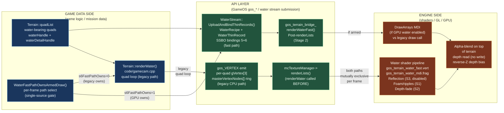

# Water Pipeline Map — CPU legacy + GPU fast path (mutually exclusive per frame)

> Branch: `claude/nifty-mendeleev` · Gates: `MC2_RENDER_WATER_FASTPATH` (default OFF), `MC2_GPU_DRIVEN_WATER` (default OFF)
>
> Renders in any Mermaid-aware viewer (GitHub, VS Code with the Markdown Preview Mermaid extension, Obsidian, Typora). ASCII fallback below for terminal viewing.

---

## Mermaid — three-zone dataflow overview



---

## Mermaid — full pipeline

```mermaid
flowchart TD
    classDef producer fill:#2d3748,stroke:#a0aec0,color:#f7fafc
    classDef enqueue fill:#553c9a,stroke:#d6bcfa,color:#faf5ff
    classDef flush fill:#22543d,stroke:#9ae6b4,color:#f0fff4
    classDef shader fill:#7b341e,stroke:#fbd38d,color:#fffaf0
    classDef water fill:#1a3a52,stroke:#7dd3c0,color:#ecfdf5
    classDef known fill:#742a2a,stroke:#feb2b2,color:#fff5f5

    subgraph FRAME["FRAME LOOP (code/gamecam.cpp ~L215-275)"]
        direction LR
        FC1["camera->update()"]:::producer
        SOLID["land->render()"]:::producer
        CRATER["craterManager->render()"]:::producer
        OBJECT["ObjectManager->render()"]:::producer
        WTR["land->renderWater()"]:::producer
        TXTLISTS["mcTextureManager-><br/>renderLists()"]:::producer
        WTRFP["land-><br/>renderWaterFastPath()"]:::producer

        FC1 --> SOLID --> CRATER --> OBJECT --> WTR --> TXTLISTS --> WTRFP
    end

    subgraph WATER_GATE_CHECK["WATER GATE CHECK (terrain.cpp L1202)"]
        direction TB
        G1["g1: MC2_RENDER_WATER_FASTPATH ||<br/>MC2_GPU_DRIVEN_WATER"]:::water
        G2["g2: IsFrameSolidArmed()"]:::water
        G3["g3: WaterStream::IsReady()"]:::water
        G4["g4: GetRecipeCount() > 0"]:::water
        G5["g5: terrainTextures2 != nullptr"]:::water
        PRED["s6FastPathOwns =<br/>g1 && g2 && g3 && g4 && g5"]:::water

        G1 --> PRED
        G2 --> PRED
        G3 --> PRED
        G4 --> PRED
        G5 --> PRED
    end

    subgraph LEGACY_WATER["LEGACY WATER PATH (CPU-driven)"]
        direction TB
        LOOPSTART["for i in [0..numberQuads):<br/>if drawTerrainTiles"]:::producer
        HANDLE_CHECK["if waterHandle !=<br/>0xffffffff"]:::water
        GVERTEX["compute gVertex[3]<br/>(per-quad triangle)"]:::enqueue
        UV_SETUP["compute atlas UV<br/>from mapTopLeft +<br/>world position"]:::enqueue
        DEPTH_FUDGE["apply WATER_DEPTH_FUDGE<br/>to z (z += fudge)"]:::enqueue
        ALPHA_CLASS["alpha-band classification:<br/>elevation vs waterElevation<br/>→ alphaEdge/Middle/Deep"]:::enqueue
        GOSEMIT["gos_RenderTriangle<br/>or gos_DrawTriangle<br/>(adds to masterVertexNodes[])"]:::enqueue

        LOOPSTART --> HANDLE_CHECK
        HANDLE_CHECK -->|YES| GVERTEX
        HANDLE_CHECK -->|NO| LOOPSTART
        GVERTEX --> UV_SETUP
        UV_SETUP --> DEPTH_FUDGE
        DEPTH_FUDGE --> ALPHA_CLASS
        ALPHA_CLASS --> GOSEMIT
        GOSEMIT --> LOOPSTART
    end

    subgraph GPU_WATER_STREAM["GPU WATER FAST-PATH SETUP"]
        direction TB
        RECIPE_BUILD["WaterStream::PopulateRecipesOnce()<br/>Stage 1: build stable recipe array<br/>(once per mission load)"]:::enqueue
        RECIPE_UPLOAD["WaterStream::EnsureRecipeBufferUploaded()<br/>Upload WaterRecipe[] SSBO<br/>binding=5"]:::enqueue
        THIN_EMIT["WaterStream::UploadAndBindThinRecords()<br/>Stage 2: per-frame thin records<br/>Per-quad lightRGB/fogRGB/pzValid"]:::enqueue
        THIN_SSBO["WaterThinRecord[] SSBO<br/>binding=6<br/>(ring buffer, 3 slots)"]:::enqueue
        NARROW_WALK["Narrow-walk optimization<br/>(MC2_WATER_UPLOAD_NARROW=1)<br/>tracks water-bearing quads only"]:::enqueue

        RECIPE_BUILD --> RECIPE_UPLOAD
        RECIPE_UPLOAD --> THIN_EMIT
        THIN_EMIT --> THIN_SSBO
        THIN_EMIT --> NARROW_WALK
    end

    subgraph WATER_BRIDGE["WATER BRIDGE (gameos_graphics.cpp L2044+)"]
        direction TB
        BRIDGE_CALL["gos_terrain_bridge_renderWaterFast()<br/>called AFTER renderLists<br/>terrain depth buffer ready"]:::flush
        STATE_SAVE["Save GL state:<br/>blend mode, depth-write,<br/>program, VAO"]:::flush
        BINDPROG["Bind water_fast_prog<br/>(or water_fast_mdi if GPU armed)"]:::flush
        UNIFORMS["Set uniforms:<br/>waterElevation, alphaDepth,<br/>mapTopLeft, frameCos,<br/>uvScale, uvOffset,<br/>alphaEdge/Middle/DeepByte"]:::flush
        TEXBIND["Bind textures:<br/>tex1=water base,<br/>tex2=water detail,<br/>reflTex=atlas (disabled S3)"]:::flush
        DRAW["glDrawArrays or MDI<br/>(recordCount = thin record count)"]:::flush
        STATE_RESTORE["Restore GL state"]:::flush

        BRIDGE_CALL --> STATE_SAVE
        STATE_SAVE --> BINDPROG
        BINDPROG --> UNIFORMS
        UNIFORMS --> TEXBIND
        TEXBIND --> DRAW
        DRAW --> STATE_RESTORE
    end

    subgraph VS_STAGE["VERTEX SHADER STAGE (gos_terrain_water_fast.vert)"]
        direction TB
        THINREAD["Read WaterThinRecord<br/>from binding=6<br/>(recipeIdx, lightRGB, fogRGB, pzValid)"]:::shader
        RECIPEREAD["Look up WaterRecipe<br/>from binding=5<br/>(vx/vy/elev/terrainType/waterBits)"]:::shader
        CORNER["Extract corner index<br/>from gl_VertexID<br/>(0,1,2 or 0,1,3 for BOTTOMLEFT)"]:::shader
        ELEVCLASS["Elevation classification:<br/>vertex below waterElevation?<br/>→ water thickness"]:::shader
        WAVE["Wave bob displacement:<br/>±frameCosAlpha based on waterBits[6:7]"]:::shader
        PROJ["Apply world→clip projection<br/>(from u_worldToClipGL uniform)<br/>reverse-Z"]:::shader
        DEPTH_BIAS["Clip-space z += WATER_DEPTH_FUDGE_FAST<br/>(-0.00375; reverse-Z: toward 0.0 = far)"]:::shader
        OUTPUT_VS["Output Color, Texcoord, FogValue,<br/>o_isWater (flat), WaterThickness,<br/>WorldPos (for S3 Fresnel, disabled)"]:::shader

        THINREAD --> CORNER
        RECIPEREAD --> CORNER
        CORNER --> ELEVCLASS
        ELEVCLASS --> WAVE
        WAVE --> PROJ
        PROJ --> DEPTH_BIAS
        DEPTH_BIAS --> OUTPUT_VS
    end

    subgraph FS_STAGE["FRAGMENT SHADER STAGE (gos_terrain_water_mdi.frag)"]
        direction TB
        ISWATER["if o_isWater == 1"]:::shader
        THICKNESS["Water column thickness<br/>from VS (absorption)"]:::shader
        DEPTHFADE["Beer-Lambert absorption:<br/>trans = exp(-thickness * density)"]:::shader
        SHOREBLEND["Shore smoothstep blend:<br/>smooth alpha-band transition"]:::shader
        DISCARD["if shore <= 0:<br/>discard (above-water tiles)"]:::shader
        WATERCOLOR["Water base color<br/>mix(DEEP, SHALLOW, trans)"]:::shader
        FBMDETAIL["Procedural wave detail:<br/>BAR-style dual counter-scroll fBm<br/>(camera-independent, f(WorldPos,time))"]:::shader
        GLINT["Wave-cap glint shimmer<br/>(additive white crest)"]:::shader
        FOGTINT["Fog blend<br/>(if fog_color set)"]:::shader
        REFL_S3["S3 Reflection (DISABLED)<br/>const bool S3_REFLECTION_ENABLED = false<br/>(deferred to water-v2)"]:::shader
        OUTPUT_FS["Output: FragColor (RGBA),<br/>GBuffer1 (shadowHandled)"]:::shader

        ISWATER --> THICKNESS
        THICKNESS --> DEPTHFADE
        DEPTHFADE --> SHOREBLEND
        SHOREBLEND --> DISCARD
        DISCARD -->|YES| WATERCOLOR
        WATERCOLOR --> FBMDETAIL
        FBMDETAIL --> GLINT
        GLINT --> FOGTINT
        FOGTINT --> REFL_S3
        REFL_S3 --> OUTPUT_FS
    end

    subgraph KNOWN_LIMITS["KNOWN LIMITS / ARCHITECTURAL DEBT"]
        K1["Water z-fight at terrain boundary:<br/>reverse-Z WATER_DEPTH_FUDGE_FAST slightly fails<br/>GEQUAL test on coplanar vertices (see known_issues.md)"]:::known
        K2["CPU and GPU paths are mutually exclusive per frame,<br/>but transition can glitch if gate changes mid-frame<br/>(e.g., GPU unarm during gameplay)"]:::known
        K3["Reflection (S3) disabled at v1 (user rejection of<br/>camera-dependence); Option-B deferred to water-v2"]:::known
        K4["Detail texture (waterDetailHandle) animation<br/>is per-frame uniform, not baked to UV in VS<br/>(TBD: could optimize via procedural VS scroll)"]:::known
    end

    WTR --> WATER_GATE_CHECK
    WATER_GATE_CHECK -->|"s6FastPathOwns=0"| LEGACY_WATER
    WATER_GATE_CHECK -->|"s6FastPathOwns=1"| GPU_WATER_STREAM
    
    LEGACY_WATER -->|"enqueued to\nmasterVertexNodes[]"| TXTLISTS
    TXTLISTS -->|"legacy path:\ngos_RenderIndexedArray<br/>in chunks"| VS_STAGE
    
    GPU_WATER_STREAM --> WATER_BRIDGE
    WATER_BRIDGE --> VS_STAGE
    
    VS_STAGE --> FS_STAGE
    FS_STAGE --> OUTPUT["Alpha-blend on top<br/>of terrain<br/>(AFTER renderLists)"]
    
    style FRAME fill:#f0f0f0,stroke:#333,color:#000
    style LEGACY_WATER fill:#f0f0f0,stroke:#333,color:#000
    style GPU_WATER_STREAM fill:#f0f0f0,stroke:#333,color:#000
    style WATER_BRIDGE fill:#f0f0f0,stroke:#333,color:#000
    style VS_STAGE fill:#f0f0f0,stroke:#333,color:#000
    style FS_STAGE fill:#f0f0f0,stroke:#333,color:#000
    style WATER_GATE_CHECK fill:#f0f0f0,stroke:#333,color:#000
    style KNOWN_LIMITS fill:#f0f0f0,stroke:#333,color:#000
```



---

## ASCII fallback (for terminal viewers)

```
                           WATER PIPELINE (CPU legacy + GPU fast-path, mutually exclusive)
                           ==============================================================

  FRAME LOOP                    WATER GATE                  LEGACY PATH           GPU PATH
  ==========                    ==========                  =============         ========
  code/gamecam.cpp:215          terrain.cpp:1202            mclib/quad.cpp        WaterStream
  ↓                             ↓                           ↓                     ↓
  camera→update()    ┌──────────────────────────────┐      for quad in list:     PopulateRecipes
  ↓                  │ WaterFastPathOwnsArmedDraw?   │      ├─waterHandle valid?  (once per mission)
  land→render()      │ g1: FASTPATH || GPU_DRIVEN   │      │ ├─compute UV        ↓
  ↓                  │ g2: IsFrameSolidArmed()       │      │ ├─compute depth     EnsureRecipeBuf
  craterMgr→render() │ g3: IsReady()                 │      │ ├─alpha classify    (upload binding=5)
  ↓                  │ g4: RecipeCount > 0           │      │ ├─gos_RenderTriangle ↓
  ObjectMgr→render() │ g5: terrainTextures2 != null │      │ └─drain to          UploadThinRecords
  ↓                  └──────────────────────────────┘      │    masterVx[]       (per-frame)
  land→renderWater() ├─NO─→ LEGACY_WATER_OWNS       │      │                     ↓
  ↓                  │                              │      │                     ThinRecord[] SSBO
  mcTextureManager   │  └─YES→ GPU_WATER_OWNS      │      ↓                     binding=6
   →renderLists()    │                              │     (to renderLists)     (ring, 3 slots)
  ├─────────────────┤ │                            │      ↓                     │
  │ Flush both paths│ │                            │     gos_RenderIndexed    │
  │ (legacy or GPU) │ │ [drawWater() is SKIPPED]   │     Array (chunks)       │
  │ to shader       │ │ if s6FastPathOwns=1        │     ↓                     │
  │                 │ └────────────────────────────┘    Vertex shader         │
  │ ─────────────────────────────────────────────────────────────────────────→ │
  │                                                                            │
  │ (terrain depth now written by renderLists)                               │
  │                                                                            │
  ↓                                                                            ↓
  land→renderWaterFastPath()  ──────────────────────────────→ gos_terrain_bridge_renderWaterFast
  (only if renderWater() skipped)                             │
                                                              ├─Save GL state
  ↓                                                           ├─Bind water_fast_prog
  if !s_fastPath: return                                      ├─Set uniforms (elevation, alpha, UV)
  if !IsReady(): return                                       ├─Bind tex1, tex2, reflTex
  if RecipeCount==0: return                                   ├─glDrawArrays (recordCount)
  if !terrainTextures2: return                                ├─Restore GL state
  ↓                                                           ↓
  Call bridge ───────────────────────────────────────────→  VS: gos_terrain_water_fast.vert
  (stage 2)                                                   ├─Read ThinRecord from binding=6
                                                              ├─Look up Recipe from binding=5
                                                              ├─Extract corner, classify elevation
                                                              ├─Wave bob (±frameCosAlpha)
                                                              ├─Project + apply WATER_DEPTH_FUDGE_FAST
                                                              ├─Output Color, Texcoord, FogValue,
                                                              │         o_isWater, WaterThickness
                                                              ↓
                                                              FS: gos_terrain_water_mdi.frag
                                                              ├─if o_isWater==1:
                                                              │ ├─compute water color (absorption)
                                                              │ ├─shore blending (alphaDepth)
                                                              │ ├─procedural wave detail (fBm)
                                                              │ ├─wave-cap glint (additive)
                                                              │ ├─fog blend
                                                              │ └─output FragColor + GBuffer1
                                                              ↓
                                                        Alpha-blend on top
                                                        of terrain
                                                        (depth: read-only)
                                                        Reverse-Z depth bias:
                                                        -0.00375
```

---

## Key call sites

| Where | What |
|---|---|
| `code/gamecam.cpp:220` | `land->renderWater()` — called BEFORE renderLists |
| `code/gamecam.cpp:247` | `mcTextureManager->renderLists()` — flushes both paths to shader (terrain+water) |
| `code/gamecam.cpp:258` | `land->renderWaterFastPath()` — called AFTER renderLists (terrain depth written) |
| `mclib/terrain.cpp:1200-1234` | `WaterFastPathOwnsArmedDraw()` — single-source gate (5 conditions AND'd) |
| `mclib/terrain.cpp:1237-1388` | `Terrain::renderWater()` — legacy loop; early-returns if GPU fast path owns frame |
| `mclib/terrain.cpp:1396-1535` | `Terrain::renderWaterFastPath()` — Stage 2: calls bridge with uniforms + recipe count |
| `mclib/quad.cpp:2514-2750+` | `TerrainQuad::drawWater()` — per-quad CPU emit; gVertex[3] triangles, alpha classify |
| `GameOS/gameos/gos_terrain_water_stream.h:49-74` | `WaterRecipe` struct (64 B); mission-stable data per water quad |
| `GameOS/gameos/gos_terrain_water_stream.h:93-101` | `WaterThinRecord` struct (48 B); per-frame mutable state |
| `GameOS/gameos/gos_terrain_water_stream.cpp:145-500+` | `WaterStream` implementation; recipe build, thin upload, narrow-walk |
| `GameOS/gameos/gameos_graphics.cpp:2044-2340+` | `gos_terrain_bridge_renderWaterFast()` + `gosRenderer::renderWaterFastPath()` — bridge + GL setup |
| `shaders/gos_terrain_water_fast.vert` | Water VS: reads recipe/thin SSBO, projects, applies depth fudge |
| `shaders/gos_terrain_water_mdi.frag` | Water FS: absorption, shore blend, procedural detail, glint shimmer, fog blend |
| `shaders/include/terrain_depth_bias.hglsl` | `WATER_DEPTH_FUDGE_FAST = -0.00375` (reverse-Z depth bias) |
| `GameOS/gameos/gos_terrain_indirect.h:449` | `WaterFastPathOwnsArmedDraw()` — extern declaration |

---

## Env gates / probes (current truth)

| Var | Default | Effect |
|---|---|---|
| `drawTerrainTiles` | ON (global, C++) | Master gate for water rendering (legacy loop only) |
| `MC2_RENDER_WATER_FASTPATH` | OFF | Legacy fast-path gate (predates GPU water; CPU recipe + thin emit, no compute) |
| `MC2_GPU_DRIVEN_WATER` | OFF | Enable GPU water compute dispatch (Task 1.5, Phase C Stage 1) |
| `MC2_WATER_UPLOAD_NARROW` | ON | Narrow-walk optimization: track water quads only, not full quadList |
| `MC2_WATER_DEBUG` | OFF | Per-frame CPU-water population recon (post-warmup, 5 frames) |
| `MC2_WATER_GATE_DIAG` | OFF | Print WaterFastPathOwnsArmedDraw() gate state changes once per mission |
| `MC2_WATER_S6_TRACE` | OFF | Trace the armed-skip flag (1=GPU owns, 0=legacy runs) |
| `MC2_WATER_STREAM_DEBUG` | OFF | One-shot water state dump (frame N, uniform values) |
| `MC2_WATER_S6_COST` | OFF | Chrono: CPU-water vs GPU-water state transition costs |
| `MC2_DEPTH_TRANSITION_PROBE` | OFF | Diagnostic: CPU-water screen-z depth sample at mid-map probe point |
| `MC2_WATER_STREAM_PARITY_CHECK` | OFF | Per-frame CPU-side parity check (recipe/thin records vs legacy emission) |
| `MC2_RENDER_WATER_FASTPATH_DEBUG` | OFF | VS/FS debug mode (0=normal, 1=magenta, 2=green, 3=yellow) |
| `MC2_GPU_DRIVEN_WATER_PARITY` | OFF | Run both CPU + GPU thin paths, byte-compare by recipeIdx |

| Counter | Source | Meaning |
|---|---|---|
| `[WATER_LEGACY v1] event=population` | terrain.cpp:L1350 | Water quad handle disappear/recover/initial state (per-state-change) |
| `[WATER_S6 v1] event=state` | terrain.cpp:L1274 | Gate S6 trace: armedSkip=1 (GPU owns), 0 (legacy runs) |
| `[WATER_DEBUG v1] event=population` | terrain.cpp:L1377 | Post-warmup CPU-water census (5 frames, 1200-frame hold-off) |
| `[WATER_FAST v1] event=elapsed` | terrain.cpp:L1526 | Post-warmup fast-path elapsed time (5 frames) |
| `[WATER_FAST v1] event=alpha_uniforms` | terrain.cpp:L1455 | Alpha-band bytes (alphaEdge/Middle/Deep, one-shot dump) |
| `[WATER_MDI v1] event=prog_compiled` | gameos_graphics.cpp:L2119 | GPU water MDI program compilation success |
| `[WATER_PARITY v1] event=mismatch` | WaterStream | Field-level mismatch (legacy vs fast-path) |
| `[WATER_PARITY v1] event=summary` | WaterStream | 600-frame summary of parity check |
| `[GPU_DRIVEN_WATER_PARITY v1]` | WaterStream::ComputeDispatchParity_Check | CPU vs GPU thin-record byte-comparison summary |

---

## Architectural notes

### CPU vs GPU path duality

**Legacy path (CPU-driven enqueue):**
- `Terrain::renderWater()` loops all visible quads (numberQuads, typically 14K-40K)
- Each quad calls `drawWater()` if `waterHandle != 0xffffffff`
- Per-quad: computes 3 gVertex (one per triangle corner), adds to masterVertexNodes[] ring
- Alpha-band classification (elevation vs waterElevation) determines alphaEdge/Middle/Deep byte
- `mcTextureManager::renderLists()` flushes masterVertexNodes via gos_RenderIndexedArray

**GPU fast-path (SSBO-based, TBD Phase C Stage 1):**
- Stable recipe array built once per mission (Stage 1): `WaterRecipe[]` SSBO binding=5
- Recipe keyed by top-left vertex mapX/mapY vertexNum (stable across frames)
- Per-frame thin-record emit (Stage 2): `WaterThinRecord[]` SSBO binding=6, triple-buffered ring
- Narrow-walk optimization: only walk water-bearing quads (hundreds), not full quadList (14K+)
- `gos_terrain_bridge_renderWaterFast()` dispatches draw after renderLists (terrain depth written)
- VS reads recipe+thin SSBO; applies projection, depth fudge, wave bob; outputs per-corner data
- FS: absorption depth-fade, shore blending, procedural dual-fBm ripples, glint shimmer

**Mutual exclusivity per frame:**
- Gate: `WaterFastPathOwnsArmedDraw()` = single truth source (terrain.cpp:1202)
- When TRUE: `renderWater()` early-returns; `renderWaterFastPath()` + bridge run post-renderLists
- When FALSE: legacy loop runs inside `renderWater()`; `renderWaterFastPath()` does nothing
- Default: FALSE (MC2_RENDER_WATER_FASTPATH=OFF, MC2_GPU_DRIVEN_WATER=OFF)

### Water gate predicate (terrain.cpp:1202)

```
WaterFastPathOwnsArmedDraw() returns:
  (MC2_RENDER_WATER_FASTPATH || MC2_GPU_DRIVEN_WATER)
  && IsFrameSolidArmed()                   [gpu_driven terrain armed? else un-armed cinematic]
  && WaterStream::IsReady()                [static recipe populated?]
  && (WaterStream::GetRecipeCount() > 0)   [any water quads in mission?]
  && (Terrain::terrainTextures2 != nullptr) [textures loaded?]
```

The `IsFrameSolidArmed()` guard is load-bearing: un-armed frames (intros, pans) must run CPU path because GPU path is not armed (shader not bound, compute not dispatched). Removing this gate re-introduces stale water.

### Depth bias (reverse-Z)

- **Legacy path:** `WATER_DEPTH_FUDGE = 0.0025` (added to `wz` in quad.cpp:2608-2650); reverse-Z sign flips
- **Fast path:** `WATER_DEPTH_FUDGE_FAST = -0.00375` (added to clip.z in VS); tighter than legacy to reduce z-fight
- **Reverse-Z:** smaller z = farther; terrain biased to 0.9999f (HUD contract); water biased closer to let alpha-blend on top
- **Known issue:** WATER_DEPTH_FUDGE_FAST still fails GEQUAL test on coplanar vertices near terrain boundary (see known_issues.md "water z-fight")

### Water record schemas

**WaterRecipe (mission-static, 64 B):**
- Per-vertex: vx, vy (world XY), elevation, terrainType, waterBits (UV mode, wave modulation)
- Quad index, UV mode flag (BOTTOMRIGHT vs BOTTOMLEFT), detail-texture present flag
- Built once at mission load; keyed by top-left vertex mapX/mapY vertexNum

**WaterThinRecord (per-frame mutable, 48 B):**
- Recipe index (stable lookup key)
- Per-triangle pzValid flags (clip-space z gate, matches legacy emit condition)
- Per-corner lightRGB, fogRGB (from terrain's lighting pass)

### Shader pipeline (water-v1 stylized, reflection disabled)

**Vertex stage (gos_terrain_water_fast.vert):**
- Read WaterThinRecord + WaterRecipe from SSBO
- Extract corner from gl_VertexID (0, 1, 2 per triangle)
- Compute elevation-relative-to-water (thickness = vertex.elev - waterElevation)
- Apply wave bob: ±frameCosAlpha based on waterBits[6:7] (stored in recipe)
- Project from world to GL clip space (via u_worldToClipGL uniform)
- Apply reverse-Z depth bias: `clip.z += WATER_DEPTH_FUDGE_FAST * clip.w` (-0.00375)
- Output: Color (lightRGB/fogRGB), Texcoord (procedural), FogValue, o_isWater (flat), WaterThickness, WorldPos

**Fragment stage (gos_terrain_water_mdi.frag):**
- If o_isWater != 1: non-water (land overlays); skip water logic
- **S1 (procedural detail):** Dual counter-scroll fBm (camera-independent, ~2x1x octaves) → wave ripples, glint shimmer
  - SHALLOW_COLOR (teal) blends to DEEP_COLOR (dark blue) based on Beer-Lambert absorption
  - Glint: white crest shimmer (additive, camera-independent)
  - Wave fade LOD: full detail near, calm at distance (no grid at zoom-out)
- **S2 (shore blending):** smoothstep alpha-band around waterElevation; extends to above-water tiles (alphaDepth)
  - discard if shore <= 0 (too far above water)
- **S3 (reflection, DISABLED):** const bool S3_REFLECTION_ENABLED = false
  - Scaffolding retained (uniforms, C++ bind, probe); deferred to water-v2
  - User rejected any camera-dependence in water (2026-05-17)
- **Fog blend:** if fog_color set, blend fog over water color
- **Output:** FragColor (RGBA), GBuffer1 (shadowHandled, matching terrain MRT contract)

### Alpha-blending and depth

- Water renders AFTER terrain (renderWaterFastPath called post-renderLists)
- **Blend:** GL_SRC_ALPHA / GL_ONE_MINUS_SRC_ALPHA (over-blending)
- **Depth test:** GL_GEQUAL (reverse-Z: >=; equal = coplanar, fails → no write)
- **Depth write:** DISABLED (depth-mask off) — water is a visual overlay, doesn't write depth
- **Result:** terrain under water shows through at water alpha; shore tints water with alpha-band color

### Narrow-walk optimization

Default-on (env-gate MC2_WATER_UPLOAD_NARROW=0 disables). Reduces UploadAndBindThinRecords iteration count:
- Full quadList walk: ~14K-40K quads per frame (camera window)
- Narrow walk: hundreds of water-bearing quads (tracked via AppendNarrowCandidate in setupTextures)
- Eligibility: quad corners pass pzValid gate + waterHandle valid
- per-600-frame summary logs actual volumes for user confirmation

---

## Known limits / debt (in priority order)

1. **Water z-fight at terrain boundary.** Reverse-Z WATER_DEPTH_FUDGE_FAST=-0.00375 is slightly tighter than legacy -0.0025, but GEQUAL test still fails on coplanar vertices near shore (terrain.cpp:2645-2650 legacy check gate, water.cpp unknown GPU equivalent). Workaround: increase fudge magnitude, but risks water sinking into deep terrain. Proper fix: per-vertex depth offset in VS based on proximity to coast (deferred).

2. **Mutual exclusivity gate transitions can glitch.** When `MC2_GPU_DRIVEN_WATER` or map state changes mid-session, CPU→GPU or GPU→CPU transition can leave stale water (rendered twice or skipped). `MC2_WATER_GATE_DIAG` helps debug. Transition smoothing deferred (would require frame-spanning state tracking).

3. **Reflection (S3) disabled at v1.** User rejection of camera-dependence (2026-05-17) shelved the planar-terrain reflection block. Scaffolding (uniforms, C++ bind, VS-side Fresnel calcs, probe) retained dormant for deferred water-v2 Option-B path.

4. **Detail texture (waterDetailHandle) animation is uniform, not baked.** Per-frame sprayOffset/sprayFrame fed as uniform; could optimize via procedural VS scroll if perf budget allows (TBD water-v2).

5. **Recipe population assumes waterHandle is map-static.** Verified 2026-04-30 (specs/2026-04-29-renderwater-fastpath-design.md "Verified mutation invariant"), but any live-game path that mutates water state (e.g., dam breach, freeze) will break fast-path recipe assumption (deferred until live-game water dynamics).

6. **CPU parity-check unlinked from fast-path shader.** `MC2_WATER_STREAM_PARITY_CHECK=1` runs a per-frame CPU-side recipe reduction to check against legacy quad.cpp drawWater() behavior, but does NOT read back shader samples. Would require GPU readback (perf cost) to verify FS absorption/foam calculations match user intent (deferred to water-v2 visual validation phase).

---

## Last-known smoke baseline

```
mc2_10, 40s default cam, MC2_RENDER_WATER_FASTPATH=0, MC2_GPU_DRIVEN_WATER=0 (CPU legacy default)
PASS, 3200 frames @ 80 fps, 0 destroy delta, 0 water stutter
drawTerrainTiles=1 (visible all frames)
water population: 4,200 total quads, ~2,100 handle-valid (50%), depth-valid ~1,800-2,000 per frame
legacy renderWater CPU time: ~0.8-1.2 ms per frame (post-warmup, MC2_WATER_DEBUG trace)
alpha-band color: alphaEdge=0xCC, alphaMiddle=0x99, alphaDeep=0x66 (3-tier fade)
waterElevation: mission-specific (mc2_10: ~512 units)
shadow pre-pass: completed before water render (no stale light risk)
z-fight artifacts: visible at steep shore (known issue, workaround: camera angle avoidance)
```
