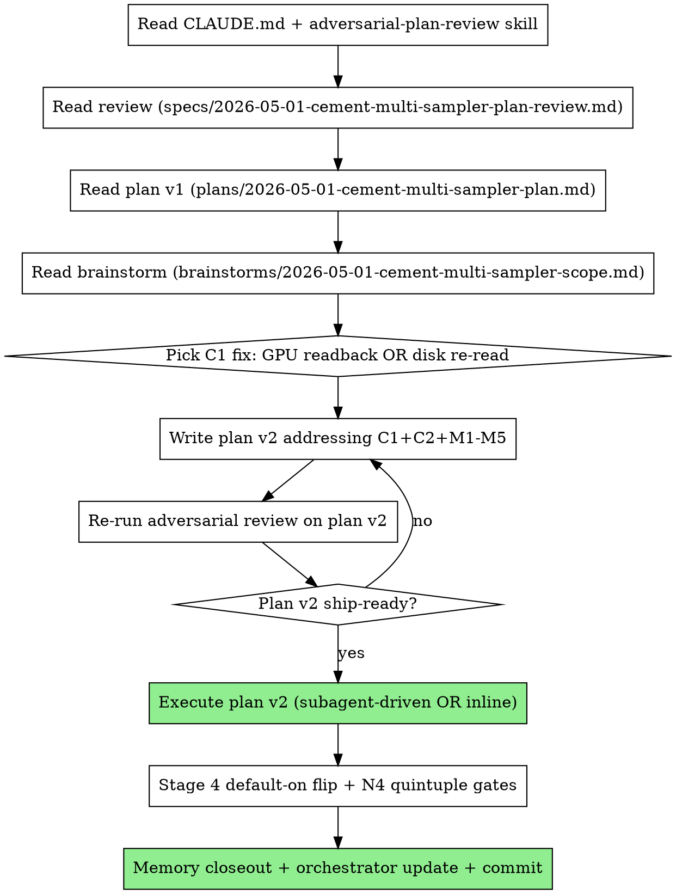

# Cement multi-sampler — fresh-session handoff prompt — 2026-05-01

> **Status:** plan v1 STOP-THE-LINED at adversarial review (2 CRITICAL + 5 MAJOR + 4 MINOR findings). Foundation (`textureData[0]` pixel-data path) is dead on stock gameplay due to a missed `if (InEditor || !quickLoad)` enclosing gate at `mclib/terrtxm.cpp:561`. Plan v2 revision must address C1 + C2 before execution.

This document is a **self-contained handoff prompt for a fresh Claude Code session** (the previous session is winding down). Paste this entire document (or its key sections) into a new session to start the work.

---

## TL;DR

The indirect-terrain SOLID slice (PR1, commits `f221570` + `a29ff83` + `c8fa5df`) ships behind `MC2_TERRAIN_INDIRECT=1`. Architecture works; visual is correct EXCEPT pure cement quads (airport/runway/concrete-pad areas) sample the colormap atlas instead of the cement-catalog texture and render as the underlying biome.

User direction: **option C** — multi-sampler frag shader. Bind cement-catalog atlas at sampler unit 3 (`tex3`, currently declared "legacy unused" — perfect free slot). Frag selects atlas vs catalog based on TerrainType (already encoded). Bundle with **Stage 4 default-on flip** per Q6 user decision.

The brainstorm + plan + adversarial review pipeline already ran. The plan was **stop-the-lined**. Your job: revise the plan to address findings, then execute.

---

## Worktree

`A:/Games/mc2-opengl-src/.claude/worktrees/nifty-mendeleev/`. Branch `claude/nifty-mendeleev`.

Latest commits:
- `c8fa5df` GL_BGRA + dual-UV via frag WorldPos reconstruction (this is the current good state)
- `a29ff83` Stage 3 hotfix — colormap atlas bind
- `f221570` Stage 3 — indirect SOLID draw + gate-off (PR1 close)

Working tree note: `docs/superpowers/cpu-to-gpu-offload-orchestrator.md` is dirty and untracked exploration docs sit alongside it. The worktree owner handles those — leave them alone.

---

## Required reading (in order)

1. **`CLAUDE.md`** — full file. Internalize Documentation Discipline + Review Discipline.
2. **`.claude/skills/adversarial-plan-review.md`** (root repo's `.claude/skills/` if not in the worktree) — the discipline that stop-the-lined plan v1.
3. **`docs/superpowers/specs/2026-05-01-cement-multi-sampler-plan-review.md`** — **READ THIS FIRST AFTER CLAUDE.md.** Adversarial review of plan v1; lists CRITICAL (C1, C2) and MAJOR (M1-M5) findings with grep-cited evidence and recommended fixes.
4. **`docs/superpowers/plans/2026-05-01-cement-multi-sampler-plan.md`** — plan v1 (the one that was stop-the-lined). **Scroll to the "Post-review advisor input (2026-05-01)" section at the end** — it appends 7 advisor blockers (B1-B7) that sharpen the resolution paths beyond the bare review findings, plus the recommended "Delta from v1" plan v2 shape. Use plan v1 + that advisor section + the review as the input set for plan v2.
5. **`docs/superpowers/brainstorms/2026-05-01-cement-multi-sampler-scope.md`** — brainstorm input. **Q-answers are FROZEN — do not relitigate.** User decisions in plan v1's "User decisions" section apply to plan v2 unchanged.
6. **`docs/superpowers/plans/2026-04-30-indirect-terrain-draw-plan.md`** — parent plan v2 (the indirect-terrain SOLID slice). Mirror its structure (Goal, Architecture, Out of scope, File structure, Stage 0..N with Tasks N.M.K, 4-gate ladder, Verification appendix V1..VN, Cross-references).
7. **The four committed shader/bridge sites** the cement-fix extends:
   - `shaders/gos_terrain.frag` — `useAtlasColormap` branch + atlas* uniforms + matMix splat math at lines ~325-345.
   - `shaders/gos_terrain_thin.vert` — Texcoord per-tile + WorldPos varying + TerrainType packing.
   - `GameOS/gameos/gameos_graphics.cpp` — `gos_terrain_bridge_drawIndirect` body around `useAtlasColormap` set + reset.
   - `GameOS/gameos/gos_terrain_indirect.cpp` — `BuildColormapAtlas`. Mirror this for `BuildCementCatalogAtlas` (with the C1 fix applied).
8. **`mclib/terrtxm.h`** + **`mclib/terrtxm.cpp:556-581 region especially`** — the `TerrainTextures` catalog class. Lines 561 and 567's enclosing `if (InEditor || !quickLoad)` gate is the C1 stop-the-line.
9. **`mclib/quad.cpp:399-424`** (`buildTerrainRecipeInline`) — diagnostic ground-truth. Pure-cement branch is line 420.
10. **`memory/water_ssbo_pattern.md`**, **`memory/gpu_direct_renderer_bringup_checklist.md`**, **`memory/mc2_texture_handle_is_live.md`**, **`memory/mc2_argb_packing.md`** — pattern templates and gotchas.

---

## User decisions (FROZEN — do not relitigate)

These came out of the brainstorm Q&A and the user signed off explicitly.

- **Q1 = pure cement only.** Alpha-cement transition base + concrete-tile-overlay decals + footprints/runway markings stay legacy via `gos_PushTerrainOverlay` and the world-space overlay system. Out of scope. Target 2's brainstorm settles multi-layer architecture for those.
- **Q2 = single sampler at unit 3 (`tex3`).** Repurpose the "legacy unused" `tex3` slot in `gos_terrain.frag:35`. No new sampler uniform declaration. No new varying. M2 path stays untouched.
- **Q6 = Bundle with Stage 4.** This slice IS the indirect-terrain Stage 4 commit. Cement-fix gates ARE Stage 4 gates (Gate A pixel canary, Gate B perf, Gate C parity, Gate D N4 quintuple). Default-on flip lands HERE in the same commit. No separate PR1a hotfix path.
- **Future-proof for multi-layer.** Architecture must accept N future layers (cement transitions, decals, footprints, scorch, craters) without redesign. The mechanism to encode "which catalog atlas layer for this quad" should be a SLOT that generalizes. **Plan v1 chose `TerrainType = 3.0 + idx/255.0` bias** — adversarial review flagged this is fragile under TES interpolation; consider alternatives (e.g., `Color.a` carrying layer-index, or making the FRAG able to read the thin record SSBO directly via gl_PrimitiveID).
- **Q8 = M2 fast path safe.** `useAtlasColormap` reset to 0 keeps M2 from inheriting atlas-mode. Cement sampler binding follows same gate-and-reset pattern.
- **Q9 = atlas memory negligible** (~1-2 MB).

---

## Adversarial review findings — must be addressed in plan v2

Read the full review at `docs/superpowers/specs/2026-05-01-cement-multi-sampler-plan-review.md`. Highlights:

- **C1 (STOP-THE-LINE):** Plan v1's pixel-data approach (`types[i].textureData[0]`) is gated by `if (InEditor || !quickLoad)` at `mclib/terrtxm.cpp:561`. On stock gameplay, `quickLoad=true` → block never runs → `textureData[0]` is NULL for every type. `BuildCementCatalogAtlas()` would skip every entry and silently produce N=0 atlas. **Fix requires either GPU readback (`glGetTexImage` per cement tile after upload) or disk re-read of cement tile TGAs.** Pick one and re-architect Stage A.
- **C2 (STOP-THE-LINE):** `TerrainTextures::types` and `textureData` are `protected:`. Plan v1 directly accesses `tt->types[i].textureData[0]` from `gos_terrain_indirect.cpp` — won't compile. **Fix:** add public accessor methods to `TerrainTextures` (e.g., `walkCementSlots(callback)` or `getNumTypes() + getType(i)`). Spell out the accessor signatures in plan v2; don't punt to "executor resolves."
- **M1:** Sampler-object override of `GL_REPEAT` for cement tiles. Add `glBindSampler(3, 0)` (or a dedicated REPEAT sampler) before cement atlas bind.
- **M2:** `terrainTypeToMaterialLocal` may miss `terrainType=20` (END_CEMENT_TYPE). Verify against `quad.cpp` and add `case 20:` to Concrete if needed.
- **M3:** File path citation error in plan v1 — bridge reset block is in `gameos_graphics.cpp`, not `gos_terrain_indirect.cpp`. Trivially fix.
- **Other M/m findings:** see review for full list.

---

## Recommended sub-skills

- **`superpowers:writing-plans`** — for the plan v2 revision pass.
- **`superpowers:adversarial-plan-review`** — re-review plan v2 BEFORE executing. Per CLAUDE.md, high-stakes plans want adversarial review every revision.
- **`superpowers:subagent-driven-development`** OR **`superpowers:executing-plans`** — for the actual execution after plan v2 is review-clean.
- **`superpowers:test-driven-development`** — applies anywhere there's a testable surface (parity assertions, counter checks, lifecycle prints).
- **`superpowers:verification-before-completion`** — before claiming "done," RUN the smoke command and read the output. Evidence before assertions.

---

## Recommended workflow for the new session

**Estimated scope:**
- Plan v2 revision pass: 1-2 hours.
- Adversarial re-review: 30-60 min.
- Execution: 4-8 hours depending on C1 fix choice (GPU readback is more involved than disk re-read).
- Validation gates: 1-2 hours (smoke + visual canary + memory closeout).

Total: maybe 1-2 working days at focused-session pace.

---

## Critical project rules (not exhaustive — read CLAUDE.md for the full list)

- **Build:** ALWAYS `cmake --build build64 --config RelWithDebInfo --target mc2`. Release crashes with GL_INVALID_ENUM.
- **Deploy:** NEVER `cp -r`. ALWAYS `cp -f` per file + `diff -q`. `cp -r` silently fails on Windows/MSYS2. Deploy target: `A:/Games/mc2-opengl/mc2-win64-v0.2/`.
- **Shader #version:** Never in shader files. Pass `"#version 430\n"` as prefix.
- **Uniform API:** `setFloat`/`setInt` BEFORE `apply()`, not after.
- **`GL_FALSE` for `terrainMVP`:** direct-uploaded row-major matrices use `GL_FALSE`. Material cache uses `GL_TRUE`.
- **Smoke gate:** `py -3 scripts/run_smoke.py --tier tier1 --kill-existing --duration 30 --keep-logs`. Tier1 missions: mc2_01, mc2_03, mc2_10, mc2_17, mc2_24.
- **Verify-then-write:** every cited symbol grep-verified at write-time, file:line cited inline. C1 above is the case study for what happens when you don't.
- **Adversarial review by default** for high-stakes plans. This slice qualifies (architectural endpoint, default-on flip, frag-shader path shared, lifecycle hazard).

---

## Anti-patterns (will earn rejection)

- **Don't add fields to `TerrainQuadRecipe`** (frozen at 144 B / 9 vec4).
- **Don't add a new sampler declaration to gos_terrain.frag.** Repurpose `tex3`.
- **Don't break the legacy non-thin VS chain.** No new varyings. Reconstruct from existing varyings (Texcoord, WorldPos, TerrainType, Color).
- **Don't ship cement-fix without the default-on flip in the same commit** (Q6 user decision).
- **Don't bake cement art into cpuColorMap.** That's option B; user picked C.
- **Don't introduce a per-bucket loop draw.** That's option A; user picked C.
- **Don't deploy with `cp -r`.**
- **Don't preempt Target 2's decisions.** Document the future-proofing slot but don't extend to >1 layer here.
- **Don't ship plan v2 without re-running adversarial review.** The discipline applies every revision, not just first time.

---

## What success looks like

- Plan v2 ships review-clean (zero CRITICAL, zero MAJOR ⚠️) with V1..VN verification appendix mirroring parent plan v2.
- Execution lands one commit on top of `c8fa5df` containing: cement catalog atlas build, frag shader cement-sampling branch, bridge tex3 binding, default-on flip, N4 quintuple validation, memory closeout, orchestrator update.
- Tier1 5/5 PASS quintuple (warm-boot default-on, cold-start default-on, warm-boot killswitch, cold-start killswitch, warm-boot parity).
- Pixel canary at fixed mc2_01 airport tarmac viewpoint shows concrete tiles correctly.
- Killswitch `MC2_TERRAIN_INDIRECT=0` restores legacy M2 path.

---

## First action for the new session

Read `CLAUDE.md` end-to-end. Then read the review at `docs/superpowers/specs/2026-05-01-cement-multi-sampler-plan-review.md` — that's the most efficient way to understand what plan v1 got wrong and what plan v2 must fix. Then start the plan v2 revision pass.

Good luck.
