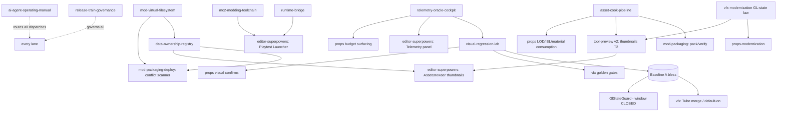

# MC2 Superpowers — Execution Roadmap (Synthesis)

**Status:** Synthesis v1, 2026-06-11. This is NOT a 13th lane. It is the one document that tells the team what to build first across the 12-doc strategy corpus (+2 pre-existing siblings), how the lanes depend on each other, and how the corpus's internal conflicts are resolved. Every recommendation cites its source doc; this document invents no systems.

**Governing manuals (read fully before acting on any slice):**
- `release-train-governance-manual.md` — branch/merge/baseline/flag-ladder/deploy/smoke law. ("governance §N" below.)
- `ai-agent-operating-manual.md` — model dispatch, prompt anatomy, verification gates. ("agent manual §N" below.)

---

## 1. North star

**"Superpowers" = the MC2 engine becomes legible, provable, and moddable from the outside — without the engine ever losing authority.**

Concretely, across all twelve lanes one architecture repeats:

1. **mc2.exe is the only authority** on what content means, what resolves, and what rendered. Tools *predict*; the engine *decides*; divergence is a tool bug (mod-packaging §6/§9, mod-VFS §1, data-ownership-registry §1, telemetry-cockpit §1).
2. **Every diagnostic is a structured, versioned fact** (`[TAG vN] key=value` → NDJSON → run folder), and every claim of correctness is an oracle counter, not eyes (telemetry-cockpit §2–§4, vfx-roadmap §1 "provable without eyes", agent manual §1).
3. **Bridges over rewrites:** files + process spawn + parsed stdout, no in-process PIE, no IPC sockets until the file-based path measurably fails (mc2-modding-toolchain §4/§7, runtime-bridge §3).
4. **Exactly one writable truth per data domain**, read-only generated indexes for tools, no second asset database — ever (data-ownership-registry §1, asset-cook §1, mod-packaging §1.2).
5. **Everything rides the governance gate train:** env-flag → A/B oracle → tier1 5/5 → user visual confirm → default-ON with opt-out → soak → delete legacy (governance §5). `run_smoke`'s verdict path (`smoke_lib/gates.py`) is sacred; no lane touches it except via the cockpit's advisory→hard promotion rule (telemetry-cockpit §1.2/§8).

A modder with the finished Superpowers stack edits a folder, presses Playtest in the editor, watches structured telemetry stream back, and ships a verifiable package — while the engine team lands GPU-modernization slices (props, VFX) gated by the same oracles and the same visual-regression lab.

---

## 2. Lane ownership map

| Concern | Owning doc | Notes |
|---|---|---|
| Mod folder layout, `package.json`, `mc2mod` pack/install/uninstall/rollback/verify, receipts, launcher wiring | `mod-packaging-deploy-architecture.md` | §2–§7, §12 |
| File-resolution semantics: layer stack, first-wins, resolve trace, write routing, scratch layer, dot-dir indexing rules | `mod-virtual-filesystem-design.md` | §3–§7, §12. The engine implementation lives in `mclib/file.cpp` |
| Per-domain writable truth, ID allocation, `registry-index.json` schema/build/staleness | `data-ownership-registry-strategy.md` | §2–§4. The index is the only sanctioned read-only cache |
| Telemetry taxonomy, NDJSON schema, tag registry, run-folder shape, budgets, cockpit panels | `telemetry-oracle-cockpit-architecture.md` | §2–§8. Pass/fail authority stays in `smoke_lib/gates.py` |
| Camera bookmarks, golden frames, pixel-diff metrics, blessing model, Baseline A bootstrap | `visual-regression-lab-architecture.md` | §2–§8. Its run output IS a cockpit artifact (§6) |
| Source/cooked/cache taxonomy, asset manifests, cook tools, runtime fallback policy | `asset-cook-pipeline-architecture.md` | §2–§8. "Cook owns derivation, runtime owns consumption" |
| Editor panels, Action/undo discipline, Playtest Launcher, editor smoke surface | `editor-superpowers-roadmap.md` | §3–§4, §7–§8 |
| Editor↔game process model, playtest session state machine, `[BRIDGE v0]` protocol, runtime IDs, crash forensics | `runtime-bridge-architecture.md` | §1–§9 (mechanism) |
| End-to-end tool ownership map, bridge map B0–B4, `mods/<id>/` IS the project file, `.modproject/` carve-out | `mc2-modding-toolchain-architecture.md` | §3–§6 (workflow). Pre-existing sibling; still authoritative for tool ownership |
| Static-prop cull/LOD/material runtime, frozen records, `StaticPropDirty`, HZB ladder, prepass gate | `props-modernization-architecture.md` | §3–§9 |
| gosFX draw migration, transparent sort/blend/depth policy, GL-state ownership law, FX fixtures | `vfx-modernization-roadmap.md` | §3–§6. Its GL-state law is adopted verbatim by props + preview docs |
| Preview backends B/A/C/T, fidelity tiers F0–F3, thumbnail pipeline, batcher preview-steal rule, preview picking rule | `tool-preview-rendering-architecture-v2.md` | **Supersedes v1** as the decision layer; v1 (`tool-preview-rendering-architecture.md`) remains reference for backend internals only (v2 §"What changed") |
| Merge windows, baselines, flag ladder, deploy targets, smoke tiers | `release-train-governance-manual.md` | Governs everything; advisory to no one — it is law |
| Model dispatch, prompt anatomy, done-gates, escalation | `ai-agent-operating-manual.md` | Companion to governance; does not restate it |

**Advisory-only docs:** the two manuals do not own engine code; they own *process*. The toolchain sibling (`mc2-modding-toolchain-architecture.md`) is partly superseded in depth — it defers bridge mechanism to `runtime-bridge-architecture.md` and packaging detail to `mod-packaging-deploy-architecture.md` — but remains the authoritative tool-ownership map and the more conservative voice on sockets (see ruling C9).

**Supersession chain:** `tool-preview-rendering-architecture-v2.md` > v1 (normative taxonomy retained, decisions replaced). `runtime-bridge-architecture.md` deepens toolchain §4 B3/B4 without replacing the workflow level. No other doc supersedes another.

---

## 3. Dependency graph

**Prose edges (with rationale):**

- **Telemetry → visual regression.** The lab's `visual_diff.json`/run folder is a cockpit artifact; severity, promotion, and identity-first compare all come from cockpit §4/§6/§8 (visual-lab §1.4, §6). Build the telemetry artifact shape first or the lab invents its own.
- **Runtime bridge → editor playtest.** The editor's Playtest Launcher (editor-roadmap §3.4) rides `EditorTaskRunner` + the bridge doc's process supervision and `[BRIDGE v0]` grammar; the toolchain doc owns the modder workflow above it (toolchain §4). Launcher MVP needs only stdout v0, not sockets.
- **Asset cook → packaging.** The packer never cooks; it packages cook output and `mc2mod verify` reads `cook.json` provenance (packaging §7, cook §12.3). Cook sidecar formats must exist before `verify` can consume them.
- **Registry → mod VFS (mutual, with VFS as foundation).** The registry's `build_index.py` consumes the VFS lane's shared static resolver and the resolve-trace parity gate (registry §4, VFS §5.2). The VFS trace + resolver land first; the index builds on them.
- **Preview rendering → asset viewer / editor thumbnails.** Editor AssetBrowser consumes T1 now, T2 later (preview-v2 §6); T2 is gated by the UV-V fixture (preview-v2 §10/§12.5); T2 regeneration hooks at (mod-)cook time tie it to cook + packaging.
- **VFX / props modernization → visual lab + cockpit.** Both lanes' "provable without eyes" oracles surface through cockpit counters (props §8, vfx §5); their visual confirms and default-on flips diff against the lab's blessed Baseline A set (vfx §5/§7, visual-lab §8.4). Neither lane's default-on can ship before Baseline A is blessed.
- **Baseline A is the choke point.** Visual-lab S4 produces it; governance §4 makes its capture a merge-window-closing event; MEMORY + governance §3.4 currently gate Tube merge and GlStateGuard on it. Everything render-affecting downstream queues behind the bless.

---

## 4. Conflict audit and rulings

Each ruling verified against the originals (grep-confirmed where cited). The **winning doc** is named in bold.

**C1 — Dual manifest validators.** `tools/validate_asset_manifest.py` (scaffold) vs `tools/asset_cook/validate_asset_manifest.py`. The cook doc itself names this a risk and makes convergence its slice 1 (cook §10, §12.1). **Ruling: `asset-cook-pipeline-architecture.md` wins; `tools/asset_cook/validate_asset_manifest.py` is the single canonical validator.** The scaffold's MATERIAL-AUTHORING rules and `invalid/material_fail_*.json` fixtures port into it; the scaffold copy is then deleted.

**C2 — ID-buffer picking, three implementations brewing.** props §192 ("ID-buffer pick from the same matrices/records; never a second projection") and tool-preview-v2 §7 (R32UI on-demand pick, citing engine precedent `MC2_OBJECT_ID_BUFFER`, `gos_mech_batcher.h:42-46`). **Ruling: `props-modernization-architecture.md` owns the engine/editor world pick (it must read the frozen-record matrices — the projection-split-brain lesson). `tool-preview-rendering-architecture-v2.md` owns standalone-preview picking only** (the viewer cannot share an engine pass). Both follow the v2 §7 rule (ID-buffer, on-demand, never per-frame, never analytic unproject). No third implementation; the editor docked-map pick reuses the props lane's pass when it lands.

**C3 — Playtest artifact home split.** Toolchain archives runs to `.modproject/playtest/<ts>/` (toolchain §165, §185); bridge saves shadow paks to `<missionDir>/.playtest/` (bridge §38) — a dot-dir inside engine-mounted `data/` that VFS §6 write routing doesn't list. **Ruling: `mc2-modding-toolchain-architecture.md` wins. One home: `mods/<id>/.modproject/playtest/`** — run archives in `.modproject/playtest/<ts>/`, shadow paks in `.modproject/playtest/shadow/`. The bridge doc's shadow-save mechanism is kept; only its path moves. This eliminates one of the four dot-dir carve-outs (see C4) and keeps the packer's dotfile exclusion doing the right thing for free.

**C4 — Four dot-dir carve-outs, four ad-hoc skip rules.** `.modindex-cache` (engine, file.cpp:161), `.modproject/` (toolchain §131 "one-line filter"), `.scratch/` (VFS §63/§73), `.playtest/` (bridge §38). Each doc independently asks `file.cpp` for a skip. **Ruling: `mod-virtual-filesystem-design.md` wins as owner of indexing semantics. One unified rule in the `file.cpp` index walk: skip ALL dot-prefixed entries under `mods/<id>/`,** replicated verbatim in the shared Python resolver (C5) and tested by the parity smoke. Individual docs stop legislating per-dir filters.

**C5 — Python resolver-replica family.** `resolver.py` (VFS §15.2), `mc2mod check` (packaging §12.5), `build_index.py` (registry §10.2-3) each need engine-identical first-wins resolution. **Ruling: `mod-virtual-filesystem-design.md` wins: `tools/mod_install/resolver.py` is the single shared module;** `mc2mod check` and `build_index.py` import it, never reimplement. The `MC2_LOG_FILE_RESOLVE` parity smoke (VFS §15.3) is the CI gate for all three consumers. Digest-4's watchlist item 1 is thereby contained.

**C6 — Three overlapping file-list+hash registries.** `package.json files[]` (packaging §3), `cook.json` (cook §12.3), `.install-receipt.json` (packaging §5). **Ruling: keep all three — they answer different questions** (distribution integrity / cook provenance / install reversal) — **but `mc2mod verify` is the single consumer that joins them** (packaging owns verify; cook §12.3 already says "teach `mc2mod verify` to read cook.json"). No fourth list; the registry index aggregates, never replaces (registry §6).

**C7 — Four overlapping material/LOD schemas.** Cook `manifest.json` materials/LOD table (cook §4), props frozen cull record material+LOD slots (props §3.1/§5), MaterialGpu ABI, Backend-A binding contract (`asset-viewer-backend-a-shader-contract.md`). **Ruling: `asset-cook-pipeline-architecture.md` wins for authoring truth — `manifest.json` is the only place material/LOD data is *written*.** Frozen records and MaterialGpu are runtime projections populated from it (props §4/§5 already say so); the Backend-A contract documents ABI, not data. Coordination point: props §12's rule — define the frozen record to carry material+LOD fields from day one, zero-filled — is mandatory at FROZEN-RECORDS-M1 time.

**C8 — Editor asset browser dual truth.** `EditorObjectMgr::init()` live catalog (editor §3.6) vs registry P4 "editor asset browser reads `registry-index.json`". **Ruling: `EditorObjectMgr` remains the enumeration source for placement (live truth); the registry index is read-only *enrichment* (providedBy, conflicts, override status) and only under the registry doc's staleness contract** (registry §4: full `inputs[]` check, loud STALE banner, never silently serve stale). The convergence point digest-2 flagged is fenced: the panel never merges two enumerations.

**C9 — Contradictory sequencing on sockets.** Bridge doc plans socket protocol v1 (bridge §4); toolchain anti-goals say "no IPC sockets — revisit only if slice 9 latency proves inadequate" (toolchain §7). **Ruling: the conservative sibling wins — `mc2-modding-toolchain-architecture.md`.** Stdout `[BRIDGE v0]` + file-based cockpit ship first; sockets are a measured-need upgrade, unblocked only by demonstrated latency failure of the file path. Matches cockpit §11 ("sockets earn-it-later").

**C10 — tag-registry vs gate-doc drift.** `tests/telemetry/tag-registry.json` vs `docs/oracle-dynamic-pipeline-gate.md`/`docs/vfx-oracle-coverage.md` — two representations of the oracle list. **Ruling: `telemetry-oracle-cockpit-architecture.md` §9 stands: registry owns *what*, gate docs own *why*; `scripts/check-oracle-registry.py` drift check is mandatory in the same slice that creates the registry** (Slice 1 below). The visual lab's bookmark `covers` tags must draw from the same registry's subsystem names to prevent a third taxonomy.

**C11 — Terminology drift: "manifest".** Five species exist: package manifest (`package.json`), asset manifest (`manifest.json`), cook sidecar (`cook.json`), run manifest (cockpit `manifest.json`), baseline manifest (governance §12.3). **Ruling: always qualify.** Any doc or commit saying bare "manifest" referencing cross-lane behavior is a review flag. Similarly "registry": the only authority registry is the data-ownership doc's domain table; `tag-registry.json`, `golden-sets.json`, `RendererFeatureRegistry.h` are *test/feature metadata*, named as such.

**C12 — Three stdout grammars, multiple lifters.** `[SMOKE v1]` (gos_smoke), `[BRIDGE v0]` (bridge §3), `[resolve]`/JSONL (VFS §5). All engine-owned and versioned — acceptable — but the editor and cockpit must share ONE lifter library factored from `smoke_lib/logparse.py` (editor §4.6 "shared code, not a reimplementation"; cockpit §10 "the grammar is the contract"). **Ruling: cockpit doc wins; the Python lifter is the reference implementation, the editor's C++ lifter is the only sanctioned duplicate, golden-tested against the same fixtures.**

**C13 — Duplicate freshness mechanisms.** Governance slice 1 (deploy mtime check) vs slice 5 (exe-hash logging). **Ruling: keep both; hash is authoritative, mtime is the cheap preflight** — they land in the same lane (governance owns both), no conflict to escalate.

**C14 — GL-state assert triplication.** vfx, props, preview docs all legislate explicit-state ownership. **Ruling: `vfx-modernization-roadmap.md` owns the policy text; `mclib/render_contract.*` is the sole implementation** (props corollary 4 already adopts it verbatim). Any lane adding its own assert macros is a review flag.

---

## 5. First 10 implementation slices

Sequenced to (a) unblock the most lanes earliest, (b) respect the dependency graph, (c) avoid everything gated on Baseline A or the CLOSED merge window (governance §3.4: no Tube merge, no GlStateGuard). All branches follow `claude/<name>` + own worktree under `.claude/worktrees/` (governance §2). All slices: tier1 5/5 PASS, canonical invocation verbatim, deployed-exe mtime verified (governance §6, §8); tier3 additionally where noted (governance §8 requires it for mission-loading/asset-resolution/mod-VFS changes).

**S1 — Telemetry tag registry + lifter** *(cockpit S1+S2)*
Owner: `telemetry-oracle-cockpit-architecture.md` §13.1-2. Branch: `claude/telemetry-tag-registry-1`. Ladder rung: n/a — pure data + offline Python, zero engine code (rung 1 by construction). Gate: `scripts/check-oracle-registry.py` green vs the 9 oracle-gate rows; `telemetry_lift.py` golden-tested against `tests/smoke/artifacts/2026-06-09T19-27-36/` known tag counts. Do NOT touch: `run_smoke.py`, `gates.py`, any engine file. Why now: the artifact shape unblocks the visual lab, the editor telemetry panel, and every later cockpit phase; also executes ruling C10.

**S2 — Run manifest + post-verdict hook in run_smoke** *(cockpit S3+S4)*
Owner: cockpit §13.3-4 (+ governance §12.1/§12.5 freshness checks fold in here). Branch: `claude/smoke-run-manifest-1`. Rung: additive sidecar, try/except-isolated. Gate: smoke exit code **byte-identical** before/after (the sacred verdict path); `manifest.json` records exe path/mtime/hash/git-describe/env deltas/deploy target; tier1 5/5. Do NOT touch: `gates.py` verdict logic, baselines.json. Why now: kills the stale-exe false-alarm class (governance §6 split-brain trap) for every future lane.

**S3 — Full-ladder resolve trace** *(VFS slice 1)*
Owner: `mod-virtual-filesystem-design.md` §15.1. Branch: `claude/vfs-resolve-trace-1`. Rung 1: `MC2_LOG_FILE_RESOLVE=2` + `MC2_RESOLVE_TRACE_FILE`, default-off, ~80 lines in `mclib/file.cpp`. Gate: tier1 byte-identical vars-unset; **tier3 required** (asset resolution touched); trace JSONL well-formed vars-set. Do NOT touch: resolution *behavior*, `g_modIndex` semantics, the dot-dir rules (that's S5). Why now: this is the parity oracle that every resolver replica (registry, packaging, VFS CLI) is gated by — oracle-first development (agent manual §9.3).

**S4 — Shared static resolver + parity smoke** *(VFS slices 2-3; executes ruling C5)*
Owner: VFS §15.2-3. Branch: `claude/vfs-shared-resolver-1`. Rung: offline tool, no engine code. Gate: unit tests on case/backslash/`..`/dup-key quirks; **0-mismatch parity** vs S3 trace on a tier1 mission with `MC2_ACTIVE_MOD=mc2x-compat`, wired as CI. Do NOT touch: `file.cpp`. Why now: `mc2mod check` (packaging) and `build_index.py` (registry) both block on this single module.

**S5 — Unified dot-dir skip rule** *(executes rulings C3+C4)*
Owner: VFS (indexing semantics) with toolchain §131 + bridge §38 amended. Branch: `claude/vfs-dotdir-skip-1`. Rung 1: behavior change to the index walk — skip all dot-prefixed entries under `mods/<id>/` — guarded by an A/B env during bring-up, then default (current deploys have only `.modindex-cache`, already skipped by name). Gate: tier1 + **tier3**; parity smoke (S4) re-run green; fixture mod containing `.modproject/`, `.scratch/`, `.playtest/` resolves identically engine-vs-resolver. Do NOT touch: playtest code (only the documented path contract changes). Why now: closes the four-carve-out conflict before any tool writes into those dirs.

**S6 — Registry index schema + base builder** *(registry slices 1-2)*
Owner: `data-ownership-registry-strategy.md` §10.1-2. Branch: `claude/registry-index-1`. Rung: offline tool (Python 3 stdlib only); engine never reads it. Gate: `validate_registry_index.py` green on fixture; stock v0.4 deploy index validates; 10 records hand-spot-checked; imports S4 resolver for any resolution question. Do NOT touch: engine, `models.json`, any writable truth. Why now: the index is the read substrate for `mc2mod check`, the editor browser enrichment (C8), and the launcher mod list.

**S7 — Manifest validator convergence** *(cook slice 1; executes ruling C1)*
Owner: `asset-cook-pipeline-architecture.md` §12.1. Branch: `claude/cook-validator-converge-1`. Rung: offline tool. Gate: golden + broken fixtures (`invalid/material_fail_*.json`) behave under the single `tools/asset_cook/validate_asset_manifest.py`; scaffold copy deleted in the same slice; wired into the `scripts/check-*` family. Do NOT touch: cook transforms, engine loaders. Why now: one validator must exist before packaging `verify` (S8) and Viewer export gates consume it.

**S8 — Package contract + `mc2mod pack`/`install`** *(packaging slices 1-3)*
Owner: `mod-packaging-deploy-architecture.md` §12.1-3. Branch: `claude/mc2mod-pack-install-1`. Rung: offline CLI; engine never reads `package.json`. Gate: pack mc2x-compat round-trips and validates; temp-deploy install → `MC2_ACTIVE_MOD` tier1 single-mission → uninstall → **byte-identical deploy**; `.install-receipt.json` written per C6 roles. Do NOT touch: `file.cpp`, `models.json` merge logic (receipt records only). Why now: S4-S7 are its substrate; this is the first modder-visible superpower.

**S9 — Visual lab in-engine capture + bookmark replay** *(visual-lab S1+S2)*
Owner: `visual-regression-lab-architecture.md` §13.1-2. Branch: `claude/visual-capture-1`. Rung 1: `MC2_VISUAL_CAPTURE_FRAME`/`MC2_VISUAL_CAPTURE_DIR`/`MC2_VISUAL_BOOKMARK_CAPTURE`, default-off, zero cost unset. Gate: capture byte-stability (same mission captured twice, self-diff clean); tier1 5/5 flags-unset byte-identical; rides `MC2_SMOKE_MODE` only — no new driver/IPC. Do NOT touch: render passes themselves, swap logic, `gates.py`. Why now: this is the **prerequisite for Baseline A** (visual-lab §8) — the named next gate in MEMORY — and Baseline A unblocks the entire closed merge window. Highest-leverage engine slice available.

**S10 — Editor Playtest Launcher MVP** *(editor slice 5 + toolchain slices 1-2, stdout v0 only per C9)*
Owner: `editor-superpowers-roadmap.md` §8.5 with `runtime-bridge-architecture.md` process model and the C3 artifact home (`.modproject/playtest/`). Branch: `claude/editor-playtest-mvp-1`. Rung: editor-only feature; game exe untouched (env vars only). Gate: `run_editor_smoke.py` green; launch deployed game exe with `-mission <pak>` + `MC2_ACTIVE_MOD`; exe-mtime staleness warning (governance §6); exit-code + log-path report archived to `.modproject/playtest/<ts>/`; tier1 untouched. Do NOT touch: sockets (C9), `[BRIDGE v0]` engine emission (later phase), mutation commands (structurally absent, bridge §10). Why now: it closes the modder loop (edit → playtest → telemetry) on top of S1/S2 artifacts and S8 mod wiring.

---

## 6. Do not start yet

| Attractive project | Unblock condition | Source |
|---|---|---|
| Tube ribbon merge (`claude/gosfx-tube-ribbon-1`) | Baseline A blessed (merge window CLOSED) | governance §3.4/§11; vfx §7 |
| GlStateGuard | Baseline A blessed | governance §3.4; MEMORY 8z handoff |
| VFX GpuMeshCache / `fx_mesh` substrate (vfx slices 3-5) | `MC2_FX_FORCE_SPAWN` destruction fixture exists first ("without it every later slice is unverifiable headlessly") | vfx §5, §9.1 |
| VFX default-on flip / MLR deletion / dead-effect sweep | Baseline A + golden gates + default-on soak | vfx §7-§8 |
| Prop impostors (Lane C) | Tree-LOD MVP shipped AND depth-prepass default-ON | props §5, §12 (P4→P7, P2 gate) |
| Building-skip broadening / service-lane split | `StaticPropDirty` funnel + frozen records live + one-release soak | props §6, §12 |
| Socket protocol v1 (`MC2_BRIDGE_PORT`) | File-based cockpit + stdout v0 measurably inadequate (latency) | toolchain §7 (ruling C9); cockpit §11 |
| Burnin/UI/mech BC7 cooks | texconv-vs-nvtt toolchain decision (`ktx create` rejects raw BC7); UI/mech additionally needs GameOS compressed-upload engine path | cook §8.4, §12.2; MEMORY 2026-06-08b |
| Supercompression (Basis/ETC1S) | compressed-upload path + vendored transcoder | cook §9 |
| Thumbnail T2 default-on | UV-V high-contrast fixture green ("UV-V is a thumbnail gate") | preview-v2 §10, §12.4-5 |
| Registry P4 tool consumption (editor/viewer read index) | Staleness contract (registry slice 4) shipped | registry §9-§10 |
| Telemetry budget hard-gates | Advisory soak + promotion via `gates.py` edit + tier1 stability proof | cockpit §8 |
| Visual-diff hard gating / FLIP gating | ≥3 weeks / ≥20 stable advisory runs; FLIP never hard-gates | visual-lab §9 |
| mc2.fx per-effect split, compbas row-merge, per-packet object2.pak overrides | A real mod need appears (engine-gated grain fixes) | registry §7/§9 P5; cook §8.5 |
| Multi-active-mod composition | A real need (single active mod + deps suffices) | packaging §4/§9 |
| Mech/vehicle cook class breadth | `claude/assimp-mech-import-1` merge | cook §8.3 |
| ABL/objective WRITE panels | Objective undo exists ("deliberately last") | editor §3.7/§6 |
| In-process PIE, second asset DB, new IPC | Never (anti-goals) | toolchain §7; registry §7; visual-lab §10 |

---

## 7. Merge / train rules applied to this roadmap

Per `release-train-governance-manual.md`:

1. **Merge window.** The window into `claude/nifty-mendeleev` is **CLOSED for render-affecting work** until Baseline A is blessed (governance §3.4, §4). S1-S8 and S10 are tooling/offline/editor slices that do not change render output and may merge in the normal flow (tier1 5/5 + oracle-clean + user approval). S9 adds an env-gated, default-off capture path — zero render change flags-unset — and is the slice that *enables* the bless; capture itself is a merge-window-closing event: schedule it, freeze render merges, capture, bless, reopen.
2. **Baseline lifecycle.** Baseline A = golden frames + per-pass timings + oracle counters off verified `mc2-win64-0.4c` (governance §4). The visual lab's `golden-sets.json` bless and the cockpit's `baseline_run` are ONE blessing with two consumers (visual-lab §8.3). Re-bless on any intentional default-ON visual change.
3. **Flag ladder.** Every engine-touching slice above names its rung; nothing here flips a default ON, and per governance §5 hard rule, no slice in this roadmap deletes legacy anything.
4. **Deploy-target verification.** Smoke runs the DEPLOYED v0.4 exe; editor runs 0.4c. Every done-report includes per-target mtime ≥ commit-time evidence (governance §6); S2 makes this machine-recorded in every run manifest.
5. **Docs vs code commits.** This roadmap and any spec amendments (C3 path change in bridge/toolchain docs, C4 in VFS doc) land as `docs(superpowers):` commits *before* the implementing slice; shipped slices get one-paragraph `docs/active_campaigns.md` ledger entries with shas + gate envs + kill-switch (governance §9).
6. **Smoke tiers.** S3/S5/S8 touch asset resolution / mod VFS → **tier3 required** in addition to tier1 (governance §8). Tooling-only slices (S1, S4, S6, S7) gate on their own unit/golden tests plus a tier1 no-regression run.
7. **Agents propose; the user owns merges, windows, deploys, and all visual confirms** (governance §3).

---

## 8. Agent routing per slice

Per the agent manual's dispatch tree (§3) — cost-of-wrong-answer beats cost-of-model; spec exists for every slice (this roadmap + owning doc section), so no Fable dispatches are needed for S1-S10:

| Slice | Route | Rationale (agent manual) |
|---|---|---|
| S1 tag registry + lifter | **Sonnet** | Well-specified, defined deliverable shape; golden test makes wrong answers visible (§2). Haiku may draft the JSON registry rows; Sonnet verifies counts. |
| S2 run-manifest hook | **Sonnet implements + Opus reviews** | Touches `run_smoke.py` adjacent to the sacred verdict path — high cost-of-wrong; byte-identical-exit-code gate is the review focus (§3 tie-breaker, §8). |
| S3 resolve trace | **Sonnet implements + Opus reviews** | `mclib/file.cpp` is load-bearing asset resolution ("a 'trivial' edit in mclib is not trivial", §3); small diff but review-discipline list applies. |
| S4 shared resolver | **Sonnet (Codex acceptable)** | Fully isolated Python module with crisp acceptance tests — the manual's Codex profile (§2); orchestrator runs the parity smoke either way. |
| S5 dot-dir skip | **Opus** | Indexing-behavior change in `file.cpp` with cross-doc contract implications (C3/C4); adversarial-plan-review before coding (§9.2). |
| S6 registry builder | **Sonnet** | Spec'd schema, stdlib-only, validator-gated. |
| S7 validator convergence | **Sonnet**; **Haiku** for fixture porting | Mechanical port + deletion, objectively checkable (§2). |
| S8 mc2mod pack/install | **Sonnet (Codex candidate for CLI internals)** | Self-contained CLI with byte-identical round-trip test; receipt/`models.json` interaction parts stay Sonnet. |
| S9 visual capture | **Opus** | In-engine render-path code (glReadPixels timing, GL state, swap interaction) = risky slice, isolated context (§2); greybeard incantation in prompt (§4). |
| S10 playtest launcher | **Sonnet** | Editor feature on existing `EditorTaskRunner` with a clear spec; escalate to Opus only on process-lifecycle bugs (Job Object, orphaned children — governance trap §10.2). |
| Commit titles, ledger one-liners | **local_llm** | Per user-global policy; verify output, never retry-loop. |

All dispatches: lean intake (ONE authoritative file = the owning doc section + this roadmap's slice row), absolute worktree path, paralysis guard verbatim for long-running, done-report with counters not adjectives (agent manual §4, §6).

---

## 9. Three concrete follow-up prompts

### Prompt A — Slice 1 implementation (Sonnet)

> In worktree `A:\Games\mc2-opengl-src\.claude\worktrees\nifty-mendeleev\` on a new branch `claude/telemetry-tag-registry-1`, implement Slice S1 of `docs/superpowers/strategy/superpowers-execution-roadmap.md` (§5 S1). Authoritative file: `docs/superpowers/strategy/telemetry-oracle-cockpit-architecture.md` §13.1-13.2 (read it; everything else needed is in this prompt).
> Deliverables: (1) `tests/telemetry/tag-registry.json` v1 covering the 9 oracle-gate rows plus FASTPATH_DROP, OBJBATCHER, GPU_CULL, SPFLUSH_COST_SPLIT, SNAPSHOT_BRIDGE_COMPARE, TIMING — each entry: tag name, version, kind (event|counter|oracle|budget|failure), owning gate-doc path, modder_text template where the doc provides one. (2) `scripts/check-oracle-registry.py` — drift check that fails if a `[TAG` emitted in `tests/smoke/artifacts/2026-06-09T19-27-36/` logs or named in `docs/oracle-dynamic-pipeline-gate.md` is absent from the registry. (3) `scripts/telemetry_lift.py` — lift `[TAG vN] key=value` lines from a smoke log into `telemetry.ndjson` records `{v, tag, tag_v, kind, ts_ms, frame, session, source, fields, raw_line}`; unversioned tags get `tag_v:0`.
> Constraints: Python 3 stdlib only; do NOT touch `scripts/run_smoke.py`, `scripts/smoke_lib/gates.py`, or any engine file; no emoji anywhere. Paralysis guard: 5+ consecutive Read/Grep/Glob without Edit/Write/Bash = STOP.
> Verification before "done": golden test — run the lifter against the 2026-06-09T19-27-36 artifact dir and assert known tag counts (record the counts you measured in the test); `check-oracle-registry.py` exit 0; one tier1 no-regression run, canonical invocation verbatim from worktree CLAUDE.md, exit 0. Report: branch + HEAD sha, test output inline, artifact dir path, PENDING list (none expected).

### Prompt B — Slice 2 implementation (Sonnet, Opus review to follow)

> In worktree `A:\Games\mc2-opengl-src\.claude\worktrees\nifty-mendeleev\` on a new branch `claude/smoke-run-manifest-1`, implement Slice S2 of `docs/superpowers/strategy/superpowers-execution-roadmap.md` (§5 S2). Authoritative file: `docs/superpowers/strategy/telemetry-oracle-cockpit-architecture.md` §13.3-13.4.
> Deliverables: (1) `run_smoke.py` writes `manifest.json` into each run's artifact folder: launched exe absolute path, exe mtime, exe sha256, `git describe --always --dirty` of the worktree, MC2_* env deltas vs empty, deploy target dir, invocation args. (2) A post-verdict hook in `run_smoke.py` that, AFTER the exit code is determined, generates `oracle_summary.json` by invoking `scripts/telemetry_lift.py` — the entire hook wrapped in try/except so any failure prints a warning and changes nothing. (3) If launched-exe sha256 differs from `build64/RelWithDebInfo/mc2.exe`, print a loud `DEPLOY STALE` warning line (warning only, never a failure — intentional old-build runs exist, governance §12.5).
> Hard constraint: the smoke verdict path is sacred — exit codes must be byte-identical for every outcome class. Do NOT modify `smoke_lib/gates.py` or `baselines.json`. No emoji. Paralysis guard: 5+ consecutive Read/Grep/Glob without Edit/Write/Bash = STOP.
> Verification before "done": run tier1 5/5 (canonical invocation verbatim) and confirm exit 0 plus `manifest.json` + `oracle_summary.json` present in the artifact dir; deliberately induce one failing run (bogus mission name) and confirm the exit code matches pre-change behavior; PIPESTATUS-correct build check not needed (no C++). Report counters and exit codes inline, branch + HEAD sha, and flag the slice for Opus review of the verdict-path isolation before any merge proposal.

### Prompt C — Slice 3 recon (Sonnet recon; output feeds the Opus-reviewed implementation)

> Recon dispatch, worktree `A:\Games\mc2-opengl-src\.claude\worktrees\nifty-mendeleev\`. Deliverable: `docs/superpowers/recon/vfs-resolve-trace-recon.md`. Authoritative file: `docs/superpowers/strategy/mod-virtual-filesystem-design.md` §5 and §15.1 (the `MC2_LOG_FILE_RESOLVE=2` + `MC2_RESOLVE_TRACE_FILE` JSONL trace slice).
> Question: produce the exact implementation map for the full-ladder resolve trace in `mclib/file.cpp`. Required shape (mechanically consumable): (1) a table of every resolution decision point in `file.cpp` (function, line — grep-verified at write-time — which layer it serves: scratch/mod/base-loose/size-strip/FastFile/CD/MISS) covering the priority chain at `file.cpp:62-67` and the mod index at `file.cpp:155-345`; (2) the single choke point (or the minimal set) where one JSONL record `{t, key, layer, path, shadowed[]}` per resolution can be emitted, with the `shadowed[]` collection cost assessed; (3) hot-path risk: which call sites resolve per-frame vs at load, and whether `=2` tracing needs a write buffer; (4) interaction with `.modindex-cache` and `MC2_REBUILD_MOD_CACHE`; (5) the dot-dir entries currently visible to the index walk (count them on the live v0.4 deploy) — this feeds ruling C4 in `docs/superpowers/strategy/superpowers-execution-roadmap.md`.
> Constraints: recon only — no code edits; every file:line cited must be grep-verified; no emoji. Paralysis guard: 5+ consecutive Read/Grep/Glob without producing sections of the deliverable = STOP and write what you have.
> Verification: the doc exists with all 5 numbered sections; a self-check section listing each cited line with the grep command that verified it; 3-line summary back to the orchestrator.

---

*Sources: all 14 docs in `docs/superpowers/strategy/` (12 lane docs + governance + agent manuals), digest scaffolding deleted after synthesis per task instruction.*
